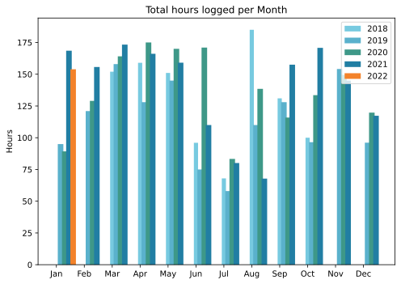
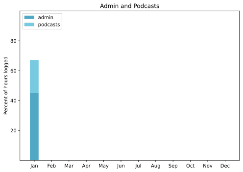

===

## Highlights of the month:

- Covid positively failed to lay me low
- Bought a new external SSD and got Time Machine backups up and running again
- Good cultural outing to a show at the Scuderie, on Dante’s Inferno
- Made some progress tidying up potential podcast episodes
- Wrote two actual, physical letters
- The Squeeze decided she would like to walk in the country …
- … which prompted me to finish work on a photo template for this site
- Started working on an academic paper on my own account
- Merch! (But no marketing as yet).

### Activities

All encompassed in the highlights. The walk in the country was the high spot, no doubt, the positive test the low. Only thankful to have been boosted, because this really was not even as bad as a bad cold. The very dry, tickly throat was the worst of it, making coughing both incessant and useless.

#### January: 
* Walking with sticks: 1 biggie
* Reading: 23
* Steps (avge): 7981
* Podcasts: 36 (29 of them [logged](https://www.jeremycherfas.net/stream/))
* In bed/asleep 8:42/7:40
* 7 Minutes: 10
* Weight (avge): 87.5
* Naps 8

#### December: 
* Walking with sticks: 0
* Reading: 15
* Steps (avge): 8713
* Podcasts: 37 (36 of them [logged](https://www.jeremycherfas.net/stream/))
* In bed/asleep 8:18/7:27
* 7 Minutes: 12
* Weight (avge): 87.7
* Naps 9

### Work

Hardly any. Which, whisper it, has been great.

#### Hours logged per month

#### Percent of logged hours

Previous years are on [an archive page](https://jeremycherfas.net/blog/working-life).

### Goals

Doing the daily old posts — 127 give or take for January —continues to be fun, although I am not doing much (anything) to resurface them. Trying to ensure that I add a Topic to the YAML where it might be warranted, with no need to do anything about that just yet. Wrote ten new posts. They’re not getting much traction either, but that’s not why I do it, right? Right!

### Niggles

After a burst of energy working with Python, I took things too easy and forgot a lot. This is definitely a tool that needs to be used to stay sharp.

### Final remarks

Glad Covid is out of the way, finally, at least until I get reinfected. 

----

## Here's the table

Click the triangle to see or hide the table

<table class="worktable">
<thead>
<tr>
<th style="text-align: right;" class="bigrow">Month</th>
<th style="text-align: center;" class="bigrow">Total</th>
<th style="text-align: center;" class="smallrow">Daily</th>
<th style="text-align: center;"class="smallrow">Admin %</th>
<th style="text-align: center;"class="smallrow">ETP %</th>
<th style="text-align: center;"class="smallrow">Other %</th>
</tr>
</thead>
<tbody>
<tr>
<td style="text-align: right;">2022-01</td>
<td style="text-align: center;">153.9</td>
<td style="text-align: center;">4.96</td>
<td style="text-align: center;">45</td>
<td style="text-align: center;">22</td>
<td style="text-align: center;">33</td>
</tr>
</tbody>
</table>

