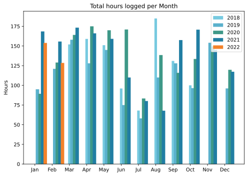
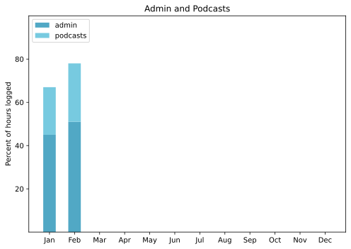

Where did the month go? I know it is a short month, but it was over so quickly. Still, there were trips to the beach and the cinema (Belfast) to remember.

===

## Highlights of the month:

- Negative Covid test on 2 February, no great consequences
- Merch samples arrived; quality is good and they are useful
- Satisfied with the podcast episodes this month, and entered Ostia Antica for the Fortnums awards
- Speaking of which, finally baked a panis quadratus for Fornacalia
- The weather has been sensational – warm and clear – but there is already talk of a bad drought this year
- Adopted a new approach to pork belly; very good
- We looked at houses in the country. Again.
- Booked a long-delayed trip to London
- Bought a new mixer and got it working, but it was a bad, hasty choice.

### Activities

Nothing particularly interesting. Continuing the notion of weekly blocks of time for key important-but-not-urgent categories of things to do, which definitely produces results. Continuing to work with my friend the artist, most of which consists of cleaning up his work so a computer can use it.

#### February: 
* Walking with sticks: 0
* Reading: 17
* Steps (avge): 9815
* Podcasts: 45 (36 of them [logged](https://www.jeremycherfas.net/stream/))
* In bed/asleep 8:32/7:30
* 7 Minutes: 9
* Weight (avge): 86.7
* Naps: 6

#### January: 
* Walking with sticks: 1 biggie
* Reading: 23
* Steps (avge): 7981
* Podcasts: 36 (29 of them [logged](https://www.jeremycherfas.net/stream/))
* In bed/asleep 8:42/7:40
* 7 Minutes: 10
* Weight (avge): 87.5
* Naps 8

### Work

Some slightly tricky merry-go-rounds. A committee writes. I edit and re-write. The committee re-writes my rewrite. Rinse and repeat. Seven times!

#### Hours logged per month

#### Percent of logged hours

Previous years are on [an archive page](https://jeremycherfas.net/blog/working-life).

### Goals

Only five new posts this month. I have notes on another four, but that's all they are; notes. Daily old posts numbered 79 for February. Some fun to be had there too, surfacing long forgotten stuff.

### Niggles

_After a burst of energy working with Python, I took things too easy and forgot a lot. This is definitely a tool that needs to be used to stay sharp._ Still too true.

### Final remarks

March will be busy, with a short trip and a long trip.

----

## Here's the table

Click the triangle to see or hide the table

<table class="worktable">
<thead>
<tr>
<th style="text-align: right;" class="bigrow">Month</th>
<th style="text-align: center;" class="bigrow">Total</th>
<th style="text-align: center;" class="smallrow">Daily</th>
<th style="text-align: center;"class="smallrow">Admin %</th>
<th style="text-align: center;"class="smallrow">ETP %</th>
<th style="text-align: center;"class="smallrow">Other %</th>
</tr>
</thead>
<tbody>
<tr>
<td style="text-align: right;">2022-02</td>
<td style="text-align: center;">128.5</td>
<td style="text-align: center;">4.62</td>
<td style="text-align: center;">51</td>
<td style="text-align: center;">27</td>
<td style="text-align: center;">22</td>
</tr>
<tr>
<td style="text-align: right;">2022-01</td>
<td style="text-align: center;">153.9</td>
<td style="text-align: center;">4.96</td>
<td style="text-align: center;">45</td>
<td style="text-align: center;">22</td>
<td style="text-align: center;">33</td>
</tr>
</tbody>
</table>

