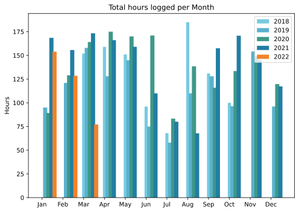
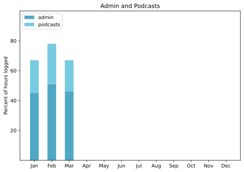

Where did the month go? This time I do know! To London, where I had a really good stay for two whole weeks. The longer stay made everything better. No pressure to be with some people all the time, which leads only to tension. Time to spend with friends I haven’t seen in an age. Time even to just walk around. What I realised more than anything was that I do not much want to move back to the UK. I want to be near to my friends.

===

## Highlights of the month:

- Bad news: a truck just touched me, damaging my wing mirror.
- Great visit to Capri (a first) and Naples (a reminder).
- Podcast scheduled a bit messed up; trying not to feel guilty.
- Booked the flights for our main summer trip.
- Told I have blepharitis and offered a cure, which works! No more itchy eyes.
- Stanley Tucci on Italy is a delight.
- Discovered a pretty good new (to me) streaming service.

### Activities

Nothing to report. 

#### March: 
* Walking with sticks: 0
* Reading: 19
* Steps (avge): 12,404
* Podcasts: 45 (36 of them [logged](https://www.jeremycherfas.net/stream/))
* In bed/asleep 8:25/7:24
* 7 Minutes: 6
* Weight (avge): 89.0
* Naps: 8

#### February: 
* Walking with sticks: 0
* Reading: 17
* Steps (avge): 9815
* Podcasts: 29 (21 of them [logged](https://www.jeremycherfas.net/stream/))
* In bed/asleep 8:32/7:30
* 7 Minutes: 9
* Weight (avge): 86.7
* Naps: 6

### Work

One awkward paying project, where some of the work I was doing has been transferred in-house, and in my opinion the results are not good. The problem is whether to even raise this. Probably best not to.

#### Hours logged per month

#### Percent of logged hours

Previous years are on [an archive page](https://jeremycherfas.net/blog/working-life).

### Goals

Only two new posts this month, and that is low, like everything else, because I was having too much fun. Old posts only 36, not because I was having fun, but possibly because I am exercising a little more decision-making. Who wants to read about decades-old struggles with a former CMS?

### Niggles

The laptop came with me to London as I had a bit of work to do, but despite my best efforts making sure it was up to date, it wasn’t. Partly this is because it is old, and partly because I do not know technically how to ensure that the desktop and the laptop share the same set of commands and preferences. May need to wait until I can afford a new laptop.

### Final remarks

A good month. April will be too.

----

## Here's the table

Click the triangle to see or hide the table

<table class="worktable">
<thead>
<tr>
<th style="text-align: right;" class="bigrow">Month</th>
<th style="text-align: center;" class="bigrow">Total</th>
<th style="text-align: center;" class="smallrow">Daily</th>
<th style="text-align: center;"class="smallrow">Admin %</th>
<th style="text-align: center;"class="smallrow">ETP %</th>
<th style="text-align: center;"class="smallrow">Other %</th>
</tr>
</thead>
<tbody>
<tr>
<td style="text-align: right;">2022-03</td>
<td style="text-align: center;">77.1</td>
<td style="text-align: center;">2.48</td>
<td style="text-align: center;">46</td>
<td style="text-align: center;">21</td>
<td style="text-align: center;">33</td>
</tr>
<tr>
<td style="text-align: right;">2022-02</td>
<td style="text-align: center;">128.5</td>
<td style="text-align: center;">4.62</td>
<td style="text-align: center;">51</td>
<td style="text-align: center;">27</td>
<td style="text-align: center;">22</td>
</tr>
<tr>
<td style="text-align: right;">2022-01</td>
<td style="text-align: center;">153.9</td>
<td style="text-align: center;">4.96</td>
<td style="text-align: center;">45</td>
<td style="text-align: center;">22</td>
<td style="text-align: center;">33</td>
</tr>
</tbody>
</table>

