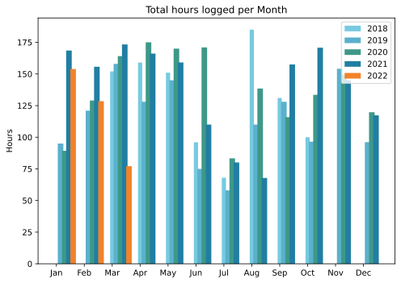

April is almost my favourite month, never standing still, the pace of change so rapid. On the terrace, dead sticks spring to life while the earliest flowers put on their show and quetly vanish. Slow heartbreaks too, like the avocado that I hoped might survive being potted on but really has not. Heartmakes, if such a thing exists, with the discovery of a score of tiny seedlings in one of the cactus pots, now duly pricked out and maybe even growing on. May brings different trials, most notably whether the irrigation can be made to work. But April, April sings.

===

## Highlights of the month:

- Some nice meals with friends
- School play of friends' daughter; good fun
- Yet another theatre; two in one year is excessive
- Read a wonderful book, Oceans of Grain, that is all over the news, but want to make more of it than that
- Snail hunts on rainy nights are so rewarding
- Made a fine Easter lunch; next time, get lamb from a halal butcher
- ”Dreadful diarrhoea and stomach cramps 2:30 to 4:30 and then a nightmare in which sick rats were gnawing at me. Woke up whimpering.”
- Wasted/not wasted so much time on merch
- Took the plunge and paid for Hazel, now slowly building up my rules
- Time Capsule died, so splurged on a new SSD for backups

### Activities

Gardening, mostly. 

#### April: 
* Walking with sticks: 0
* Reading: 17
* Steps (avge): 9595
* Podcasts: 45 (36 of them [logged](https://www.jeremycherfas.net/stream/))
* In bed/asleep 8:12/7:25
* 7 Minutes: 12
* Weight (avge): 88.5
* Naps: 3

#### March: 
* Walking with sticks: 0
* Reading: 19
* Steps (avge): 12,404
* Podcasts: 45 (36 of them [logged](https://www.jeremycherfas.net/stream/))
* In bed/asleep 8:25/7:24
* 7 Minutes: 6
* Weight (avge): 89.0
* Naps: 8

### Work

Got to love clients who postpone meetings with very little notice. No problem for them, they're sitting in their offices or in traffic anyway, but a drag for those of us who may have other things to do. That is just a minor hiccough though; all is mostly very good.

#### Hours logged per month

#### Percent of logged hours

Previous years are on [an archive page](https://jeremycherfas.net/blog/working-life).

### Goals

Only two new posts this month, and that is low, like everything else, because I was having too much fun. Old posts only 36, not because I was having fun, but possibly because I am exercising a little more decision-making. Who wants to read about decades-old struggles with a former CMS?

### Niggles

The laptop came with me to London as I had a bit of work to do, but despite my best efforts making sure it was up to date, it wasn’t. Partly this is because it is old, and partly because I do not know technically how to ensure that the desktop and the laptop share the same set of commands and preferences. May need to wait until I can afford a new laptop.

### Final remarks

A good month. April will be too.

----

## Here's the table

Click the triangle to see or hide the table

<table class="worktable">
<thead>
<tr>
<th style="text-align: right;" class="bigrow">Month</th>
<th style="text-align: center;" class="bigrow">Total</th>
<th style="text-align: center;" class="smallrow">Daily</th>
<th style="text-align: center;"class="smallrow">Admin %</th>
<th style="text-align: center;"class="smallrow">ETP %</th>
<th style="text-align: center;"class="smallrow">Other %</th>
</tr>
</thead>
<tbody>
<tr>
<td style="text-align: right;">2022-03</td>
<td style="text-align: center;">77.1</td>
<td style="text-align: center;">2.48</td>
<td style="text-align: center;">46</td>
<td style="text-align: center;">21</td>
<td style="text-align: center;">33</td>
</tr>
<tr>
<td style="text-align: right;">2022-02</td>
<td style="text-align: center;">128.5</td>
<td style="text-align: center;">4.62</td>
<td style="text-align: center;">51</td>
<td style="text-align: center;">27</td>
<td style="text-align: center;">22</td>
</tr>
<tr>
<td style="text-align: right;">2022-01</td>
<td style="text-align: center;">153.9</td>
<td style="text-align: center;">4.96</td>
<td style="text-align: center;">45</td>
<td style="text-align: center;">22</td>
<td style="text-align: center;">33</td>
</tr>
</tbody>
</table>

