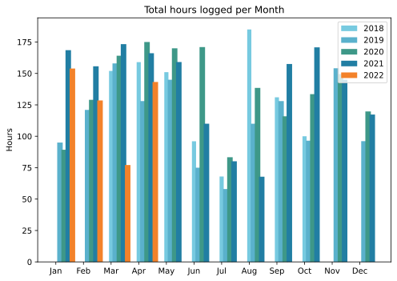

April is almost my favourite month, never standing still, the pace of change so rapid. On the terrace, dead sticks spring to life while the earliest flowers put on their show and quietly vanish. Slow heartbreaks too, like the avocado that I hoped might survive being potted on but really has not. Heartmakes, if such a thing exists, with the discovery of a score of tiny seedlings in one of the cactus pots, now duly pricked out and maybe even growing on. May brings different trials, most notably whether the irrigation can be made to work. But April, April sings.

===

## Highlights of the month:

- Some nice meals with friends
- School play of friends' daughter; good fun
- Yet another theatre; two in one year is excessive
- Read a wonderful book, Oceans of Grain, that is all over the news, but want to make more of it than that
- Snail hunts on rainy nights are so rewarding
- Made a fine Easter lunch; next time, get lamb from a halal butcher
- ”Dreadful diarrhoea and stomach cramps 2:30 to 4:30 and then a nightmare in which sick rats were gnawing at me. Woke up whimpering.”
- Wasted/not wasted so much time on merch
- Took the plunge and paid for Hazel, now slowly building up my rules
- Time Capsule died, so splurged on a new SSD for backups

### Activities

Gardening, mostly. And on the making life easier front, two good things. A couple of simple automations (Alfred) and the discovery of an Alfred workflow that totally mutes the adverts on Spotify. Bliss!

#### April: 
* Walking with sticks: 0
* Reading: 17
* Steps (avge): 9595
* Podcasts: 38 (32 of them [logged](https://www.jeremycherfas.net/stream/))
* In bed/asleep 8:12/7:25
* 7 Minutes: 12
* Weight (avge): 88.5
* Naps: 3

#### March: 
* Walking with sticks: 0
* Reading: 19
* Steps (avge): 12,404
* Podcasts: 45 (36 of them [logged](https://www.jeremycherfas.net/stream/))
* In bed/asleep 8:25/7:24
* 7 Minutes: 6
* Weight (avge): 89.0
* Naps: 8

### Work

Got to love clients who postpone meetings with very little notice. No problem for them, they're sitting in their offices or in traffic anyway, but a drag for those of us who may have other things to do. That is just a minor hiccough though; all is mostly very good. Two old clients asked me to submit proposals; not sure I want the work, but it is nice to be asked.

#### Hours logged per month

#### Percent of logged hours

Previous years are on [an archive page](https://jeremycherfas.net/blog/working-life).

### Goals

Ten new posts this month; I’m a machine, sometimes. Old posts 91 and 28 passed over, either because they are boringly about an old CMS or too many links are dead and there's no point.

### Niggles

Last month I almost decided that I needed a new laptop or, possibly, a proper iPad, but I didn't get either and I'm currently glad I didn't. Deciding between a top o’ th’ line iPad and a laptop could be tough, and I need more time. A normal iPad would probably do me as well in any case.

### Final remarks

Another good month. I made some progress trying to systematise my understanding of Python and zsh and need to keep at it.

----

## Here's the table

Click the triangle to see or hide the table

<table class="worktable">
<thead>
<tr>
<th style="text-align: right;" class="bigrow">Month</th>
<th style="text-align: center;" class="bigrow">Total</th>
<th style="text-align: center;" class="smallrow">Daily</th>
<th style="text-align: center;"class="smallrow">Admin %</th>
<th style="text-align: center;"class="smallrow">ETP %</th>
<th style="text-align: center;"class="smallrow">Other %</th>
</tr>
</thead>
<tbody>
<tr>
<td style="text-align: right;">04</td>
<td style="text-align: center;">143.2</td>
<td style="text-align: center;">5.11</td>
<td style="text-align: center;">49</td>
<td style="text-align: center;">29</td>
<td style="text-align: center;">22</td>
</tr>
<tr>
<td style="text-align: right;">03</td>
<td style="text-align: center;">77.1</td>
<td style="text-align: center;">2.48</td>
<td style="text-align: center;">46</td>
<td style="text-align: center;">21</td>
<td style="text-align: center;">33</td>
</tr>
<tr>
<td style="text-align: right;">02</td>
<td style="text-align: center;">128.5</td>
<td style="text-align: center;">4.62</td>
<td style="text-align: center;">51</td>
<td style="text-align: center;">27</td>
<td style="text-align: center;">22</td>
</tr>
<tr>
<td style="text-align: right;">2022-01</td>
<td style="text-align: center;">153.9</td>
<td style="text-align: center;">4.96</td>
<td style="text-align: center;">45</td>
<td style="text-align: center;">22</td>
<td style="text-align: center;">33</td>
</tr>
</tbody>
</table>

