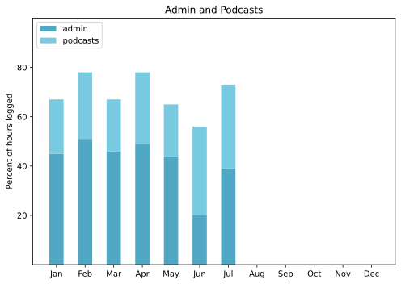

! This post was a mess, because my Python was a mess, because I know just enough to break things badly. I sort-of detoxified [my superfund site](https://imgs.xkcd.com/comics/python_environment_2x.png) and now I think I need to nuke Anaconda from space and try to live with what I have learned.

No excuses. Well, plenty of them, actually, including trips to London and the USA, during which I resolved not to clutter my life with doing things for the sake of it. So, I did some things I needed to do, but not things I might have wanted to do had I been at home. As a result, there’s a big chunk not accounted from, from roughly 20 June to 20 July. And I don’t care. Much.

===

## Highlights of the months:

- Trips to London and the USA
- Strong work on the podcast series from _Oceans of Grain_

### Activities

Life on the terrace seemed to flourish while we were gone. Hot as Hades on our return, so reset the alarm to 6:00 am and did an hour tidying up plants in the morning for the first week or so. Two trips to the lake since our return, which remains blissful.

#### May, June, July (approx): 
* Walking with sticks: 1
* Reading: 32
* Steps (avge): 10571, 8982, 7757
* Podcasts: 75 (37, 23, 13 (73) of them [logged](https://www.jeremycherfas.net/stream/))
* In bed/asleep 8:12/7:17, 8:16/6:39, 7:53/6:35
* 7 Minutes: 17
* Weight (avge): 88.8, 87.4, 89.5
* Naps: 40

#### April: 
* Walking with sticks: 0
* Reading: 17
* Steps (avge): 9595
* Podcasts: 38 (32 of them [logged](https://www.jeremycherfas.net/stream/))
* In bed/asleep 8:12/7:25
* 7 Minutes: 12
* Weight (avge): 88.5
* Naps: 3

### Work

Not too much, discharged with pleasure. And still taking it very easy.

#### Hours logged per month

#### Percent of logged hours

Previous years are on [an archive page](https://jeremycherfas.net/blog/working-life).

### Goals

New posts: 9 in May, 4 each in June and July. Old posts 44 in June and 72 in May, with 27 passed over because they are boringly about an old CMS or too many links are dead and there's no point. Not caring about daily chores while on holiday means that I’m still working on old posts from Julys past.

### Niggles

I took the new to me iPad on holiday and barely used it. Real work still, in my mind, needs the laptop, which I also took. I’m now tilting more in the direction of a new laptop, though the iPad is very spiffy for reading books and stuff.

### Final remarks

It’s been fun.

----

## Here's the table

Click the triangle to see or hide the table

<table class="worktable">
<thead>
<tr>
<th style="text-align: right;" class="bigrow">Month</th>
<th style="text-align: center;" class="bigrow">Total</th>
<th style="text-align: center;" class="smallrow">Daily</th>
<th style="text-align: center;"class="smallrow">Admin %</th>
<th style="text-align: center;"class="smallrow">ETP %</th>
<th style="text-align: center;"class="smallrow">Other %</th>
</tr>
</thead>
<tbody>
<tr>
<td style="text-align: right;">07</td>
<td style="text-align: center;">52.8</td>
<td style="text-align: center;">1.70</td>
<td style="text-align: center;">39</td>
<td style="text-align: center;">34</td>
<td style="text-align: center;">27</td>
</tr>
<tr>
<td style="text-align: right;">06</td>
<td style="text-align: center;">73.25</td>
<td style="text-align: center;">2.44</td>
<td style="text-align: center;">20</td>
<td style="text-align: center;">36</td>
<td style="text-align: center;">44</td>
</tr>
<tr>
<td style="text-align: right;">05</td>
<td style="text-align: center;">97.1</td>
<td style="text-align: center;">3.13</td>
<td style="text-align: center;">44</td>
<td style="text-align: center;">21</td>
<td style="text-align: center;">35</td>
</tr>
<tr>
<td style="text-align: right;">04</td>
<td style="text-align: center;">143.2</td>
<td style="text-align: center;">5.11</td>
<td style="text-align: center;">49</td>
<td style="text-align: center;">29</td>
<td style="text-align: center;">22</td>
</tr>
<tr>
<td style="text-align: right;">03</td>
<td style="text-align: center;">77.1</td>
<td style="text-align: center;">2.48</td>
<td style="text-align: center;">46</td>
<td style="text-align: center;">21</td>
<td style="text-align: center;">33</td>
</tr>
<tr>
<td style="text-align: right;">02</td>
<td style="text-align: center;">128.5</td>
<td style="text-align: center;">4.62</td>
<td style="text-align: center;">51</td>
<td style="text-align: center;">27</td>
<td style="text-align: center;">22</td>
</tr>
<tr>
<td style="text-align: right;">2022-01</td>
<td style="text-align: center;">153.9</td>
<td style="text-align: center;">4.96</td>
<td style="text-align: center;">45</td>
<td style="text-align: center;">22</td>
<td style="text-align: center;">33</td>
</tr>
</tbody>
</table>

