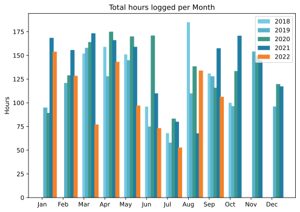
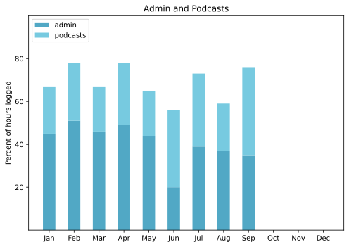

The best news, in a way, is that summer is very definitely over. We have enjoyed some excellent rain, both thunderous downpours and more gentle soaks and the park is greening up nicely as a result. It is still warm though, so the terrace plants are doing really well. Launched the new season of Eat This Podcast to an uptick in downloads but a downturn in subscribers. Truly, I have no idea what makes sense any more, so I'll just keep plodding along.

===

## Highlights of the months:

- Swam 1km almost every day while cat-sitting, and resolved to continue, but
- Had a suspect mole removed, which I then had to keep dry.
- I won't say QE2 dying was a highlight, but it was interesting.
- The giant blowsy hibiscus had a seedpod that contained seeds.
- Made some [lime pickle](https://jeremycherfas.net/blog/homemade-lime-pickle).
- Shared my first public Alfred workflow, to [smartify quotes](https://github.com/jeremycherfas/alfred-smartify-quotes).
- Stonkingly good six-course tasting menu at a swanky hotel, a parting gift from The Squeeze's colleagues.
- Excellent visit from one of my most durable friends.
- Created podcast music that sounds like … music!

### Activities

Managed to sustain reading and napping, and got some walking with sticks done into the bargain. I keep thinking about getting the Brompton tuned up again because the busses have been shite lately, but the old bike shop seems to have closed some time during the pandemic..

#### September: 
* Walking with sticks: 4
* Reading: 25
* Steps (avge): 7916
* Podcasts: 35 (33 of them [logged](https://www.jeremycherfas.net/stream/))
* In bed/asleep 8:13/7:04
* 7 Minutes: 8
* Weight (avge): 89.1
* Naps: 23

#### August: 
* Walking with sticks: 0
* Reading: 25
* Steps (avge): 7652
* Podcasts: 34 (all of them [logged](https://www.jeremycherfas.net/stream/))
* In bed/asleep 7:21/6:18
* 7 Minutes: 9
* Weight (avge): 88.3
* Naps: 28

### Work

I did a bit. Had one offer turned down, because they wabnted it more urgently than I was able, and that felt absolutely fine.

#### Hours logged per month

#### Percent of logged hours

Previous years are on [an archive page](https://jeremycherfas.net/blog/working-life).

### Goals

Only four new posts this month, but that's OK.

### Niggles

I sort of decided on a new MacBook Air, but I haven't actually done anything about it, which is stupid as I will be travelling quite a bit at the end of this month and beginning of next, so I need to time to get it organised.

### Final remarks

Life continues to be very good, although at times like this, when friends have passed through, I feel the lack a bit more than usual.

----

## Here's the table

Click the triangle to see or hide the table

<table class="worktable">
<thead>
<tr>
<th style="text-align: right;" class="bigrow">Month</th>
<th style="text-align: center;" class="bigrow">Total</th>
<th style="text-align: center;" class="smallrow">Daily</th>
<th style="text-align: center;"class="smallrow">Admin %</th>
<th style="text-align: center;"class="smallrow">ETP %</th>
<th style="text-align: center;"class="smallrow">Other %</th>
</tr>
</thead>
<tbody>
<tr>
<td style="text-align: right;">09</td>
<td style="text-align: center;">106.33</td>
<td style="text-align: center;">4.1</td>
<td style="text-align: center;">35</td>
<td style="text-align: center;">41</td>
<td style="text-align: center;">34</td>
</tr>
<tr>
<td style="text-align: right;">08</td>
<td style="text-align: center;">134.02</td>
<td style="text-align: center;">4.28</td>
<td style="text-align: center;">37</td>
<td style="text-align: center;">22</td>
<td style="text-align: center;">41</td>
</tr>
<tr>
<td style="text-align: right;">07</td>
<td style="text-align: center;">52.8</td>
<td style="text-align: center;">1.70</td>
<td style="text-align: center;">39</td>
<td style="text-align: center;">34</td>
<td style="text-align: center;">27</td>
</tr>
<tr>
<td style="text-align: right;">06</td>
<td style="text-align: center;">73.25</td>
<td style="text-align: center;">2.44</td>
<td style="text-align: center;">20</td>
<td style="text-align: center;">36</td>
<td style="text-align: center;">44</td>
</tr>
<tr>
<td style="text-align: right;">05</td>
<td style="text-align: center;">97.1</td>
<td style="text-align: center;">3.13</td>
<td style="text-align: center;">44</td>
<td style="text-align: center;">21</td>
<td style="text-align: center;">35</td>
</tr>
<tr>
<td style="text-align: right;">04</td>
<td style="text-align: center;">143.2</td>
<td style="text-align: center;">5.11</td>
<td style="text-align: center;">49</td>
<td style="text-align: center;">29</td>
<td style="text-align: center;">22</td>
</tr>
<tr>
<td style="text-align: right;">03</td>
<td style="text-align: center;">77.1</td>
<td style="text-align: center;">2.48</td>
<td style="text-align: center;">46</td>
<td style="text-align: center;">21</td>
<td style="text-align: center;">33</td>
</tr>
<tr>
<td style="text-align: right;">02</td>
<td style="text-align: center;">128.5</td>
<td style="text-align: center;">4.62</td>
<td style="text-align: center;">51</td>
<td style="text-align: center;">27</td>
<td style="text-align: center;">22</td>
</tr>
<tr>
<td style="text-align: right;">2022-01</td>
<td style="text-align: center;">153.9</td>
<td style="text-align: center;">4.96</td>
<td style="text-align: center;">45</td>
<td style="text-align: center;">22</td>
<td style="text-align: center;">33</td>
</tr>
</tbody>
</table>

