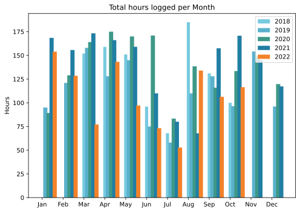
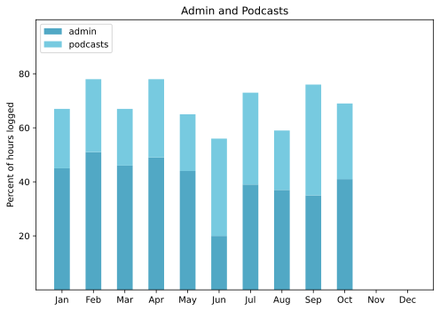

Travellin’ Man: Just back from a train trip to Budapest, just off on a flight to the west of England. This update will of necessity be brief.

Also, I’ve concluded that I do indeed know just enough to be dangerous when it comes to Python and Perl. Advice will be sought. 

===

## Highlights of the month:

- The aforementioned trip to Budapest, despite the train connections not being quite up to scratch.
- Potted on a bunch of lily offsets; patience will be needed.
- Finished (maybe?) a website for the most technologically challenged friend I have.
- Got the Brompton out and serviced; like new, the man said.
- New MacBook. Wonderful, but.
- Got boosted, for a total of four shots now.

### Activities

All good. Pleasantly surprised by the uptick in steps walked with no extra effort on my part. Downtick in weight surely a coincidence. Despite HIIT supposedly being the ultimate in portable regimes, I never do it while travelling.

#### October: 
* Walking with sticks: 3
* Reading: 13
* Steps (avge): 9177
* Podcasts: 33 (All of them [logged](https://www.jeremycherfas.net/stream/))
* In bed/asleep 8:12/7:04
* 7 Minutes: 7
* Weight (avge): 87.6
* Naps: 16

#### September: 
* Walking with sticks: 4
* Reading: 25
* Steps (avge): 7916
* Podcasts: 35 (33 of them [logged](https://www.jeremycherfas.net/stream/))
* In bed/asleep 8:13/7:04
* 7 Minutes: 8
* Weight (avge): 89.1
* Naps: 23

### Work

I did a bit. The life of the consultant: they pay me goodish money to offer advice, which they then ignore, and I get used to it. Couldn’t we just cut out the middleman and have them pay me without me having to offer advice?

#### Hours logged per month

#### Percent of logged hours

Previous years are on [an archive page](https://jeremycherfas.net/blog/working-life).

### Goals

Five new posts this month, which is fine. Have not yet embarked on anything new that requires doing something every day.

### Niggles

Although I have made some progress on actually programming things I want to, I increasingly find myself performing voodoo magic incantations to get things to work, and then giving up when the incantations fail to have the desired effect. The new MBA made this painfully obvious, as I tried to get the Perl script that shows me visitors to my websites to work. Flummoxed at every turn. Then the same sort of thing happened on the iMac. Python is a mess again too, and I haven’t even started to put Python onto the MacBook. I’m coming to the conclusion that I ought to clean out all instances of everything — Perl, Python, maybe even MAMP — and start from scratch. I mean, how hard can that be? And it isn’t as if I need to be all that careful about dependencies and so on because I am not planning to publish anything.

### Final remarks

October has continued to offer simply fabulous weather, and at times it seems like the climate reckoning is far, far away. It isn’t.

——

## Here’s the table

Click the triangle to see or hide the table

<table class="worktable">
<thead>
<tr>
<th style="text-align: right;" class="bigrow">Month</th>
<th style="text-align: center;" class="bigrow">Total</th>
<th style="text-align: center;" class="smallrow">Daily</th>
<th style="text-align: center;"class="smallrow">Admin %</th>
<th style="text-align: center;"class="smallrow">ETP %</th>
<th style="text-align: center;"class="smallrow">Other %</th>
</tr>
</thead>
<tbody>
<tr>
<td style="text-align: right;">10</td>
<td style="text-align: center;">116.50</td>
<td style="text-align: center;">5.0</td>
<td style="text-align: center;">40</td>
<td style="text-align: center;">28</td>
<td style="text-align: center;">32</td>
</tr>
<tr>
<td style="text-align: right;">09</td>
<td style="text-align: center;">106.33</td>
<td style="text-align: center;">4.1</td>
<td style="text-align: center;">35</td>
<td style="text-align: center;">41</td>
<td style="text-align: center;">34</td>
</tr>
<tr>
<td style="text-align: right;">08</td>
<td style="text-align: center;">134.02</td>
<td style="text-align: center;">4.28</td>
<td style="text-align: center;">37</td>
<td style="text-align: center;">22</td>
<td style="text-align: center;">41</td>
</tr>
<tr>
<td style="text-align: right;">07</td>
<td style="text-align: center;">52.8</td>
<td style="text-align: center;">1.70</td>
<td style="text-align: center;">39</td>
<td style="text-align: center;">34</td>
<td style="text-align: center;">27</td>
</tr>
<tr>
<td style="text-align: right;">06</td>
<td style="text-align: center;">73.25</td>
<td style="text-align: center;">2.44</td>
<td style="text-align: center;">20</td>
<td style="text-align: center;">36</td>
<td style="text-align: center;">44</td>
</tr>
<tr>
<td style="text-align: right;">05</td>
<td style="text-align: center;">97.1</td>
<td style="text-align: center;">3.13</td>
<td style="text-align: center;">44</td>
<td style="text-align: center;">21</td>
<td style="text-align: center;">35</td>
</tr>
<tr>
<td style="text-align: right;">04</td>
<td style="text-align: center;">143.2</td>
<td style="text-align: center;">5.11</td>
<td style="text-align: center;">49</td>
<td style="text-align: center;">29</td>
<td style="text-align: center;">22</td>
</tr>
<tr>
<td style="text-align: right;">03</td>
<td style="text-align: center;">77.1</td>
<td style="text-align: center;">2.48</td>
<td style="text-align: center;">46</td>
<td style="text-align: center;">21</td>
<td style="text-align: center;">33</td>
</tr>
<tr>
<td style="text-align: right;">02</td>
<td style="text-align: center;">128.5</td>
<td style="text-align: center;">4.62</td>
<td style="text-align: center;">51</td>
<td style="text-align: center;">27</td>
<td style="text-align: center;">22</td>
</tr>
<tr>
<td style="text-align: right;">2022-01</td>
<td style="text-align: center;">153.9</td>
<td style="text-align: center;">4.96</td>
<td style="text-align: center;">45</td>
<td style="text-align: center;">22</td>
<td style="text-align: center;">33</td>
</tr>
</tbody>
</table>

