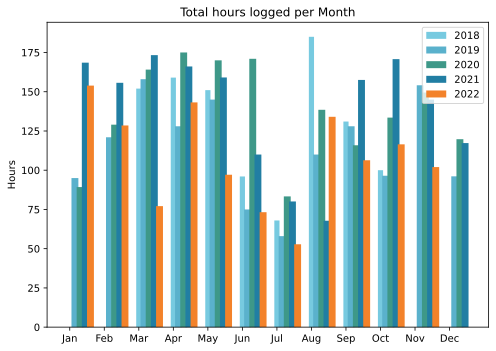
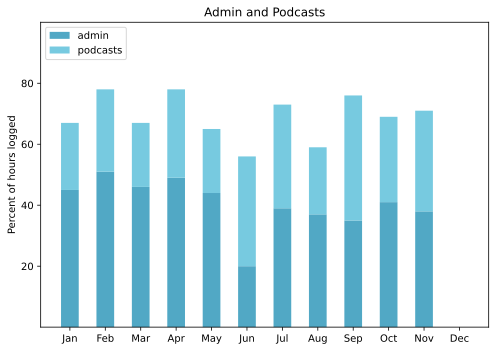

A rather fine month, overall, making slow and solid progress on a couple of fronts.

===

## Highlights of the month:

- Brief trip to the UK to see family, including a fine Guy Fawkes night
- Enjoying the Brompton
- Some good evenings out, drinking a cocktail and chatting
- Fine Raoul Dufy show in Rome
- A silent auction, at which The Squeeze sold a painting
- Finally moved in on the sore neck with a great massage and new exercises
- Marmalade
- A huge challah for Thanksgiving, which was well received
- Resumed Vaviblog

### Activities

More bedtime, as befits the winter. Podcasts down a bit, thanks to traveling and busyness.

#### November: 
* Walking with sticks: 1
* Reading: 17
* Steps (avge): 8517
* Podcasts: 26 (All of them [logged](https://www.jeremycherfas.net/stream/))
* In bed/asleep 8:15/7:25
* 7 Minutes: 8
* Weight (avge): 88.3
* Naps: 10

#### October: 
* Walking with sticks: 3
* Reading: 13
* Steps (avge): 9177
* Podcasts: 33 (All of them [logged](https://www.jeremycherfas.net/stream/))
* In bed/asleep 8:12/7:04
* 7 Minutes: 7
* Weight (avge): 87.6
* Naps: 16

### Work

An interesting topic this month, in unexpected ways. The Italian tax system being what it is, midway through the month, when I paid my final installment, I came to the conclusion that I really didn’t have a clue what was going on, so I arranged a meeting with a Man Who Knows. At the end of that, I had accepted that I really don’t **need** to work for money. If I want to, because the work is particularly interesting, fine. But there is no necessity. And that immediately triggered me, on the last day of the month, to plunge into a project that I’ve talked endlessly about — and done nothing about — since 2015. It’s almost as if a barrier were lifted. Will it last? I think it will, although there will be nothing to show for it until January at the earliest. I’m tempted, aping the [marvellous Phil Gyford](https://ooh.directory/blog/2022/welcome/), to refer to it as *$project* if I decide to chart my journey.

Even before that, though, the lack of paid work, rather than being a source of distress, was a source of joy as it allowed me to devote time not only to the podcast but also to work on my [current Python project](https://www.jeremycherfas.net/blog/mapping-my-future) slowly, incrementally and with more effort actually to understand.

#### Hours logged per month

#### Percent of logged hours

Previous years are on [an archive page](https://jeremycherfas.net/blog/working-life).

### Goals

Six posts, one of which (gasp!) was a somewhat skimpy Photo post. 

### Niggles

I have nothing to complain, whine or even protest mildly about. That’s a good thing, right?

### Final remarks

A good month, and given that December will undoutedly be short on content, one that presages a change in gear for 2023.

——

## Here’s the table

Click the triangle to see or hide the table

<table class="worktable">
<thead>
<tr>
<th style="text-align: right;" class="bigrow">Month</th>
<th style="text-align: center;" class="bigrow">Total</th>
<th style="text-align: center;" class="smallrow">Daily</th>
<th style="text-align: center;"class="smallrow">Admin %</th>
<th style="text-align: center;"class="smallrow">ETP %</th>
<th style="text-align: center;"class="smallrow">Other %</th>
</tr>
</thead>
<tbody>
<tr>
<td style="text-align: right;">11</td>
<td style="text-align: center;">102.0</td>
<td style="text-align: center;">4.5</td>
<td style="text-align: center;">38</td>
<td style="text-align: center;">33</td>
<td style="text-align: center;">29</td>
</tr>
<tr>
<td style="text-align: right;">10</td>
<td style="text-align: center;">116.50</td>
<td style="text-align: center;">5.0</td>
<td style="text-align: center;">40</td>
<td style="text-align: center;">28</td>
<td style="text-align: center;">32</td>
</tr>
<tr>
<td style="text-align: right;">09</td>
<td style="text-align: center;">106.33</td>
<td style="text-align: center;">4.1</td>
<td style="text-align: center;">35</td>
<td style="text-align: center;">41</td>
<td style="text-align: center;">34</td>
</tr>
<tr>
<td style="text-align: right;">08</td>
<td style="text-align: center;">134.02</td>
<td style="text-align: center;">4.28</td>
<td style="text-align: center;">37</td>
<td style="text-align: center;">22</td>
<td style="text-align: center;">41</td>
</tr>
<tr>
<td style="text-align: right;">07</td>
<td style="text-align: center;">52.8</td>
<td style="text-align: center;">1.70</td>
<td style="text-align: center;">39</td>
<td style="text-align: center;">34</td>
<td style="text-align: center;">27</td>
</tr>
<tr>
<td style="text-align: right;">06</td>
<td style="text-align: center;">73.25</td>
<td style="text-align: center;">2.44</td>
<td style="text-align: center;">20</td>
<td style="text-align: center;">36</td>
<td style="text-align: center;">44</td>
</tr>
<tr>
<td style="text-align: right;">05</td>
<td style="text-align: center;">97.1</td>
<td style="text-align: center;">3.13</td>
<td style="text-align: center;">44</td>
<td style="text-align: center;">21</td>
<td style="text-align: center;">35</td>
</tr>
<tr>
<td style="text-align: right;">04</td>
<td style="text-align: center;">143.2</td>
<td style="text-align: center;">5.11</td>
<td style="text-align: center;">49</td>
<td style="text-align: center;">29</td>
<td style="text-align: center;">22</td>
</tr>
<tr>
<td style="text-align: right;">03</td>
<td style="text-align: center;">77.1</td>
<td style="text-align: center;">2.48</td>
<td style="text-align: center;">46</td>
<td style="text-align: center;">21</td>
<td style="text-align: center;">33</td>
</tr>
<tr>
<td style="text-align: right;">02</td>
<td style="text-align: center;">128.5</td>
<td style="text-align: center;">4.62</td>
<td style="text-align: center;">51</td>
<td style="text-align: center;">27</td>
<td style="text-align: center;">22</td>
</tr>
<tr>
<td style="text-align: right;">2022-01</td>
<td style="text-align: center;">153.9</td>
<td style="text-align: center;">4.96</td>
<td style="text-align: center;">45</td>
<td style="text-align: center;">22</td>
<td style="text-align: center;">33</td>
</tr>
</tbody>
</table>

