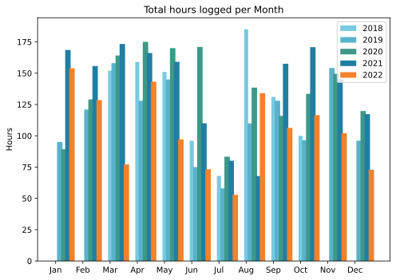
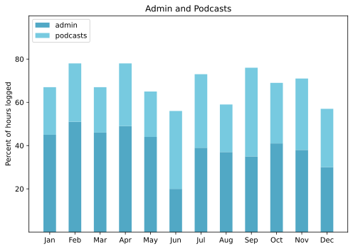

Only half a month, really, because we were on holiday from the 16th and there isn't much from that time that I care to share.

===

## Highlights of the month:

- Flu jab
- Second loosening massage
- Client website seems to have satisfied client, for now
- Digital hearing aids FTW
- Catalytic converter stolen
- Much time (too much time?) at the National Gallery of Art
- Fun 5km walk from Arlington to Shirlington

### Activities

Even more bedtime, as befits the winter. Podcasts down a lot, while travelling.

#### December: 
* Walking with sticks: 0
* Reading: 25
* Steps (avge): 8810
* Podcasts: 14 (12 of them [logged](https://www.jeremycherfas.net/stream/))
* In bed/asleep 8:36/7:48
* 7 Minutes: 6
* Weight (avge): 88.5
* Naps: 9

#### November: 
* Walking with sticks: 1
* Reading: 17
* Steps (avge): 8517
* Podcasts: 26 (All of them [logged](https://www.jeremycherfas.net/stream/))
* In bed/asleep 8:15/7:25
* 7 Minutes: 8
* Weight (avge): 88.3
* Naps: 10

### Work

Two teeny bits of client work, the lack of which remains a source of joy. Good and busy nevertheless, at least during the first half of the month.

#### Hours logged per month

#### Percent of logged hours

Previous years are on [an archive page](https://jeremycherfas.net/blog/working-life).

### Goals

Two posts, which is OK for half a month. Continued to work on `$project` and a couple of other things, including a podcast episode that pleased me enormously, even though I did rather drop it into a void on Christmas Eve.

### Niggles

None, although in 2023 I want to reconsider how I do various bits of monitoring myself.

### Final remarks

A good half month, looking forward now to 2023.

——

## Here’s the table

Click the triangle to see or hide the table

<table class="worktable">
<thead>
<tr>
<th style="text-align: right;" class="bigrow">Month</th>
<th style="text-align: center;" class="bigrow">Total</th>
<th style="text-align: center;" class="smallrow">Daily</th>
<th style="text-align: center;"class="smallrow">Admin %</th>
<th style="text-align: center;"class="smallrow">ETP %</th>
<th style="text-align: center;"class="smallrow">Other %</th>
</tr>
</thead>
<tbody>
<tr>
<td style="text-align: right;">12</td>
<td style="text-align: center;">72.9</td>
<td style="text-align: center;">4.86</td>
<td style="text-align: center;">30</td>
<td style="text-align: center;">27</td>
<td style="text-align: center;">43</td>
</tr>
<tr>
<td style="text-align: right;">11</td>
<td style="text-align: center;">102.0</td>
<td style="text-align: center;">4.5</td>
<td style="text-align: center;">38</td>
<td style="text-align: center;">33</td>
<td style="text-align: center;">29</td>
</tr>
<tr>
<td style="text-align: right;">10</td>
<td style="text-align: center;">116.50</td>
<td style="text-align: center;">5.0</td>
<td style="text-align: center;">40</td>
<td style="text-align: center;">28</td>
<td style="text-align: center;">32</td>
</tr>
<tr>
<td style="text-align: right;">09</td>
<td style="text-align: center;">106.33</td>
<td style="text-align: center;">4.1</td>
<td style="text-align: center;">35</td>
<td style="text-align: center;">41</td>
<td style="text-align: center;">34</td>
</tr>
<tr>
<td style="text-align: right;">08</td>
<td style="text-align: center;">134.02</td>
<td style="text-align: center;">4.28</td>
<td style="text-align: center;">37</td>
<td style="text-align: center;">22</td>
<td style="text-align: center;">41</td>
</tr>
<tr>
<td style="text-align: right;">07</td>
<td style="text-align: center;">52.8</td>
<td style="text-align: center;">1.70</td>
<td style="text-align: center;">39</td>
<td style="text-align: center;">34</td>
<td style="text-align: center;">27</td>
</tr>
<tr>
<td style="text-align: right;">06</td>
<td style="text-align: center;">73.25</td>
<td style="text-align: center;">2.44</td>
<td style="text-align: center;">20</td>
<td style="text-align: center;">36</td>
<td style="text-align: center;">44</td>
</tr>
<tr>
<td style="text-align: right;">05</td>
<td style="text-align: center;">97.1</td>
<td style="text-align: center;">3.13</td>
<td style="text-align: center;">44</td>
<td style="text-align: center;">21</td>
<td style="text-align: center;">35</td>
</tr>
<tr>
<td style="text-align: right;">04</td>
<td style="text-align: center;">143.2</td>
<td style="text-align: center;">5.11</td>
<td style="text-align: center;">49</td>
<td style="text-align: center;">29</td>
<td style="text-align: center;">22</td>
</tr>
<tr>
<td style="text-align: right;">03</td>
<td style="text-align: center;">77.1</td>
<td style="text-align: center;">2.48</td>
<td style="text-align: center;">46</td>
<td style="text-align: center;">21</td>
<td style="text-align: center;">33</td>
</tr>
<tr>
<td style="text-align: right;">02</td>
<td style="text-align: center;">128.5</td>
<td style="text-align: center;">4.62</td>
<td style="text-align: center;">51</td>
<td style="text-align: center;">27</td>
<td style="text-align: center;">22</td>
</tr>
<tr>
<td style="text-align: right;">2022-01</td>
<td style="text-align: center;">153.9</td>
<td style="text-align: center;">4.96</td>
<td style="text-align: center;">45</td>
<td style="text-align: center;">22</td>
<td style="text-align: center;">33</td>
</tr>
</tbody>
</table>

