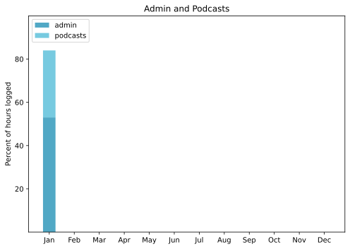

Still surprising how quickly a month can go by. Yes, there was a trip away for a week, and that speeds things up, but still, how is already February?

===

## Highlights of the month:

- Aforementioned trip to the UK
- With a wonderful, freezing, day in Margate
- And a great Cezanne show at the Tate
- End of year clean up, always feels good
- La Befana with friends here
- Bad sore throat and long lingering chesty cough, not actually a highlight, but
- Dentist and doctor checkups
- Updated to Ventura

### Activities

Bedtime mostly constant, podcast up, natch.

#### January: 
* Walking with sticks: 0
* Reading: 14
* Steps (avge): 8868
* Podcasts: 21 (18 of them [logged](https://www.jeremycherfas.net/stream/))
* In bed/asleep 8:38/7:54
* 7 Minutes: 0 (Just as soon as I can breathe again …)
* Weight (avge): 87.9
* Naps: 8

#### December: 
* Walking with sticks: 0
* Reading: 25
* Steps (avge): 8810
* Podcasts: 14 (12 of them [logged](https://www.jeremycherfas.net/stream/))
* In bed/asleep 8:36/7:48
* 7 Minutes: 6
* Weight (avge): 88.5
* Naps: 9

### Work

Very little client work, still a joy. Good and busy nevertheless, reading, podcasting, doing fun things (and learning) with Python. Missed a soft launch date for `$project` but not too concerned as long as it does keep moving along.

I had meant to think about this in better time (and said so in December's roundup), but it seems that I need to rethink these graphs a bit. With five years worth of data, the oldest year should probably fall off this first graph, though I'll keep all the data to update the annual summary. And maybe the logged hours should become a bit more granular; reflecting some of the other things that I hope I am being more conscientious about. No time for that now, but I can always come back and revise.

#### Hours logged per month

#### Percent of logged hours

Previous years are on [an archive page](https://jeremycherfas.net/blog/working-life).

### Goals

Four posts, which is less than I had hoped for, especially as two were roundups. Continued to work on `$project` and read a lot of fun books.

### Niggles

This remains true from December:

> None, although in 2023 I want to reconsider how I do various bits of monitoring myself.

### Final remarks

Good and bad, in parts, with some poor health and some dismal weather that made getting anything done even harder. Lying under a blanket and reading is just so much more rewarding, at least in the short term.

——

## Here’s the table

Click the triangle to see or hide the table

<table class="worktable">
<thead>
<tr>
<th style="text-align: right;" class="bigrow">Month</th>
<th style="text-align: center;" class="bigrow">Total</th>
<th style="text-align: center;" class="smallrow">Daily</th>
<th style="text-align: center;"class="smallrow">Admin %</th>
<th style="text-align: center;"class="smallrow">ETP %</th>
<th style="text-align: center;"class="smallrow">Other %</th>
</tr>
</thead>
<tbody>
<tr>
<td style="text-align: right;">2023-01</td>
<td style="text-align: center;">101.0</td>
<td style="text-align: center;">4.8</td>
<td style="text-align: center;">53</td>
<td style="text-align: center;">31</td>
<td style="text-align: center;">16</td>
</tr>
</tbody>
</table>

