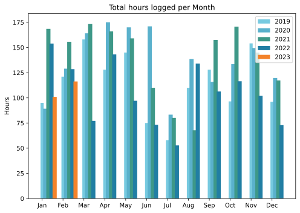
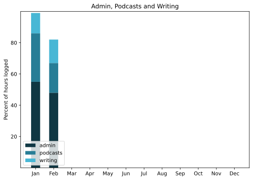

Last month I worried about how fast January had sped by. This time it is February's turn, although for a short month, I did get quite a bit done.

===

## Highlights of the month:

- Breakthrough in bread baking; I can fit two Dutch ovens in at once
- Fun outing to Anzio on a beautiful clear day
- Another good outing to Bologna to meet good friends
- Went on an organised bike ride and loved it
- Had my first ever MRI; strangely stressful _after_ the event
- Thought about Eat This Podcast strategy and started a redesign

### Activities

Bed time consistent, sleep declined, podcasts up, steps down. But cycling!

#### February: 
* Walking with sticks: 0
* Reading: 20
* Steps (avge): 8487
* Podcasts: 27 (25 of them [logged](https://www.jeremycherfas.net/stream/))
* In bed/asleep 8:40/7:40
* 7 Minutes: 6 days
* Cycled: 6 days
* Weight (avge): 87.2
* Naps: 9

#### January: 
* Walking with sticks: 0
* Reading: 14
* Steps (avge): 8868
* Podcasts: 21 (18 of them [logged](https://www.jeremycherfas.net/stream/))
* In bed/asleep 8:38/7:54
* 7 Minutes: 0 (Just as soon as I can breathe again …)
* Weight (avge): 87.9
* Naps: 8

### ~~Work~~ Stuff Done

Changing the crosshead here to better reflect how I feel about how I pass my time these days. In the past, I always said that I got paid money for some of the work I did, and not for the rest, and it was all work. I could continue to say that, but in my heart I know that work I am paid for is somehow “better” than work I do for myself, even though in my head I know that to be false. So maybe better to go with my head and just think about the things I’ve done. I could even say _achieved_, although that smacks of smugitude.

So, what have I done?

Well, I whipped my Python workplaces into shape, although I didn’t do much more than that. I read a bunch of books and saw a few movies _at the cinema_! Probably the best thing I did was buy a bike repair stand, which I should have done years ago, and rediscover my tribe: I am an [UnRacer](https://www.rivbike.com/pages/the-efficiency-ruse). 

It is impossible to believe how much easier it is to do almost anything with the bike off the ground. Of course, that meant getting lost in YouTube videos ([Calvin Jones at Park Tool](https://www.youtube.com/results?search_query=calvin+park+tool) is my new hero) and having to take notes, because there’s no way to watch them where the bike it, but the end result is that front and rear derailleurs are swift and slick now, which they have not been for a while. All of which made me look longingly again at my old, steel, Raleigh, bought in early 1980 and unloved since about 2005. Restoring that — not completely, but at least to get it on the road and running smoothly — is absolutely a thing I want to do next. 

#### Hours logged per month

#### Percent of logged hours

Previous years are on [an archive page](https://jeremycherfas.net/blog/working-life).

As threatened, I have expanded this plot to include a category that I log as writing, which is not all fingers hammering on keys but is mostly to do with putting things online (or in a notebook). The rest is probably work for money.

### Goals

Only three posts, which is even less than I had hoped for a month ago. I did continue to work on `$project` and read a lot of fun books.

### Niggles

None, really. Which is nice

### Final remarks

It was really good to get back on my bike seriously and to take a break from podcasting in order to think about podcasting.

——

## Here’s the table

Click the triangle to see or hide the table

<table class="worktable">
<thead>
<tr>
<th style="text-align: right;" class="bigrow">Month</th>
<th style="text-align: center;" class="bigrow">Total</th>
<th style="text-align: center;" class="smallrow">Daily</th>
<th style="text-align: center;"class="smallrow">Admin %</th>
<th style="text-align: center;"class="smallrow">ETP %</th>
<th style="text-align: center;"class="smallrow">Writing %</th>
<th style="text-align: center;"class="smallrow">Other %</th>
</tr>
</thead>
<tbody>
<tr>
<td style="text-align: right;">02</td>
<td style="text-align: center;">116.3</td>
<td style="text-align: center;">4.8</td>
<td style="text-align: center;">48</td>
<td style="text-align: center;">19</td>
<td style="text-align: center;">15</td>
<td style="text-align: center;">18</td>
</tr>

<tr>
<td style="text-align: right;">2023-01</td>
<td style="text-align: center;">101.0</td>
<td style="text-align: center;">4.8</td>
<td style="text-align: center;">53</td>
<td style="text-align: center;">31</td>
<td style="text-align: center;">13</td>
<td style="text-align: center;">3</td>
</tr>
</tbody>
</table>

