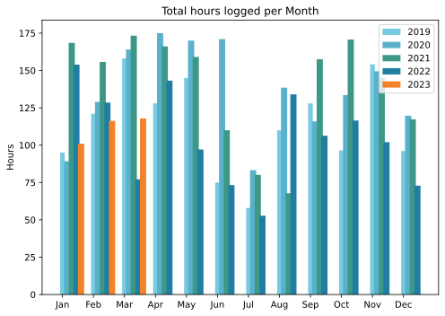
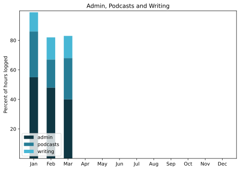

March slowed down slightly, perhaps because I had more, not less, to do. This post, for example, is a bit late because I have to get ready for a brief trip over Easter and some things absolutely need to be finished before I leave.

===

## Highlights of the month:

- Despite obsessing over fixing up the old bike, I have not actually started
- Resubmitted an academic paper after it finally got refereed
- Some more great out-of-town excursions, to Lago di Vico, Cerveteri and Tuscania
- Two more organised bike rides
- *Empire of Light* was glorious, made more so by a visit to Margate in January
- Tidied up the cantina
- Started spring work on the terrace; slow going
- Huge hailstorm battered the terrace; just reward
- Biopsied

### Activities

Nothing much changed.

#### March: 
* Walking with sticks: 0
* Reading: 17
* Steps (avge): 8947
* Podcasts: 33 (28 of them [logged](https://www.jeremycherfas.net/stream/))
* In bed/asleep 8:33/7:42
* 7 Minutes: 6 days
* Cycled: 10 days
* Weight (avge): 87.2
* Naps: 4

#### February: 
* Walking with sticks: 0
* Reading: 20
* Steps (avge): 8487
* Podcasts: 27 (25 of them [logged](https://www.jeremycherfas.net/stream/))
* In bed/asleep 8:40/7:40
* 7 Minutes: 6 days
* Cycled: 6 days
* Weight (avge): 87.2
* Naps: 9

### Stuff Done

Spent quite a lot of time futzing around with some kind of site builder for ClassicPress and in the end had to admit to myself that it was not actually worth it, so switched to tinkering a little with the old design to clean things up a bit, make some things more prominent, others less so. Released it with no fanfare and nobody has complained, which I count as a win. Mind you, nobody praised it either.

Also on the site, did a bit of sleuthing and tracked down a couple of servers that were between them sending an awful lot of requests and, as it happened, the vast bulk of the spam. With some trepidation went into the database to delete all spam comments — well I wasn’t going to wait around for CP to do it — and to my amazement, succeeded without breaking anything. Now trying to do it more or less weekly. No sign yet of any impact on the size of the logs, and I do wonder whether it might be worth banning the offending IPs.

Early enthusiasm for restoring my old Raleigh bike did not turn into action, because I have been unable to source one key spanner, for the bottom bracket. I wandered down to an area of town famous for re-purposing old bikes of dubious provenance, and tried to procure such a spanner. The woman I ended up dealing with kind of laughed and then showed me how she does it, with a cold chisel and a large hammer. Yeah, no. It’s a bit of a Catch-22, because if I could ride the bike to the bike shop, they would to lend me the correct spanner, but there are at least two different sizes and I can’t get in there easily enough to make the measurement. Maybe I should just remove the cranks and be done with it.

Much repotting on the terrace, which is always rewarding. And this year, most of the surplus material went down to be left neatly by the garbage. It was very rewarding to see it removed within hours and, like a woman leaving her infant at a foundling hospital, I can always imagine that they found new homes that will love them. Or at least, survive.

#### Hours logged per month

#### Percent of logged hours

Previous years are on [an archive page](https://jeremycherfas.net/blog/working-life).

### Goals

Wrote here six times, which is respectable enough even if too many were too geeky. `$project` did not get a lot of love. I think I’ll save the quarterly transport summary for another day.

### Niggles

I just can’t seem to find the time to devote chunks of it to understanding the coding I am doing better. And there are too many ideas on which I haven’t even made a start.

### Final remarks

The inability to bring Twitter reactions back to my sites, not to mention the lack of engagement over there, prompted me to spend some quality time reading up on Mastodon. This might be the month.

----

## Here’s the table

Click the triangle to see or hide the table

<table class="worktable">
<thead>
<tr>
<th style="text-align: right;" class="bigrow">Month</th>
<th style="text-align: center;" class="bigrow">Total</th>
<th style="text-align: center;" class="smallrow">Daily</th>
<th style="text-align: center;"class="smallrow">Admin %</th>
<th style="text-align: center;"class="smallrow">ETP %</th>
<th style="text-align: center;"class="smallrow">Writing %</th>
<th style="text-align: center;"class="smallrow">Other %</th>
</tr>
</thead>
<tr>
<td style="text-align: right;">03</td>
<td style="text-align: center;">117.9</td>
<td style="text-align: center;">3.8</td>
<td style="text-align: center;">40</td>
<td style="text-align: center;">28</td>
<td style="text-align: center;">15</td>
<td style="text-align: center;">17</td>
</tr>
<tbody>
<tr>
<td style="text-align: right;">02</td>
<td style="text-align: center;">116.3</td>
<td style="text-align: center;">4.8</td>
<td style="text-align: center;">48</td>
<td style="text-align: center;">19</td>
<td style="text-align: center;">15</td>
<td style="text-align: center;">18</td>
</tr>

<tr>
<td style="text-align: right;">2023-01</td>
<td style="text-align: center;">101.0</td>
<td style="text-align: center;">4.8</td>
<td style="text-align: center;">53</td>
<td style="text-align: center;">31</td>
<td style="text-align: center;">13</td>
<td style="text-align: center;">3</td>
</tr>
</tbody>
</table>

