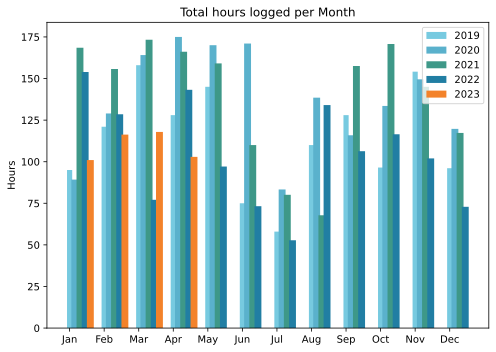
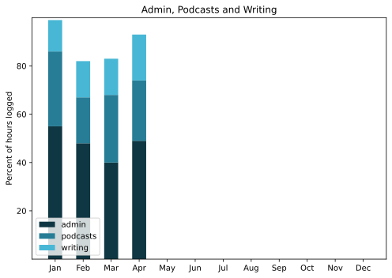

It was a good month, although an early spell of good weather rather lulled me into thinking that spring had sprung, only for April to go out like a lion.

===

## Highlights of the month:

- The [academic paper was published](https://www.sciencedirect.com/science/article/abs/pii/S2211912423000196) to no substantive objection. Yet
- Negative biopsy. Yay!
- Excellent visit to old friends in Brussels, plus recorded an episode of ETP there
- Dismantled the old bike completely (with professional help) and started to fix things up
- Fine visit from an old friend and colleague, and her daughter and mother
- Made actual use of ChatGPT to write a little program
- A succession of successful snail hunts on the terrace
- One piece of paid work, and that was plenty

### Activities

Steps up, sleep down. Must be the seasons.

#### April: 
* Walking with sticks: 0
* Reading: 5
* Steps (avge): 9143
* Podcasts: 33 (31 of them [logged](https://www.jeremycherfas.net/stream/))
* In bed/asleep 8:12/7:26
* 7 Minutes: 5 days
* Cycled: 4 days
* Weight (avge): 86.8
* Naps: 5

#### March: 
* Walking with sticks: 0
* Reading: 17
* Steps (avge): 8947
* Podcasts: 33 (28 of them [logged](https://www.jeremycherfas.net/stream/))
* In bed/asleep 8:33/7:42
* 7 Minutes: 6 days
* Cycled: 10 days
* Weight (avge): 87.2
* Naps: 4

### Stuff Done

Still getting loads of spam to just one or two posts, despite having deleted all previous spam comments, so I guess the spammers are not actually monitoring anything, just blasting their crap out willy nilly. I cannot think of anything more soul-crushing.

On the bike restoration, I oscillate madly between the fantasy of wanting to lovingly fix absolutely every original part and the reality of knowing that I definitely don't have the patience and likely don't have the skills or resources. I'm currently stalking eBay for a replacement saddle, a quill stem and a left crank, having discovered to my astonishment that the cranks are ill-matched, with a right of 165mm and a left of 170mm. Never noticed that before now.

Splurged out on Keyboard Maestro, in order to use a single macro that converts Bike outline files into Markdown files, and am finding it very much harder to understand or, dare I say it, grok, than I anticipated. I've built a couple of little things to speed my chores, fractionally, but I'm torn between accepting it was an expensive purchase and spending yet more for a tutorial course.

#### Hours logged per month

#### Percent of logged hours

Previous years are on [an archive page](https://jeremycherfas.net/blog/working-life).

### Goals

Nine posts here, which will do nicely. `$project` got absolutely no attention, and that needs to be fixed. The little automations I built were satisfying.

### Niggles

Not too many this month. I would still like to be a bit more disciplined about blocking time for things, but I am not beating myself up about it.

### Final remarks

Not too bothered about the lack of Twitter as I do seem to be able to follow lists. So maybe I need to put more people into one list or the other.

----

## Here’s the table

Click the triangle to see or hide the table

<table class="worktable">
<thead>
<tr>
<th style="text-align: right;" class="bigrow">Month</th>
<th style="text-align: center;" class="bigrow">Total</th>
<th style="text-align: center;" class="smallrow">Daily</th>
<th style="text-align: center;"class="smallrow">Admin %</th>
<th style="text-align: center;"class="smallrow">ETP %</th>
<th style="text-align: center;"class="smallrow">Writing %</th>
<th style="text-align: center;"class="smallrow">Other %</th>
</tr>
</thead>
<tbody>
<tr>
<td style="text-align: right;">04</td>
<td style="text-align: center;">102.9</td>
<td style="text-align: center;">3.4</td>
<td style="text-align: center;">49</td>
<td style="text-align: center;">25</td>
<td style="text-align: center;">19</td>
<td style="text-align: center;">7</td>
</tr>
<tr>
<td style="text-align: right;">03</td>
<td style="text-align: center;">117.9</td>
<td style="text-align: center;">3.8</td>
<td style="text-align: center;">40</td>
<td style="text-align: center;">28</td>
<td style="text-align: center;">15</td>
<td style="text-align: center;">17</td>
</tr>
<tr>
<td style="text-align: right;">02</td>
<td style="text-align: center;">116.3</td>
<td style="text-align: center;">4.8</td>
<td style="text-align: center;">48</td>
<td style="text-align: center;">19</td>
<td style="text-align: center;">15</td>
<td style="text-align: center;">18</td>
</tr>

<tr>
<td style="text-align: right;">2023-01</td>
<td style="text-align: center;">101.0</td>
<td style="text-align: center;">4.8</td>
<td style="text-align: center;">53</td>
<td style="text-align: center;">31</td>
<td style="text-align: center;">13</td>
<td style="text-align: center;">3</td>
</tr>
</tbody>
</table>

