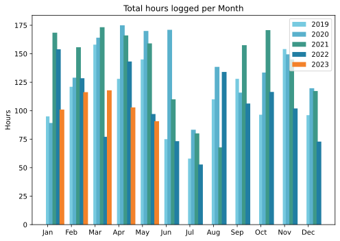
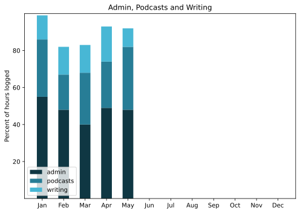

Appalling. Over halfway through this month before summarising last month, and I was sorely tempted to just abandon a report for May. I know what that would do to me, eventually. In any case, I have excuses, two week-long trips, one in May, and one the first week in June.

===

## Highlights of the month:

- Continued to fix up the old Raleigh
- Teeth cleaned (mine, not the bike's)
- A week in Tunisia, unblogged and uncatalogued
- Rode a camel to see bread being baked in desert sand
- Taxes submitted
- Walking tour of the Rome Ghetto; fascinating
- Abandoned my previous monitor speakers and bought a new pair
- Watering system needed only a new battery to function again
- Baby figs!

### Activities

Steps down; time on the bus, sleep up. Must be the seasons.

#### May: 
* Walking with sticks: 0
* Reading: 18
* Steps (avge): 7623
* Podcasts: 36 (27 of them [logged](https://www.jeremycherfas.net/stream/))
* In bed/asleep 8:27/7:46
* 7 Minutes: 7 days
* Cycled: 3 days
* Weight (avge): 87.3
* Naps: 15

#### April: 
* Walking with sticks: 0
* Reading: 5
* Steps (avge): 9143
* Podcasts: 33 (31 of them [logged](https://www.jeremycherfas.net/stream/))
* In bed/asleep 8:12/7:26
* 7 Minutes: 5 days
* Cycled: 4 days
* Weight (avge): 86.8
* Naps: 5

### Stuff Done

On the bike restoration, there has to be a word that is considerably less than restoration but considerably more than greasing up the chain. Fixing up doesn't seem to quite do it. Anyway, I scored a quill stem and a saddle on eBay, though the saddle has not yet arrived. Sniper worked beautifully. The mismatched crank thing is weird too, because I found other pairs of mismatched cranks on eBay that, the sellers said, was just how they found them. Only the frame left now, but I seem to be procrastinating more than usual. Fear of failure, almost certainly, as I have never done anything like this. Of course I blame the wind, because I have to spray outside, but the basic problem is fear, no matter how many YouTubes I watch.

#### Hours logged per month

#### Percent of logged hours

Previous years are on [an archive page](https://jeremycherfas.net/blog/working-life).

### Goals

Ten posts here, which is good, even though `$project` continued to be ignored. Trying to put Keyboard Maestro to more use, but the climb is steep.

### Niggles

None?

### Final remarks

Portable computing needs to be raised a notch. We will be on the road quite a bit this summer and I want to be able to keep up with things and, indeed, develop new things. So I need to mirror a bunch of things to the laptop and do it in good time.

----

## Here’s the table

Click the triangle to see or hide the table

<table class="worktable">
<thead>
<tr>
<th style="text-align: right;" class="bigrow">Month</th>
<th style="text-align: center;" class="bigrow">Total</th>
<th style="text-align: center;" class="smallrow">Daily</th>
<th style="text-align: center;"class="smallrow">Admin %</th>
<th style="text-align: center;"class="smallrow">ETP %</th>
<th style="text-align: center;"class="smallrow">Writing %</th>
<th style="text-align: center;"class="smallrow">Other %</th>
</tr>
</thead>
<tbody>
<tr>
<td style="text-align: right;">05</td>
<td style="text-align: center;">90.75</td>
<td style="text-align: center;">4.1</td>
<td style="text-align: center;">48</td>
<td style="text-align: center;">34</td>
<td style="text-align: center;">10</td>
<td style="text-align: center;">8</td>
</tr>
<tr>
<td style="text-align: right;">04</td>
<td style="text-align: center;">102.9</td>
<td style="text-align: center;">3.4</td>
<td style="text-align: center;">49</td>
<td style="text-align: center;">25</td>
<td style="text-align: center;">19</td>
<td style="text-align: center;">7</td>
</tr>
<tr>
<td style="text-align: right;">03</td>
<td style="text-align: center;">117.9</td>
<td style="text-align: center;">3.8</td>
<td style="text-align: center;">40</td>
<td style="text-align: center;">28</td>
<td style="text-align: center;">15</td>
<td style="text-align: center;">17</td>
</tr>
<tr>
<td style="text-align: right;">02</td>
<td style="text-align: center;">116.3</td>
<td style="text-align: center;">4.8</td>
<td style="text-align: center;">48</td>
<td style="text-align: center;">19</td>
<td style="text-align: center;">15</td>
<td style="text-align: center;">18</td>
</tr>

<tr>
<td style="text-align: right;">2023-01</td>
<td style="text-align: center;">101.0</td>
<td style="text-align: center;">4.8</td>
<td style="text-align: center;">53</td>
<td style="text-align: center;">31</td>
<td style="text-align: center;">13</td>
<td style="text-align: center;">3</td>
</tr>
</tbody>
</table>

