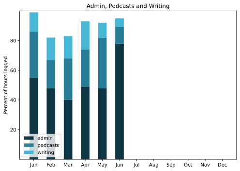

Ah, summer, when all resolve to do stuff even while lazing about on holiday melts under the pressure of ... no pressure.
===

## Highlights of the month:

- Raleigh bicycle frame painted and looking sharp, but all further work suspended until August (see above)
- Convinced the MBA to be more like the iMac
- Gentle progress on automation of a couple of repetitive tasks
- Excellent week in London seeing families and sights
- Returned to find the terrace bloomin' marvellous
- Tried to buy a new matress, but what to do with the old?
- Cooked some fine celebratory meals
- Gave a reasonable account of myself in a webinar, but too long
- Met Valerio Reale, who works on rewilding in the Abruzzo, and may collaborate
- Took off again for a couple of weeks cat-sitting, orto-harvesting and swimming.

### Activities

Steps big up; time in bed up, sleep down. Exciting.

#### June: 
* Walking with sticks: 0
* Reading: 16
* Steps (avge): 9590 (London!)
* Podcasts: 23 (23 of them [logged](https://www.jeremycherfas.net/stream/))
* In bed/asleep 8:37/7:33
* 7 Minutes: 5 days
* Cycled: 3 days
* Weight (avge): 86.8
* Naps: 16

#### May: 
* Walking with sticks: 0
* Reading: 18
* Steps (avge): 7623
* Podcasts: 36 (27 of them [logged](https://www.jeremycherfas.net/stream/))
* In bed/asleep 8:27/7:46
* 7 Minutes: 7 days
* Cycled: 3 days
* Weight (avge): 87.3
* Naps: 15

### Stuff Done

Bit the bullet, rattled the spray cans and painted the bike frame and, to my astonishment, it seems to have turned out OK. My preparation was probably not as thorough as it might have been, and the fact that the primer was white was both a surprise and very useful. In the end, as a frame, it looks good. Matt black, one sticker left and two beat-up decals. I might try and polish up the head-tube badge for a bit of bling, but that is a low priority.

At that point, I stopped, for the time being. There was some discussion over whether the bottom bracket spindle was OK to proceed with, and I think I will indeed proceed. But the bike needs whole new sets of all ball bearings, which need buying, and I really want to try and get all the reassembly done without major gaps. So, as we are here and there for the rest of July, everything is on hold for a month. In any case, the saddle had not yet arrived.

Other stuff done included a paper recut of one of my podcast episodes for another outlet, which will be nice if it comes off. Bits and bobs to keep things in order on the terrace, including a great big plastic box to keep the barbecue and charcoal in. And, at the end of the month, renewing my pleasure in swimming daily. Every time that happens I tell myself I could easily do the same in Rome, although perhaps not daily. And each time, I don't.

#### Hours logged per month

#### Percent of logged hours

Previous years are on [an archive page](https://jeremycherfas.net/blog/working-life).

### Goals

Only six posts here, which is OK but not really good enough. `$project` continued to be ignored. Happy to have got the MBA up and running almost as effectively as the iMac.

### Niggles

Continuing to worry in a low-grade way about promoting the podcast and newsletter. I'n not on Twitter nearly as much, which is fine, but it means I miss some pointers to interesting stuff. And I still have not taken any kind of plunge into Mastodon. Maybe during the next phase of the holidays?

### Final remarks

Aside from getting a grip on promotion, as above, not much else looming. I'm keen to get back to the bicycle, and glad I decided not to rush.

----

## Here’s the table

Click the triangle to see or hide the table

<table class="worktable">
<thead>
<tr>
<th style="text-align: right;" class="bigrow">Month</th>
<th style="text-align: center;" class="bigrow">Total</th>
<th style="text-align: center;" class="smallrow">Daily</th>
<th style="text-align: center;"class="smallrow">Admin %</th>
<th style="text-align: center;"class="smallrow">ETP %</th>
<th style="text-align: center;"class="smallrow">Writing %</th>
<th style="text-align: center;"class="smallrow">Other %</th>
</tr>
</thead>
<tbody>
<tr>
<td style="text-align: right;">06</td>
<td style="text-align: center;">70.4</td>
<td style="text-align: center;">3.9</td>
<td style="text-align: center;">78</td>
<td style="text-align: center;">11</td>
<td style="text-align: center;">6</td>
<td style="text-align: center;">5</td>
</tr>
<tr>
<td style="text-align: right;">05</td>
<td style="text-align: center;">90.75</td>
<td style="text-align: center;">4.1</td>
<td style="text-align: center;">48</td>
<td style="text-align: center;">34</td>
<td style="text-align: center;">10</td>
<td style="text-align: center;">8</td>
</tr>
<tr>
<td style="text-align: right;">04</td>
<td style="text-align: center;">102.9</td>
<td style="text-align: center;">3.4</td>
<td style="text-align: center;">49</td>
<td style="text-align: center;">25</td>
<td style="text-align: center;">19</td>
<td style="text-align: center;">7</td>
</tr>
<tr>
<td style="text-align: right;">03</td>
<td style="text-align: center;">117.9</td>
<td style="text-align: center;">3.8</td>
<td style="text-align: center;">40</td>
<td style="text-align: center;">28</td>
<td style="text-align: center;">15</td>
<td style="text-align: center;">17</td>
</tr>
<tr>
<td style="text-align: right;">02</td>
<td style="text-align: center;">116.3</td>
<td style="text-align: center;">4.8</td>
<td style="text-align: center;">48</td>
<td style="text-align: center;">19</td>
<td style="text-align: center;">15</td>
<td style="text-align: center;">18</td>
</tr>

<tr>
<td style="text-align: right;">2023-01</td>
<td style="text-align: center;">101.0</td>
<td style="text-align: center;">4.8</td>
<td style="text-align: center;">53</td>
<td style="text-align: center;">31</td>
<td style="text-align: center;">13</td>
<td style="text-align: center;">3</td>
</tr>
</tbody>
</table>

