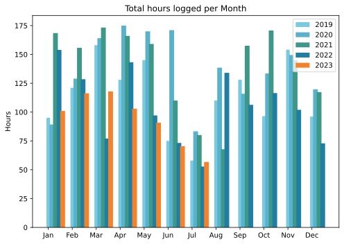

Three weeks away from home makes for a very pleasant month, not least because we were able to read about Rome sweltering from afar.

===

## Highlights of the month:

- Daily swims the first week, and *orto* abundance
- Visits to new rural friends
- Frangipani and blowsy pink hibiscus giving of their best
- Taxes done and dusted, for now
- Reacquainted with Puglia ...
- ... and Matera
- Big repotting on the terrace: cycad, wisteria, strelitzia, agave regina

### Activities

All changes predictable

#### July: 
* Walking with sticks: 0
* Reading: 24
* Steps (avge): 6645 (Holidays)
* Podcasts: 22 (All of them [logged](https://www.jeremycherfas.net/stream/))
* In bed/asleep 8:15/7:25
* 7 Minutes: 1 day (on the 31st!)
* Cycled: 2 days
* Weight (avge): 86.8 (no change!)
* Naps: 28

#### June: 
* Walking with sticks: 0
* Reading: 16
* Steps (avge): 9590 (London!)
* Podcasts: 23 (23 of them [logged](https://www.jeremycherfas.net/stream/))
* In bed/asleep 8:37/7:33
* 7 Minutes: 5 days
* Cycled: 3 days
* Weight (avge): 86.8
* Naps: 16

### Stuff Done

Er, nothing to report that isn't in the highlights. No, wait. Rode the Brompton over to Pigneto to go to Zio Bici, a Brompton specialist I heard about on IG. Turned out to be the most charming chap who fitted me with the roller wheels I had been wanting, and we had a good chat into the bargain. When I wrote it up I thought I might like to visit more often, just for the sake of it. That feeling hasn't left. Also, started being a bit conscientious about the Guardian Cryptic Crosswords, at least on Mondays and Tuesdays (though I should probably at least try and then look at solutions an the more difficult days too.)

#### Hours logged per month

#### Percent of logged hours

Previous years are on [an archive page](https://jeremycherfas.net/blog/working-life).

### Goals

Eight posts here, not bad for being on holiday. Or maybe that's the reason. `$project` continued to be ignored.

### Niggles

Er ... didn't deal with any of last month's niggles, so I suppose they remain, but muted.

### Final remarks

What a great month is was.

----

## Here’s the table

Click the triangle to see or hide the table

<table class="worktable">
<thead>
<tr>
<th style="text-align: right;" class="bigrow">Month</th>
<th style="text-align: center;" class="bigrow">Total</th>
<th style="text-align: center;" class="smallrow">Daily</th>
<th style="text-align: center;"class="smallrow">Admin %</th>
<th style="text-align: center;"class="smallrow">ETP %</th>
<th style="text-align: center;"class="smallrow">Writing %</th>
<th style="text-align: center;"class="smallrow">Other %</th>
</tr>
</thead>
<tbody>
<tr>
<td style="text-align: right;">07</td>
<td style="text-align: center;">56.75</td>
<td style="text-align: center;">1.83</td>
<td style="text-align: center;">53</td>
<td style="text-align: center;">22</td>
<td style="text-align: center;">19</td>
<td style="text-align: center;">6</td>
</tr>
<tr>
<td style="text-align: right;">06</td>
<td style="text-align: center;">70.4</td>
<td style="text-align: center;">3.9</td>
<td style="text-align: center;">78</td>
<td style="text-align: center;">11</td>
<td style="text-align: center;">6</td>
<td style="text-align: center;">5</td>
</tr>
<tr>
<td style="text-align: right;">05</td>
<td style="text-align: center;">90.75</td>
<td style="text-align: center;">4.1</td>
<td style="text-align: center;">48</td>
<td style="text-align: center;">34</td>
<td style="text-align: center;">10</td>
<td style="text-align: center;">8</td>
</tr>
<tr>
<td style="text-align: right;">04</td>
<td style="text-align: center;">102.9</td>
<td style="text-align: center;">3.4</td>
<td style="text-align: center;">49</td>
<td style="text-align: center;">25</td>
<td style="text-align: center;">19</td>
<td style="text-align: center;">7</td>
</tr>
<tr>
<td style="text-align: right;">03</td>
<td style="text-align: center;">117.9</td>
<td style="text-align: center;">3.8</td>
<td style="text-align: center;">40</td>
<td style="text-align: center;">28</td>
<td style="text-align: center;">15</td>
<td style="text-align: center;">17</td>
</tr>
<tr>
<td style="text-align: right;">02</td>
<td style="text-align: center;">116.3</td>
<td style="text-align: center;">4.8</td>
<td style="text-align: center;">48</td>
<td style="text-align: center;">19</td>
<td style="text-align: center;">15</td>
<td style="text-align: center;">18</td>
</tr>

<tr>
<td style="text-align: right;">2023-01</td>
<td style="text-align: center;">101.0</td>
<td style="text-align: center;">4.8</td>
<td style="text-align: center;">53</td>
<td style="text-align: center;">31</td>
<td style="text-align: center;">13</td>
<td style="text-align: center;">3</td>
</tr>
</tbody>
</table>

