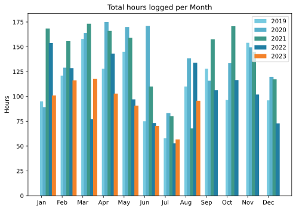
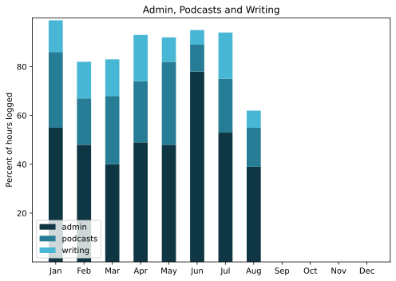

This may be the latest I have ever done a monthly report, and that is down to having an enjoyable but tough piece of paid work that should have been delivered a week ago, but was finally delivered yesterday. And the biggest thrill of the undocumented month actually took place in September, so you’ll just have to wait.

===

## Highlights of the month:

- Successful Ikea visit for The Squeeze
- Improved cryptic crossword solving
- Bee-eaters in the park!
- Letizia Battaglia show in the blazing heat at Terme di Caracalla
- Visit to the Tarot Garden and beach at Santa Marinella
- Bloody FATCA
- 6:30 bike ride
- Fine day at the beach at Mastino
- Photo show historic Italy at the Scuderie
- Weekend in the country at Montecchio, including Prince Stash and his castle
- Mastodon!

### Activities

As steps go up, so will podcasts

#### August: 
* Walking with sticks: 0
* Reading: 27
* Steps (avge): 7857
* Podcasts: 24 (All of them [logged](https://www.jeremycherfas.net/stream/))
* In bed/asleep 8:25/7:33
* 7 Minutes: 4 days
* Cycled: 6 days
* Weight (avge): 87.1
* Naps: 25

#### July: 
* Walking with sticks: 0
* Reading: 24
* Steps (avge): 6645 (Holidays)
* Podcasts: 22 (All of them [logged](https://www.jeremycherfas.net/stream/))
* In bed/asleep 8:15/7:25
* 7 Minutes: 1 day (on the 31st!)
* Cycled: 2 days
* Weight (avge): 86.8 (no change!)
* Naps: 28

### Stuff Done

The big piece of work, finished five of seven elements. Other than that, many bits of time spent reassembling the bicycle and, when it was very hot, lying in a darkened room reading or attempting the crossword.

#### Hours logged per month

#### Percent of logged hours

Previous years are on [an archive page](https://jeremycherfas.net/blog/working-life).

### Goals

Seven posts here, which is fine. Slowly getting into Mastodon, which was a goal. `$project` continued to be ignored, but winter is coming.

### Niggles

Maintaining work:life balance was great, as the number of naps and days reading attests, but it did slightly upset the fun:work balance, where work is work for money and fun is work for some other reason.

### Final remarks

Another very enjoyable month, despite the heat.

----

## Here’s the table

Click the triangle to see or hide the table

<table class="worktable">
<thead>
<tr>
<th style="text-align: right;" class="bigrow">Month</th>
<th style="text-align: center;" class="bigrow">Total</th>
<th style="text-align: center;" class="smallrow">Daily</th>
<th style="text-align: center;"class="smallrow">Admin %</th>
<th style="text-align: center;"class="smallrow">ETP %</th>
<th style="text-align: center;"class="smallrow">Writing %</th>
<th style="text-align: center;"class="smallrow">Other %</th>
</tr>
</thead>
<tbody>
<tr>
<td style="text-align: right;">08</td>
<td style="text-align: center;">95.7</td>
<td style="text-align: center;">3.17</td>
<td style="text-align: center;">39</td>
<td style="text-align: center;">16</td>
<td style="text-align: center;">7</td>
<td style="text-align: center;">32</td>
</tr>
<tr>
<td style="text-align: right;">07</td>
<td style="text-align: center;">56.75</td>
<td style="text-align: center;">1.83</td>
<td style="text-align: center;">53</td>
<td style="text-align: center;">22</td>
<td style="text-align: center;">19</td>
<td style="text-align: center;">6</td>
</tr>
<tr>
<td style="text-align: right;">06</td>
<td style="text-align: center;">70.4</td>
<td style="text-align: center;">3.9</td>
<td style="text-align: center;">78</td>
<td style="text-align: center;">11</td>
<td style="text-align: center;">6</td>
<td style="text-align: center;">5</td>
</tr>
<tr>
<td style="text-align: right;">05</td>
<td style="text-align: center;">90.75</td>
<td style="text-align: center;">4.1</td>
<td style="text-align: center;">48</td>
<td style="text-align: center;">34</td>
<td style="text-align: center;">10</td>
<td style="text-align: center;">8</td>
</tr>
<tr>
<td style="text-align: right;">04</td>
<td style="text-align: center;">102.9</td>
<td style="text-align: center;">3.4</td>
<td style="text-align: center;">49</td>
<td style="text-align: center;">25</td>
<td style="text-align: center;">19</td>
<td style="text-align: center;">7</td>
</tr>
<tr>
<td style="text-align: right;">03</td>
<td style="text-align: center;">117.9</td>
<td style="text-align: center;">3.8</td>
<td style="text-align: center;">40</td>
<td style="text-align: center;">28</td>
<td style="text-align: center;">15</td>
<td style="text-align: center;">17</td>
</tr>
<tr>
<td style="text-align: right;">02</td>
<td style="text-align: center;">116.3</td>
<td style="text-align: center;">4.8</td>
<td style="text-align: center;">48</td>
<td style="text-align: center;">19</td>
<td style="text-align: center;">15</td>
<td style="text-align: center;">18</td>
</tr>

<tr>
<td style="text-align: right;">2023-01</td>
<td style="text-align: center;">101.0</td>
<td style="text-align: center;">4.8</td>
<td style="text-align: center;">53</td>
<td style="text-align: center;">31</td>
<td style="text-align: center;">13</td>
<td style="text-align: center;">3</td>
</tr>
</tbody>
</table>

