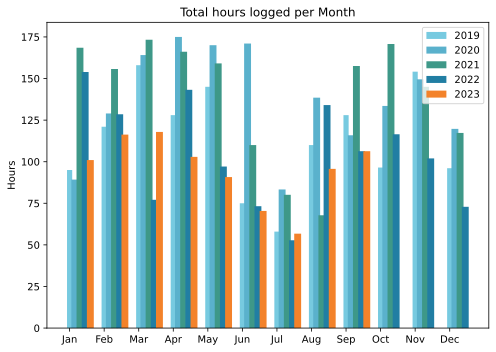
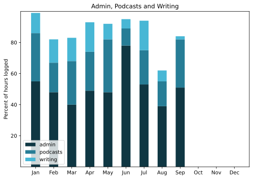

Delayed by a day because I judged a blog carnival round-up to be of a higher priority. And to be honest, there isn't that much to report, but here goes anyway.

===

## Highlights of the month:

- Finished a piece of paid work that was actually fun, and the client was pleased.
- Rode the revitalised Raleigh; wonderful.
- Resumed podcasting, with the added thrill of an empty pipeline.
- Bad outage -- not entirely my fault -- at the podcast website.
- A lovely day at the Botanic Gardens.
- And at home, the big cycad is recovered.
- Nice visits out of town.
- Deep clean at the dentist.
- Bread thing taught to undergraduates.
- Cleaned beneath the washing machine; yuck.
- Accidentally enountered part of the Eroica in Buonconvento.

### Activities

Some good long bike rides; I do wonder whether I am ever going to do another walk with sticks. I hosted the IndieWeb Blog Carnival, which was fun, and managed to spread the word a bit. Naps have taken a dive.

#### September: 
* Walking with sticks: 0
* Reading: 18
* Steps (avge): 7862
* Podcasts: 23 (19 of them [logged](https://www.jeremycherfas.net/stream/))
* In bed/asleep 8:25/7:21
* 7 Minutes: 6 days
* Cycled: 5 days
* Weight (avge): 86.4
* Naps: 20

#### August: 
* Walking with sticks: 0
* Reading: 27
* Steps (avge): 7857
* Podcasts: 24 (All of them [logged](https://www.jeremycherfas.net/stream/))
* In bed/asleep 8:25/7:33
* 7 Minutes: 4 days
* Cycled: 6 days
* Weight (avge): 87.1
* Naps: 25

### Stuff Done

Lots of little things, none of them terribly worthy of special mention, and mostly noted in the Highlights. Rather pleased to see that total hours per month is following the standard pattern and at a lower level. That is how it ought to be.

#### Hours logged per month

#### Percent of logged hours

Previous years are on [an archive page](https://jeremycherfas.net/blog/working-life).

### Goals

Six posts here, and no real reason why there weren't more. Enjoying Mastodon, to the extent that today I decided to sign up for my instance's Patreon. I have not automated POSSE from here, and probably never will, although I have added a front page link here to my presence there. Swapped for Twitter, where all I do is read and post once a week with the episode or the newsletter.

`$project` continued to be ignored, and winter is still coming.

### Niggles

For some reason, while I make trivial use of Keyboard Maestro, I cannot seem to get into doing more. Perhaps I should just spring for a book.

### Final remarks

I could scarcely be more content.

----

## Here’s the table

Click the triangle to see or hide the table

<table class="worktable">
<thead>
<tr>
<th style="text-align: right;" class="bigrow">Month</th>
<th style="text-align: center;" class="bigrow">Total</th>
<th style="text-align: center;" class="smallrow">Daily</th>
<th style="text-align: center;"class="smallrow">Admin %</th>
<th style="text-align: center;"class="smallrow">ETP %</th>
<th style="text-align: center;"class="smallrow">Writing %</th>
<th style="text-align: center;"class="smallrow">Other %</th>
</tr>
</thead>
<tbody>
<tr>
<td style="text-align: right;">09</td>
<td style="text-align: center;">106.3</td>
<td style="text-align: center;">4.25</td>
<td style="text-align: center;">51</td>
<td style="text-align: center;">31</td>
<td style="text-align: center;">2</td>
<td style="text-align: center;">16</td>
</tr>
<tr>
<td style="text-align: right;">08</td>
<td style="text-align: center;">95.7</td>
<td style="text-align: center;">3.17</td>
<td style="text-align: center;">39</td>
<td style="text-align: center;">16</td>
<td style="text-align: center;">7</td>
<td style="text-align: center;">32</td>
</tr>
<tr>
<td style="text-align: right;">07</td>
<td style="text-align: center;">56.75</td>
<td style="text-align: center;">1.83</td>
<td style="text-align: center;">53</td>
<td style="text-align: center;">22</td>
<td style="text-align: center;">19</td>
<td style="text-align: center;">6</td>
</tr>
<tr>
<td style="text-align: right;">06</td>
<td style="text-align: center;">70.4</td>
<td style="text-align: center;">3.9</td>
<td style="text-align: center;">78</td>
<td style="text-align: center;">11</td>
<td style="text-align: center;">6</td>
<td style="text-align: center;">5</td>
</tr>
<tr>
<td style="text-align: right;">05</td>
<td style="text-align: center;">90.75</td>
<td style="text-align: center;">4.1</td>
<td style="text-align: center;">48</td>
<td style="text-align: center;">34</td>
<td style="text-align: center;">10</td>
<td style="text-align: center;">8</td>
</tr>
<tr>
<td style="text-align: right;">04</td>
<td style="text-align: center;">102.9</td>
<td style="text-align: center;">3.4</td>
<td style="text-align: center;">49</td>
<td style="text-align: center;">25</td>
<td style="text-align: center;">19</td>
<td style="text-align: center;">7</td>
</tr>
<tr>
<td style="text-align: right;">03</td>
<td style="text-align: center;">117.9</td>
<td style="text-align: center;">3.8</td>
<td style="text-align: center;">40</td>
<td style="text-align: center;">28</td>
<td style="text-align: center;">15</td>
<td style="text-align: center;">17</td>
</tr>
<tr>
<td style="text-align: right;">02</td>
<td style="text-align: center;">116.3</td>
<td style="text-align: center;">4.8</td>
<td style="text-align: center;">48</td>
<td style="text-align: center;">19</td>
<td style="text-align: center;">15</td>
<td style="text-align: center;">18</td>
</tr>

<tr>
<td style="text-align: right;">2023-01</td>
<td style="text-align: center;">101.0</td>
<td style="text-align: center;">4.8</td>
<td style="text-align: center;">53</td>
<td style="text-align: center;">31</td>
<td style="text-align: center;">13</td>
<td style="text-align: center;">3</td>
</tr>
</tbody>
</table>

