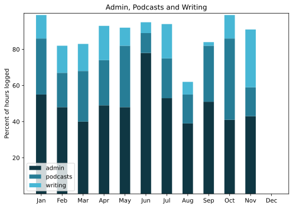

A good month, with two brief excursions and a lot of little achievements.

===

## Highlights of the month:

- A visit to Venice, seeing old friends, old and new restaurants and some excellent art. But no pressure.
- Disastrous windstorm, destroyed the terrace cupboard and resulted in ...
- ... Ongoing unpleasantness from neighbours.
- Academic bunfight over our anti-biofortification paper.
- Fixed (at least partially) map problems with Known check-ins.
- Cycled to bag a geohash.
- A visit to Bologna, ditto Venice.
- Sad, but not unexpected, death of a very good friend.
- New battery in the iPhone.
- Decided not to podcast on YouTube.
- Progress on a Python version of Bise.

### Activities

Need to get back into reading books. Steps picking up. Consistency of sleep is satisfying and good.

#### November: 
* Walking with sticks: 1
* Reading: 23
* Steps (avge): 10,301
* Podcasts: 38 (32 of them [logged](https://www.jeremycherfas.net/stream/))
* In bed/asleep 8:21/7:44
* 7 Minutes: 5 days
* Cycled: 3 days (50 km)
* Weight (avge): 87.9
* Naps: 15

#### October: 
* Walking with sticks: 0
* Reading: 7
* Steps (avge): 9045
* Podcasts: 38 (32 of them [logged](https://www.jeremycherfas.net/stream/))
* In bed/asleep 8:24/7:27
* 7 Minutes: 4 days
* Cycled: 4 days (50 km)
* Weight (avge): 86.7
* Naps: 15

### Stuff Done

All the little things mentioned in the highlights added up to a very satisfactory month overall, with a good balance. It would have been nice to ride the bike a bit more, but life must have got in the way. The [frustrations of IndieWeb Camp](https://www.jeremycherfas.net/blog/indieweb-camp-nu%CC%88rnberg-2023) were more than offset by the very engaging talks at border:none and the friends, old and new. Also enjoying Mastodon more and more.

#### Hours logged per month

#### Percent of logged hours

Previous years are on [an archive page](https://jeremycherfas.net/blog/working-life).

### Goals

Eight posts here, which is pretty good. Right at the end of the month I decided to look again at the [six-box to-do list](https://anniemueller.com/everything-youve-ever-wanted-to-know-about-using-a-6-box-to-do-list/) and I like how it offers you choices of what to do next in a more ordered way than simply picking something off an impossible list. Need to tweak the actual layout though.

`$project` continued to be ignored, and winter is still coming.

### Niggles

I'm peeved at my inability to solve the problem of maps in Known and need to decide between really getting to grips with the code and just giving it all up as having no real future.

### Final remarks

Life is good, despite travel putting pressure on weak spots.

----

## Here’s the table

Click the triangle to see or hide the table

<table class="worktable">
<thead>
<tr>
<th style="text-align: right;" class="bigrow">Month</th>
<th style="text-align: center;" class="bigrow">Total</th>
<th style="text-align: center;" class="smallrow">Daily</th>
<th style="text-align: center;"class="smallrow">Admin %</th>
<th style="text-align: center;"class="smallrow">ETP %</th>
<th style="text-align: center;"class="smallrow">Writing %</th>
<th style="text-align: center;"class="smallrow">Other %</th>
</tr>
</thead>
<tbody>
<tr>
<td style="text-align: right;">10</td>
<td style="text-align: center;">103.75</td>
<td style="text-align: center;">3.34</td>
<td style="text-align: center;">41</td>
<td style="text-align: center;">45</td>
<td style="text-align: center;">13</td>
<td style="text-align: center;">1</td>
</tr>
<tr>
<td style="text-align: right;">09</td>
<td style="text-align: center;">106.3</td>
<td style="text-align: center;">4.25</td>
<td style="text-align: center;">51</td>
<td style="text-align: center;">31</td>
<td style="text-align: center;">2</td>
<td style="text-align: center;">16</td>
</tr>
<tr>
<td style="text-align: right;">08</td>
<td style="text-align: center;">95.7</td>
<td style="text-align: center;">3.17</td>
<td style="text-align: center;">39</td>
<td style="text-align: center;">16</td>
<td style="text-align: center;">7</td>
<td style="text-align: center;">32</td>
</tr>
<tr>
<td style="text-align: right;">07</td>
<td style="text-align: center;">56.75</td>
<td style="text-align: center;">1.83</td>
<td style="text-align: center;">53</td>
<td style="text-align: center;">22</td>
<td style="text-align: center;">19</td>
<td style="text-align: center;">6</td>
</tr>
<tr>
<td style="text-align: right;">06</td>
<td style="text-align: center;">70.4</td>
<td style="text-align: center;">3.9</td>
<td style="text-align: center;">78</td>
<td style="text-align: center;">11</td>
<td style="text-align: center;">6</td>
<td style="text-align: center;">5</td>
</tr>
<tr>
<td style="text-align: right;">05</td>
<td style="text-align: center;">90.75</td>
<td style="text-align: center;">4.1</td>
<td style="text-align: center;">48</td>
<td style="text-align: center;">34</td>
<td style="text-align: center;">10</td>
<td style="text-align: center;">8</td>
</tr>
<tr>
<td style="text-align: right;">04</td>
<td style="text-align: center;">102.9</td>
<td style="text-align: center;">3.4</td>
<td style="text-align: center;">49</td>
<td style="text-align: center;">25</td>
<td style="text-align: center;">19</td>
<td style="text-align: center;">7</td>
</tr>
<tr>
<td style="text-align: right;">03</td>
<td style="text-align: center;">117.9</td>
<td style="text-align: center;">3.8</td>
<td style="text-align: center;">40</td>
<td style="text-align: center;">28</td>
<td style="text-align: center;">15</td>
<td style="text-align: center;">17</td>
</tr>
<tr>
<td style="text-align: right;">02</td>
<td style="text-align: center;">116.3</td>
<td style="text-align: center;">4.8</td>
<td style="text-align: center;">48</td>
<td style="text-align: center;">19</td>
<td style="text-align: center;">15</td>
<td style="text-align: center;">18</td>
</tr>

<tr>
<td style="text-align: right;">2023-01</td>
<td style="text-align: center;">101.0</td>
<td style="text-align: center;">4.8</td>
<td style="text-align: center;">53</td>
<td style="text-align: center;">31</td>
<td style="text-align: center;">13</td>
<td style="text-align: center;">3</td>
</tr>
</tbody>
</table>

