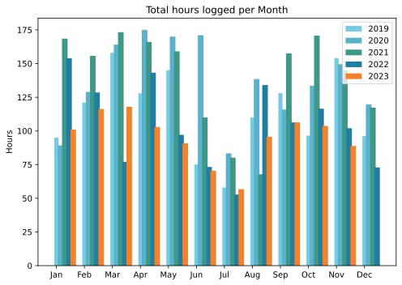

Very late, because January's downtime was almost all-encompassing. No regrets.

===

## Highlights of the month:

- Replaced a punctured bicycle tube but somehow loosened the bearings, so ...
- ... bought proper cone spanners
- Cooked some good, new-to-me dishes
- All clear from the dermatologist
- Started bagging targets supplied by [rabbit-quest](https://rabbit-rabbit.quest/)
- Visit to London, Phillip Guston show at Tate Modern, HOlbein drawings at the Queen's Gallery
- Fun trundle round old haunts with Lucy
- Marmalade, reboiled because it was not properly set
- Covid booster
- Superb Christmas lunch of duck breast
- Dublin for a couple of days

### Activities

Steps staying high thanks to lots of walking in London. Reading low, for the same reason.

#### December: 
* Walking with sticks: 1
* Reading: 10
* Steps (avge): 10,496
* Podcasts: 31 (27 of them [logged](https://www.jeremycherfas.net/stream/))
* In bed/asleep 8:28/7:35
* 7 Minutes: 3 days
* Cycled: 2 days (XX km)
* Weight (avge): 87.8
* Naps: 16

#### November: 
* Walking with sticks: 1
* Reading: 23
* Steps (avge): 10,301
* Podcasts: 31 (27 of them [logged](https://www.jeremycherfas.net/stream/))
* In bed/asleep 8:21/7:44
* 7 Minutes: 5 days
* Cycled: 3 days (43 km)
* Weight (avge): 87.9
* Naps: 15

### Stuff Done

More than a week away from home and some nastyish wether conspired to keep me off my bicycle. A slow puncture in the hybrid's front wheel, which I absolutely could not locate, is another fine excuse. I bought, and started digging into, the Field Guide to Keyboard Maestro, and while I have scribbled a couple of could-KM-do-this notes, I also truly wonder who finds a use for many of those triggers and actions. I shall continue to explore.

#### Hours logged per month

#### Percent of logged hours

Previous years are on [an archive page](https://jeremycherfas.net/blog/working-life).

### Goals

Seven posts here, which is fine. Continued with the six-box to-do list, although I did make mistakes drawing a couple of weeks so they ended up with only four boxes, and that worked too. Got a bit lost with the podcast, all kinds of doubts, why do I bother etc etc. I think I am over that. Again.

### Niggles

Came up against cultural norms in a big way, because the storms early in the month blew a pot off the terrace wall. Nobody was hurt. Almost nothing was damaged. And yet we have had lawyer's letters, shrill haranguing, could have been so much worse, mental distress etc etc. Italians can be such big babies at times, and the stereotype of voluble hysteria has more than a grain of truth to it. Not quite the last straw, but they are accumulating.

### Final remarks

Life is good. Very excited by the prospect of the new Audio Hijack being able to do useful transcriptions.

----

## Here’s the table

Click the triangle to see or hide the table

<table class="worktable">
<thead>
<tr>
<th style="text-align: right;" class="bigrow">Month</th>
<th style="text-align: center;" class="bigrow">Total</th>
<th style="text-align: center;" class="smallrow">Daily</th>
<th style="text-align: center;"class="smallrow">Admin %</th>
<th style="text-align: center;"class="smallrow">ETP %</th>
<th style="text-align: center;"class="smallrow">Writing %</th>
<th style="text-align: center;"class="smallrow">Other %</th>
</tr>
</thead>
<tbody>
<tr>
<td style="text-align: right;">11</td>
<td style="text-align: center;">88.8</td>
<td style="text-align: center;">4.02</td>
<td style="text-align: center;">43</td>
<td style="text-align: center;">16</td>
<td style="text-align: center;">32</td>
<td style="text-align: center;">9</td>
</tr>
<tr>
<td style="text-align: right;">10</td>
<td style="text-align: center;">103.75</td>
<td style="text-align: center;">3.34</td>
<td style="text-align: center;">41</td>
<td style="text-align: center;">45</td>
<td style="text-align: center;">13</td>
<td style="text-align: center;">1</td>
</tr>
<tr>
<td style="text-align: right;">09</td>
<td style="text-align: center;">106.3</td>
<td style="text-align: center;">4.25</td>
<td style="text-align: center;">51</td>
<td style="text-align: center;">31</td>
<td style="text-align: center;">2</td>
<td style="text-align: center;">16</td>
</tr>
<tr>
<td style="text-align: right;">08</td>
<td style="text-align: center;">95.7</td>
<td style="text-align: center;">3.17</td>
<td style="text-align: center;">39</td>
<td style="text-align: center;">16</td>
<td style="text-align: center;">7</td>
<td style="text-align: center;">32</td>
</tr>
<tr>
<td style="text-align: right;">07</td>
<td style="text-align: center;">56.75</td>
<td style="text-align: center;">1.83</td>
<td style="text-align: center;">53</td>
<td style="text-align: center;">22</td>
<td style="text-align: center;">19</td>
<td style="text-align: center;">6</td>
</tr>
<tr>
<td style="text-align: right;">06</td>
<td style="text-align: center;">70.4</td>
<td style="text-align: center;">3.9</td>
<td style="text-align: center;">78</td>
<td style="text-align: center;">11</td>
<td style="text-align: center;">6</td>
<td style="text-align: center;">5</td>
</tr>
<tr>
<td style="text-align: right;">05</td>
<td style="text-align: center;">90.75</td>
<td style="text-align: center;">4.1</td>
<td style="text-align: center;">48</td>
<td style="text-align: center;">34</td>
<td style="text-align: center;">10</td>
<td style="text-align: center;">8</td>
</tr>
<tr>
<td style="text-align: right;">04</td>
<td style="text-align: center;">102.9</td>
<td style="text-align: center;">3.4</td>
<td style="text-align: center;">49</td>
<td style="text-align: center;">25</td>
<td style="text-align: center;">19</td>
<td style="text-align: center;">7</td>
</tr>
<tr>
<td style="text-align: right;">03</td>
<td style="text-align: center;">117.9</td>
<td style="text-align: center;">3.8</td>
<td style="text-align: center;">40</td>
<td style="text-align: center;">28</td>
<td style="text-align: center;">15</td>
<td style="text-align: center;">17</td>
</tr>
<tr>
<td style="text-align: right;">02</td>
<td style="text-align: center;">116.3</td>
<td style="text-align: center;">4.8</td>
<td style="text-align: center;">48</td>
<td style="text-align: center;">19</td>
<td style="text-align: center;">15</td>
<td style="text-align: center;">18</td>
</tr>

<tr>
<td style="text-align: right;">2023-01</td>
<td style="text-align: center;">101.0</td>
<td style="text-align: center;">4.8</td>
<td style="text-align: center;">53</td>
<td style="text-align: center;">31</td>
<td style="text-align: center;">13</td>
<td style="text-align: center;">3</td>
</tr>
</tbody>
</table>

