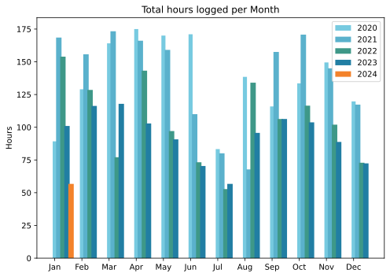
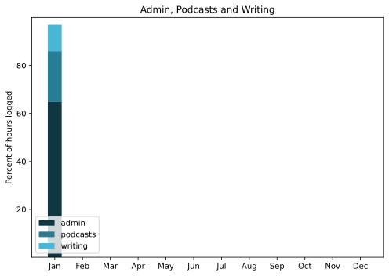

Back in the swing of things and managing to keep on top of everything. A run of glorious weather (ongoing) makes the cold within bearable because we can also go outside to warm up. Weird.

===

## Highlights of the month:

- Terrific couple of weeks away, including ...
- ... great visit with a friend of very long standing.
- A week of remedial eating (minestrone etc).
- Added a stand to a bicycle and raised the handlebars; much comfier.
- Some fine nights with friends.
- Read *Orwell's Roses* by Rebecca Solnit, a total delight.
- Two lovely gentle movies, Perfect Days and The Holdovers.
- Bicycle ride for Holocaust Memorial Day.
- Sharpened my axe; worthwhile.

### Activities

Steps dropping a bit as reading goes up, for related reasons. Snuck in a single session of HIIT, but can report that as of today (2024-02-06) I am back on the wagon.

#### January: 
* Walking with sticks: 0
* Reading: 18
* Steps (avge): 8633
* Podcasts: 27 (All of them [logged](https://www.jeremycherfas.net/stream/)) Coincidence.
* In bed/asleep 8:32/7:45
* 7 Minutes: 1 day
* Cycled: 3 days (42 km)
* Weight (avge): 88.4
* Naps: 19

#### December: 
* Walking with sticks: 1
* Reading: 10
* Steps (avge): 10,496
* Podcasts: 27 (All of them [logged](https://www.jeremycherfas.net/stream/))
* In bed/asleep 8:28/7:35
* 7 Minutes: 3 days
* Cycled: 2 days (110 km)
* Weight (avge): 87.8
* Naps: 16

### Stuff Done

Not much. Failed to continue both Keyboard Maestro and other bits of coding, but so what? There will be time.

#### Hours logged per month

#### Percent of logged hours

Previous years are on [an archive page](https://jeremycherfas.net/blog/working-life).

Current me would like to thank past me for showing unusual foresight, which made updating the scripts to produce the graphs easier than expected.

### Goals

Nine posts this month, which is nice.

### Niggles

None, really, but then it was a very easy month.

### Final remarks

Hard to know what to tackle in the way of something larger. `$project` languishes, for now, paralysed in part by indecision about the CMS behind it. Cleaning up this site by hiving off some of the podcast posts would be a good thing. WithKnown continues to thwart me at times but not quite at the point where I want to start over. Still, for all that, spring is springing.

----

## Here’s the table

Click the triangle to see or hide the table

<table class="worktable">
<thead>
<tr>
<th style="text-align: right;" class="bigrow">Month</th>
<th style="text-align: center;" class="bigrow">Total</th>
<th style="text-align: center;" class="smallrow">Daily</th>
<th style="text-align: center;"class="smallrow">Admin %</th>
<th style="text-align: center;"class="smallrow">ETP %</th>
<th style="text-align: center;"class="smallrow">Writing %</th>
<th style="text-align: center;"class="smallrow">Other %</th>
</tr>
</thead>
<tbody>
<tr>
<td style="text-align: right;">2024-01</td>
<td style="text-align: center;">56.75</td>
<td style="text-align: center;">4.0</td>
<td style="text-align: center;">65</td>
<td style="text-align: center;">21</td>
<td style="text-align: center;">11</td>
<td style="text-align: center;">3</td>
</tr>
</tbody>
</table>

