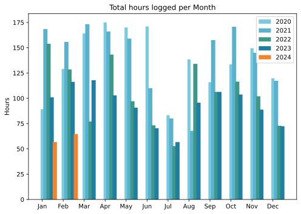
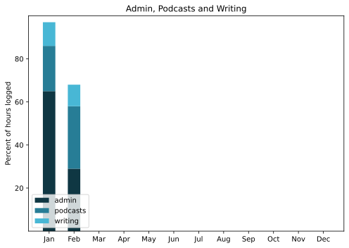

Wow, February went whizzing by. Managed to do something slightly clever with the subscription emails for Eat This Newsletter, and it paid off, at least this once. Mastodon is still fun and may be proving useful. Hard to say, until I polish up my thing for looking at logs.

===

## Highlights of the month:

- Teeny bits of paid work, for fun not really reward.
- A day out weeding in a friend's clay patch.
- Entertaining evening at the American Academy in Rome.
- Dug in to remedy the important-but-not-urgent neglect.
- New lens for the "proper" camera.
- Valentine's day feast.
- Restored missing photos to WithKnown-powered stream.
- All booked for the Brompton World Championships in Venice.
- Visited the new Forma Urbis museum.
- Leap Year dinner.

### Activities

Steps up and HIIT happening again too. Odd to have spent more time in bed and asleep; no explanation.

#### February: 
* Walking with sticks: 0
* Reading: 17
* Steps (avge): 8982
* Podcasts: 42 (35 of them [logged](https://www.jeremycherfas.net/stream/)).
* In bed/asleep 8:46/7:56
* 7 Minutes: 10 days
* Cycled: 2 days (45 km)
* Weight (avge): 89.0
* Naps: 18

#### January: 
* Walking with sticks: 0
* Reading: 18
* Steps (avge): 8633
* Podcasts: 27 (All of them [logged](https://www.jeremycherfas.net/stream/)) Coincidence.
* In bed/asleep 8:32/7:45
* 7 Minutes: 1 day
* Cycled: 3 days (42 km)
* Weight (avge): 88.4
* Naps: 19

### Stuff Done

Aforementioned important-but-not-urgent things that had been allowed to fester for far too long. Still festering, but less so. The de-festeration, alas, prevented much else.

#### Hours logged per month

#### Percent of logged hours

Previous years are on [an archive page](https://jeremycherfas.net/blog/working-life).

### Goals

Eight posts this month, which is surprising as I thought I hadn't done much at all.

### Niggles

Not enough bicycle rides.

### Final remarks

Still vacillating about moving the stream and perhaps, even, the mothership, but no actual progress, yet.

----

## Here’s the table

Click the triangle to see or hide the table

<table class="worktable">
<thead>
<tr>
<th style="text-align: right;" class="bigrow">Month</th>
<th style="text-align: center;" class="bigrow">Total</th>
<th style="text-align: center;" class="smallrow">Daily</th>
<th style="text-align: center;"class="smallrow">Admin %</th>
<th style="text-align: center;"class="smallrow">ETP %</th>
<th style="text-align: center;"class="smallrow">Writing %</th>
<th style="text-align: center;"class="smallrow">Other %</th>
</tr>
</thead>
<tbody>
<tr>
<td style="text-align: right;">02</td>
<td style="text-align: center;">64.7</td>
<td style="text-align: center;">4.7</td>
<td style="text-align: center;">53</td>
<td style="text-align: center;">29</td>
<td style="text-align: center;">10</td>
<td style="text-align: center;">5</td>
</tr>
<tr>
<td style="text-align: right;">2024-01</td>
<td style="text-align: center;">56.75</td>
<td style="text-align: center;">4.0</td>
<td style="text-align: center;">65</td>
<td style="text-align: center;">21</td>
<td style="text-align: center;">11</td>
<td style="text-align: center;">3</td>
</tr>
</tbody>
</table>

