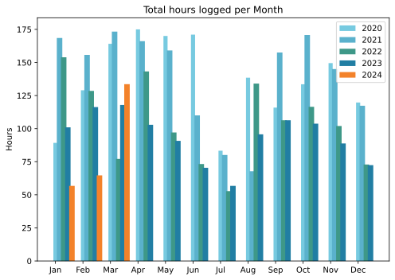
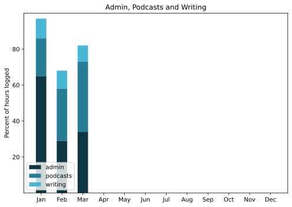

March was ... March. Changeable, erratic, unpredictable. Good things on the bicycle, taking the train somewhere and cycling to a different train station. Movement among the plants on the terrace. Good fun and some entertaining podcasts made.

===

## Highlights of the month:

- Home-made lemon curd from home-grown lemons
- Getting closer to photos all processed
- Dinners cooked for friends
- Macro to make work notes easier
- Signed up for Komoot to guide bicycle rides
- Which prompted a program to draw a static map with photo markers
- Celebratory Guinness for St Patrick's
- Repotting continues
- Judicious POSSE to Mastodon

### Activities

Steps down a little and HIIT too, because cycling. Less time in bed and asleep as the days grow longer. Weight bad, which I put down to eating out on Tuesdays. (I weigh on Wednesdays)

#### March: 
* Walking with sticks: 0
* Reading: 22
* Steps (avge): 8650
* Podcasts: 31 (29 of them [logged](https://www.jeremycherfas.net/stream/)).
* In bed/asleep 8:32/7:36
* 7 Minutes: 6 days
* Cycled: 4 days (154 km)
* Weight (avge): 90.0
* Naps: 14

#### February: 
* Walking with sticks: 0
* Reading: 17
* Steps (avge): 8982
* Podcasts: 42 (35 of them [logged](https://www.jeremycherfas.net/stream/)).
* In bed/asleep 8:46/7:56
* 7 Minutes: 10 days
* Cycled: 2 days (45 km)
* Weight (avge): 89.0
* Naps: 18

### Stuff Done

Hard to put my finger on anything super-specific. Even so, it felt like a good month, overall. I missed out on the IndieWeb Carnival this month, probably because I do not have much to say on [accessibility in the small web](https://blog.basementcommunity.com/indieweb-carnival-march-round-up/) and my site is by no means an exemplar of good practice. Might be the first month in which hours logged to podcasting exceeded hours logged to administration.

#### Hours logged per month

#### Percent of logged hours

Previous years are on [an archive page](https://jeremycherfas.net/blog/working-life).

### Goals

Nine posts this month, which is encouraging.

### Niggles

Yet more bicycle rides needed.

### Final remarks

Going into some serious travelling, and trying to be positive about keeping things buzzing online. But maybe not.

----

## Here’s the table

Click the triangle to see or hide the table

<table class="worktable">
<thead>
<tr>
<th style="text-align: right;" class="bigrow">Month</th>
<th style="text-align: center;" class="bigrow">Total</th>
<th style="text-align: center;" class="smallrow">Daily</th>
<th style="text-align: center;"class="smallrow">Admin %</th>
<th style="text-align: center;"class="smallrow">ETP %</th>
<th style="text-align: center;"class="smallrow">Writing %</th>
<th style="text-align: center;"class="smallrow">Other %</th>
</tr>
</thead>
<tbody>
<tr>
<td style="text-align: right;">03</td>
<td style="text-align: center;">133.6</td>
<td style="text-align: center;">4.75</td>
<td style="text-align: center;">34</td>
<td style="text-align: center;">39</td>
<td style="text-align: center;">18</td>
<td style="text-align: center;">9</td>
</tr>
<tr>
<td style="text-align: right;">02</td>
<td style="text-align: center;">64.7</td>
<td style="text-align: center;">4.7</td>
<td style="text-align: center;">53</td>
<td style="text-align: center;">29</td>
<td style="text-align: center;">10</td>
<td style="text-align: center;">5</td>
</tr>
<tr>
<td style="text-align: right;">2024-01</td>
<td style="text-align: center;">56.75</td>
<td style="text-align: center;">4.0</td>
<td style="text-align: center;">65</td>
<td style="text-align: center;">21</td>
<td style="text-align: center;">11</td>
<td style="text-align: center;">3</td>
</tr>
</tbody>
</table>

