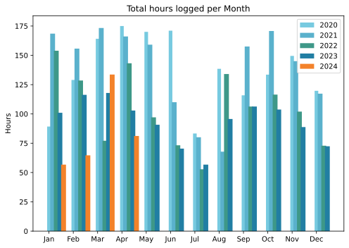
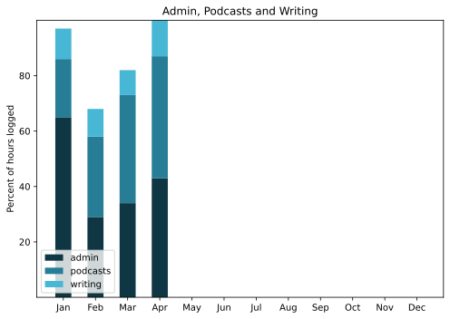

Around the web, a few people are saying that April went by super quick. Not for me. Nor dragging either. Just felt like an ordinary month in which I did some extraordinary things, most notably spending time with a great friend from grad-student days first in Rome, then by train to Venice, then by train to Vienna. Glorious.

===

## Highlights of the month:

- All that travel, including a 15 km walk round Prater and hours in the Kunsthistorisches Museum
- Picnic in the Botanic Garden
- Upgraded ETP site with a new theme
- Made another watercolour book, coptic stitch
- Disappointing exhibit on Marco Polo at the Doge's Palace
- Rewatched Triplettes de Belleville
- Irrigation restarted on the terrace
- Elderflower cordial and dill seedlings
- Litigation settled; they were wrong, but that's no comfort

### Activities

Steps way up, because tourism. Cycling ditto. Can't decide what (fiction) to read next. Weight coming down again, slowly.

#### April: 
* Walking with sticks: 0
* Reading: 10
* Steps (avge): 10,356
* Podcasts: 31 (All of them [logged](https://www.jeremycherfas.net/stream/)).
* In bed/asleep 8:41/7:48
* 7 Minutes: 7 days
* Cycled: 2 days (18 km)
* Weight (avge): 89.7
* Naps: 13

#### March: 
* Walking with sticks: 0
* Reading: 22
* Steps (avge): 8650
* Podcasts: 31 (29 of them [logged](https://www.jeremycherfas.net/stream/)).
* In bed/asleep 8:32/7:36
* 7 Minutes: 6 days
* Cycled: 4 days (154 km)
* Weight (avge): 90.0
* Naps: 14

### Stuff Done

Seems like I didn't do any paid work this month, which is nice.

The big effort was a new theme and some new static content at [ETP](https://eatthispodcast.com), prompted by a very reasonable question from a putative guest: Who are you? That led to the revelation that the sidebars and footers, unnoticed, had gone missing at some date in the past. The result is reasonably pleasing, and made me realise yet again that the average WordPress theme is much, much more complicated than I need. Of course, to be popular a theme needs to be all things to all people, but that does mean that adjustment of anything beyond what the theme offers is fraught with complexity. That goes especially for indiewebifying. Not for the first time, I embarked on a theme from scratch. We'll see how that goes.

#### Hours logged per month

#### Percent of logged hours

Previous years are on [an archive page](https://jeremycherfas.net/blog/working-life).

### Goals

Only six posts this month.

### Niggles

Part of me thinks I should have been recording my travels in the moment. The rest disagrees. No clear winner. Next trip I am travelling even lighter, but maybe socials?

### Final remarks

Life is good. I keep saying that, and it keeps being true.

----

## Here’s the table

Click the triangle to see or hide the table

<table class="worktable">
<thead>
<tr>
<th style="text-align: right;" class="bigrow">Month</th>
<th style="text-align: center;" class="bigrow">Total</th>
<th style="text-align: center;" class="smallrow">Daily</th>
<th style="text-align: center;"class="smallrow">Admin %</th>
<th style="text-align: center;"class="smallrow">ETP %</th>
<th style="text-align: center;"class="smallrow">Writing %</th>
<th style="text-align: center;"class="smallrow">Other %</th>
</tr>
</thead>
<tbody>
<tr>
<td style="text-align: right;">04</td>
<td style="text-align: center;">81.2</td>
<td style="text-align: center;">2.71</td>
<td style="text-align: center;">43</td>
<td style="text-align: center;">44</td>
<td style="text-align: center;">13</td>
<td style="text-align: center;">0</td>
</tr>
<tr>
<td style="text-align: right;">03</td>
<td style="text-align: center;">133.6</td>
<td style="text-align: center;">4.75</td>
<td style="text-align: center;">34</td>
<td style="text-align: center;">39</td>
<td style="text-align: center;">18</td>
<td style="text-align: center;">9</td>
</tr>
<tr>
<td style="text-align: right;">02</td>
<td style="text-align: center;">64.7</td>
<td style="text-align: center;">4.7</td>
<td style="text-align: center;">53</td>
<td style="text-align: center;">29</td>
<td style="text-align: center;">10</td>
<td style="text-align: center;">5</td>
</tr>
<tr>
<td style="text-align: right;">2024-01</td>
<td style="text-align: center;">56.75</td>
<td style="text-align: center;">4.0</td>
<td style="text-align: center;">65</td>
<td style="text-align: center;">21</td>
<td style="text-align: center;">11</td>
<td style="text-align: center;">3</td>
</tr>
</tbody>
</table>

