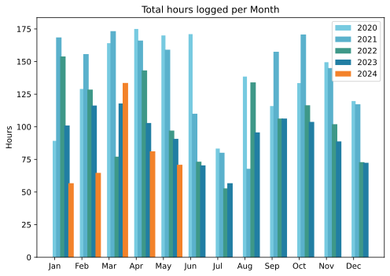
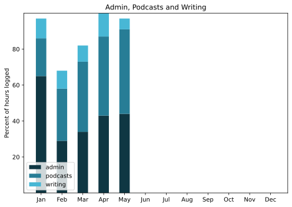

To Venice, again, and this time on the Brompton. Well, train to Treviso and then cycle to Venice, but still. Magic. Fun trips also to see my sainted mother in England and the Dublin Gastronomy Symposium. The cooler, wetter spring has meant the terrace is a jungle.

===

## Highlights of the month:

- Wonderful group cycle trip to Venice, which sold me on an electric pump. Joy!
- Good progress on a ground-up theme for ETP.
- Raleigh back wheel out of true; LBS replaced but I foolishly let them keep the hub and rim.
- New shoes!
- Stunning show on Naples at the Quirinale.
- A birthday party in the country with roast piglet.
- Visits to London and Dublin.
- Shocked by two deaths I had been unaware of.

### Activities

Steps down a bit, because no great tourism. Cycling monthly best performance. Reading plunged because I could not decide what to read next. Weight taking its sweet time to drift down. Worried that I am losing the habit of HIIT exercise. It has become very boring and I need to revitalise it, although cycling is a partial replacement.

#### May: 
* Walking with sticks: 0
* Reading: 4
* Steps (avge): 9454
* Podcasts: 13 (All of them [logged](https://www.jeremycherfas.net/stream/)).
* In bed/asleep 8:20/7:19
* 7 Minutes: 4 days
* Cycled: 7 days (211 km)
* Weight (avge): 89.0
* Naps: 9

#### April: 
* Walking with sticks: 0
* Reading: 10
* Steps (avge): 10,356
* Podcasts: 31 (All of them [logged](https://www.jeremycherfas.net/stream/)).
* In bed/asleep 8:41/7:48
* 7 Minutes: 7 days
* Cycled: 2 days (18 km)
* Weight (avge): 89.7
* Naps: 13

### Stuff Done

Managed a smidgen of paid work this month, and aside from that got on with my various projects, including trips. Being away from my desk means I don’t make progress on geeky things, and then have to force myself to restart.

#### Hours logged per month

#### Percent of logged hours

Previous years are on [an archive page](https://jeremycherfas.net/blog/working-life).

### Goals

Only three posts this month, which squares with my concern last month that I should be trying to write during travels rather than after the fact. There’s so much else to do though, and I’m not going to be sitting in a hotel room writing when I could be slurping a Guinness.

### Niggles

Mastodon continues to be engaging and fun, although frustrating because sync just sometimes doesn't in Ivory. No clear idea what to do. Try another app?

### Final remarks

All fine, all good.

----

## Here’s the table

Click the triangle to see or hide the table

<table class="worktable">
<thead>
<tr>
<th style="text-align: right;" class="bigrow">Month</th>
<th style="text-align: center;" class="bigrow">Total</th>
<th style="text-align: center;" class="smallrow">Daily</th>
<th style="text-align: center;"class="smallrow">Admin %</th>
<th style="text-align: center;"class="smallrow">ETP %</th>
<th style="text-align: center;"class="smallrow">Writing %</th>
<th style="text-align: center;"class="smallrow">Other %</th>
</tr>
</thead>
<tbody>
<tr>
<td style="text-align: right;">05</td>
<td style="text-align: center;">70.9</td>
<td style="text-align: center;">2.29</td>
<td style="text-align: center;">44</td>
<td style="text-align: center;">47</td>
<td style="text-align: center;">6</td>
<td style="text-align: center;">3</td>
</tr>
<tr>
<td style="text-align: right;">04</td>
<td style="text-align: center;">81.2</td>
<td style="text-align: center;">2.71</td>
<td style="text-align: center;">43</td>
<td style="text-align: center;">44</td>
<td style="text-align: center;">13</td>
<td style="text-align: center;">0</td>
</tr>
<tr>
<td style="text-align: right;">03</td>
<td style="text-align: center;">133.6</td>
<td style="text-align: center;">4.75</td>
<td style="text-align: center;">34</td>
<td style="text-align: center;">39</td>
<td style="text-align: center;">18</td>
<td style="text-align: center;">9</td>
</tr>
<tr>
<td style="text-align: right;">02</td>
<td style="text-align: center;">64.7</td>
<td style="text-align: center;">4.7</td>
<td style="text-align: center;">53</td>
<td style="text-align: center;">29</td>
<td style="text-align: center;">10</td>
<td style="text-align: center;">5</td>
</tr>
<tr>
<td style="text-align: right;">2024-01</td>
<td style="text-align: center;">56.75</td>
<td style="text-align: center;">4.0</td>
<td style="text-align: center;">65</td>
<td style="text-align: center;">21</td>
<td style="text-align: center;">11</td>
<td style="text-align: center;">3</td>
</tr>
</tbody>
</table>

