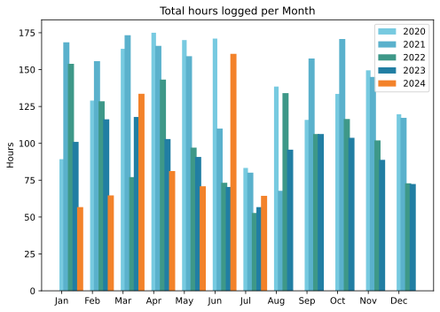
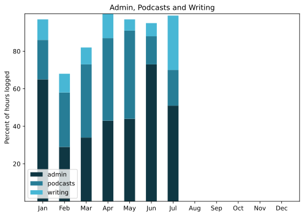

Very late, which is entirely understandable as I have very little of substance to report. We were away for almost the entire month having fun and relaxing, as it should be.

===

## Highlights of the month:

- Fresh produce straight from the _orto_ and a swimming pool
- A great new (to me) simple quiche crust recipe
- Redesign of ETP site continued with focused sessions
- Symlinks are still my friends, but not without issues
- Saw a big blue-gray heron take off
- Only a couple of deaths on the terrace, although one is my precious sorrel
- Peeking into gorgeous private gardens in Presicce
- A sweet dachshund chewed all four ends off my shoelaces during an interview
- Agriturismo Seliano and Paestum!
- Plumeria cuttings rooted and one flowering

### Activities

No cycling, no weighing, no surprises. And not going to record swims only for the one month in which they mostly occur.

#### July: 
* Walking with sticks: 0
* Reading: 22
* Steps (avge): 7473
* Podcasts: 11 (All of them [logged](https://www.jeremycherfas.net/stream/)).
* In bed/asleep 8:18/7:16
* 7 Minutes: 0 days
* Cycled: 0 days
* Weight (avge): N/A (no scales)
* Naps:25

#### June: 
* Walking with sticks: 3
* Reading: 21
* Steps (avge): 7418
* Podcasts: 20 (All of them [logged](https://www.jeremycherfas.net/stream/)).
* In bed/asleep 8:19/7:29
* 7 Minutes: 2 days
* Cycled: 7 days (XXX km; to be added back at desktop)
* Weight (avge): 89.3
* Naps:20

### Stuff Done

Surprised myself with good progress on site redesign on the laptop, making good use of MAMP shared via Syncthing. Other bits of work done with no great fuss.

#### Hours logged per month

#### Percent of logged hours

Previous years are still on [an archive page](https://jeremycherfas.net/blog/working-life).

### Goals

Six posts, not too shabby for a month in which I was mostly doing nothing. Continued progress on redesigning ETP theme from scratch, but now of course I want to do the same for this site, wityh the additional aim of making it more efficient.

### Niggles

Not a one, even though I still have not done the Q2 transport summary. I have some ideas on that front.

### Final remarks

I could pretend to be prescient and claim my optimism was restored in July (which it was, to some extent) but truly August has brought the good news.

----

## Here’s the table

Click the triangle to see or hide the table

<table class="worktable">
<thead>
<tr>
<th style="text-align: right;" class="bigrow">Month</th>
<th style="text-align: center;" class="bigrow">Total</th>
<th style="text-align: center;" class="smallrow">Daily</th>
<th style="text-align: center;"class="smallrow">Admin %</th>
<th style="text-align: center;"class="smallrow">ETP %</th>
<th style="text-align: center;"class="smallrow">Writing %</th>
<th style="text-align: center;"class="smallrow">Other %</th>
</tr>
</thead>
<tbody>
<tr>
<td style="text-align: right;">07</td>
<td style="text-align: center;">64.4</td>
<td style="text-align: center;">2.08</td>
<td style="text-align: center;">51</td>
<td style="text-align: center;">19</td>
<td style="text-align: center;">29</td>
<td style="text-align: center;">1</td>
</tr>
<tr>
<td style="text-align: right;">06</td>
<td style="text-align: center;">160.7</td>
<td style="text-align: center;">5.35</td>
<td style="text-align: center;">73</td>
<td style="text-align: center;">15</td>
<td style="text-align: center;">7</td>
<td style="text-align: center;">5</td>
</tr>
<tr>
<td style="text-align: right;">05</td>
<td style="text-align: center;">70.9</td>
<td style="text-align: center;">2.29</td>
<td style="text-align: center;">44</td>
<td style="text-align: center;">47</td>
<td style="text-align: center;">6</td>
<td style="text-align: center;">3</td>
</tr>
<tr>
<td style="text-align: right;">04</td>
<td style="text-align: center;">81.2</td>
<td style="text-align: center;">2.71</td>
<td style="text-align: center;">43</td>
<td style="text-align: center;">44</td>
<td style="text-align: center;">13</td>
<td style="text-align: center;">0</td>
</tr>
<tr>
<td style="text-align: right;">03</td>
<td style="text-align: center;">133.6</td>
<td style="text-align: center;">4.75</td>
<td style="text-align: center;">34</td>
<td style="text-align: center;">39</td>
<td style="text-align: center;">18</td>
<td style="text-align: center;">9</td>
</tr>
<tr>
<td style="text-align: right;">02</td>
<td style="text-align: center;">64.7</td>
<td style="text-align: center;">4.7</td>
<td style="text-align: center;">53</td>
<td style="text-align: center;">29</td>
<td style="text-align: center;">10</td>
<td style="text-align: center;">5</td>
</tr>
<tr>
<td style="text-align: right;">2024-01</td>
<td style="text-align: center;">56.75</td>
<td style="text-align: center;">4.0</td>
<td style="text-align: center;">65</td>
<td style="text-align: center;">21</td>
<td style="text-align: center;">11</td>
<td style="text-align: center;">3</td>
</tr>
</tbody>
</table>

