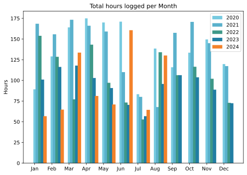

Phew! What a scorcher! Seriously, August was hotter for longer than I can remember. Almost impossible to go for a walk at any reasonable hour, and although I managed a few early morning rides, they got pretty hot pretty fast too.

===

## Highlights of the month:

- Faked new blogging thing -- Blaugust -- by recycling Our Daily Bread
- Plants snagged in Puglia planted up and thriving
- Mackup proved to be a bit of a disaster
- Put new shifters on the Raleigh and rode
- New mattress! More than 20 years on ... 
- One good day at the lake
- Traditional, by now, supper and walk on the beach
- Good art show of Carla Accredi at the Palazzo della Esposizione with a good lunch
- 250 issues of Eat This Newsletter
- Up to Tuscany for a successful painting show for Lucy

### Activities

Very sedentary on account of the heat. Still a few good long bicycle rides on the roadster.

#### August: 
* Walking with sticks: 0
* Reading: 19
* Steps (avge): 6713
* Podcasts: 11 (All of them [logged](https://www.jeremycherfas.net/stream/)).
* In bed/asleep 8:22/7:04
* 7 Minutes: 0 days
* Cycled: 3 days
* Weight (avge): 88.5
* Naps:28

#### July: 
* Walking with sticks: 0
* Reading: 22
* Steps (avge): 7473
* Podcasts: 11 (All of them [logged](https://www.jeremycherfas.net/stream/)).
* In bed/asleep 8:18/7:16
* 7 Minutes: 0 days
* Cycled: 0 days
* Weight (avge): N/A (no scales)
* Naps:25

### Stuff Done

Got quite involved in some work for money that I can’t really talk about and that has been going quite well. Not that I enjoy online teaching, but still.

#### Hours logged per month

#### Percent of logged hours

Previous years are still on [an archive page](https://jeremycherfas.net/blog/working-life).

### Goals

Lots of posts, thanks to recycling Our Daily Bread, but that’s cheating, a bit. Redesign of ETP site stalled somewhat under the pressure of actually putting out the first episode of the new season and that paid work thing eating into free time.

### Niggles

The lack of sync I alluded to last month has me thinking that what I really ought to move towards is a single computer, a laptop, plugged into a big old screen at home. Also, I need to figure out a longer ride for the roadster bicycle without just doubling back to do the cyclepath twice.

### Final remarks

I really need to be more protective of my time and not take on paid work just because somebody nice asks me to do something interesting.

----

## Here’s the table

Click the triangle to see or hide the table

<table class="worktable">
<thead>
<tr>
<th style="text-align: right;" class="bigrow">Month</th>
<th style="text-align: center;" class="bigrow">Total</th>
<th style="text-align: center;" class="smallrow">Daily</th>
<th style="text-align: center;"class="smallrow">Admin %</th>
<th style="text-align: center;"class="smallrow">ETP %</th>
<th style="text-align: center;"class="smallrow">Writing %</th>
<th style="text-align: center;"class="smallrow">Other %</th>
</tr>
</thead>
<tbody>
<tr>
<td style="text-align: right;">08</td>
<td style="text-align: center;">130.1</td>
<td style="text-align: center;">4.20</td>
<td style="text-align: center;">50</td>
<td style="text-align: center;">22</td>
<td style="text-align: center;">19</td>
<td style="text-align: center;">9</td>
</tr>

<tr>
<td style="text-align: right;">07</td>
<td style="text-align: center;">64.4</td>
<td style="text-align: center;">2.08</td>
<td style="text-align: center;">51</td>
<td style="text-align: center;">19</td>
<td style="text-align: center;">29</td>
<td style="text-align: center;">1</td>
</tr>
<tr>
<td style="text-align: right;">06</td>
<td style="text-align: center;">160.7</td>
<td style="text-align: center;">5.35</td>
<td style="text-align: center;">73</td>
<td style="text-align: center;">15</td>
<td style="text-align: center;">7</td>
<td style="text-align: center;">5</td>
</tr>
<tr>
<td style="text-align: right;">05</td>
<td style="text-align: center;">70.9</td>
<td style="text-align: center;">2.29</td>
<td style="text-align: center;">44</td>
<td style="text-align: center;">47</td>
<td style="text-align: center;">6</td>
<td style="text-align: center;">3</td>
</tr>
<tr>
<td style="text-align: right;">04</td>
<td style="text-align: center;">81.2</td>
<td style="text-align: center;">2.71</td>
<td style="text-align: center;">43</td>
<td style="text-align: center;">44</td>
<td style="text-align: center;">13</td>
<td style="text-align: center;">0</td>
</tr>
<tr>
<td style="text-align: right;">03</td>
<td style="text-align: center;">133.6</td>
<td style="text-align: center;">4.75</td>
<td style="text-align: center;">34</td>
<td style="text-align: center;">39</td>
<td style="text-align: center;">18</td>
<td style="text-align: center;">9</td>
</tr>
<tr>
<td style="text-align: right;">02</td>
<td style="text-align: center;">64.7</td>
<td style="text-align: center;">4.7</td>
<td style="text-align: center;">53</td>
<td style="text-align: center;">29</td>
<td style="text-align: center;">10</td>
<td style="text-align: center;">5</td>
</tr>
<tr>
<td style="text-align: right;">2024-01</td>
<td style="text-align: center;">56.75</td>
<td style="text-align: center;">4.0</td>
<td style="text-align: center;">65</td>
<td style="text-align: center;">21</td>
<td style="text-align: center;">11</td>
<td style="text-align: center;">3</td>
</tr>
</tbody>
</table>

