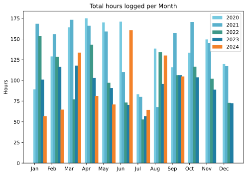
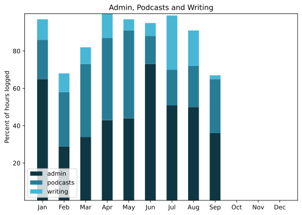

After the heat of August, a totally cool month in more ways than one. Way up north in Northern Ireland staying in a lovely, warm and comfortable house about 100 metres from a huge great strand. People said, what for? Because we could, and it turned out to be a much better time that passed much more rapidly than I could ever have imagined.

===

## Highlights of the month:

- Rental car with CarPlay, which is nice. Considering a retro-fit.
- Vision checked, no change except possible cataracts.
- Walks on the strand with huge skies and wide sands.
- Visit to Malin Head, the stuff of boyhood adventures of the mind.
- A few days of stunningly good weather.
- Belfast Botanic Gardens and the Ulster Museum.
- Giant’s Causeway.
- iPlayer and Line of Duty

### Activities

Good to see steps up again, and even better to reflect on some of the walks which were so different to what I am used to. Very proud of huge increase in Bed and Sleep. Didn’t actually put on much weight, which was a bit of a surprise.

#### September: 
* Walking with sticks: 0
* Reading: 23
* Steps (avge): 7753
* Podcasts: 10 (All of them [logged](https://www.jeremycherfas.net/stream/)).
* In bed/asleep 9:08/7:58
* 7 Minutes: 0 days
* Cycled: 0 days
* Weight (avge): N/A
* Naps: 13

#### August: 
* Walking with sticks: 0
* Reading: 19
* Steps (avge): 6713
* Podcasts: 11 (All of them [logged](https://www.jeremycherfas.net/stream/)).
* In bed/asleep 8:22/7:04
* 7 Minutes: 0 days
* Cycled: 3 days
* Weight (avge): 88.5
* Naps:28

### Stuff Done

The work for money took up a fair bit of time, but it wasn't actually all that difficult. More difficult on the house-mates, who had to tiptoe around or go out in some rotten weather. Grateful to them for that.

The hardest part of being a nomad, and this was the first time I had been away from home for this long, was the business of synchronising desktop and laptop. Mackup proved to be a bust on Sonoma and as far as I can tell has not seen any effort to address the problems, so I have ditched that. Not as easy as it seems, because there are so many different ways that apps store their vitals. Not absolutely convinced I am back to square one yet, but I think so. And going forward I am going to try and make use of whatever native abilities apps may have for keeping in sync.

- `Alfred` makes it easy with a workflow to backup and restore.
- `zsh` has a [plugin for GPG encrypted internet synchronised Zsh history, with Git](https://github.com/wulfgarpro/history-sync) that I might try.
- `Reaper` is easy enough to have on two machines.
- What else?

The solution that now seems even more attractive is the one I alluded to last month: one machine, the laptop, plugged into a big old monitor at home and making much more use of iCloud storage.

Less geeky, I read The Heather Blazing by Colm Tóibín and was absolutely delighted by its quiet recounting of a life well lived. The grieving struck me as realistic, though I have no way of knowing why. Also an unimpressive Le Carré. And we managed to binge five seasons of Line of Duty, which is every bit as good as people say it is.

#### Hours logged per month

#### Percent of logged hours

Previous years are still on [an archive page](https://jeremycherfas.net/blog/working-life).

### Goals

Not much written at all. Sosumi.

### Niggles

None

### Final remarks

OK, the break is over, get back into the rut!

----

## Here’s the table

Click the triangle to see or hide the table

<table class="worktable">
<thead>
<tr>
<th style="text-align: right;" class="bigrow">Month</th>
<th style="text-align: center;" class="bigrow">Total</th>
<th style="text-align: center;" class="smallrow">Daily</th>
<th style="text-align: center;"class="smallrow">Admin %</th>
<th style="text-align: center;"class="smallrow">ETP %</th>
<th style="text-align: center;"class="smallrow">Writing %</th>
<th style="text-align: center;"class="smallrow">Other %</th>
</tr>
</thead>
<tbody>
<tr>
<td style="text-align: right;">09</td>
<td style="text-align: center;">104.8</td>
<td style="text-align: center;">4.20</td>
<td style="text-align: center;">36</td>
<td style="text-align: center;">29</td>
<td style="text-align: center;">2</td>
<td style="text-align: center;">34</td>
</tr>
<tr>
<td style="text-align: right;">08</td>
<td style="text-align: center;">130.1</td>
<td style="text-align: center;">4.20</td>
<td style="text-align: center;">50</td>
<td style="text-align: center;">22</td>
<td style="text-align: center;">19</td>
<td style="text-align: center;">9</td>
</tr>
<tr>
<td style="text-align: right;">07</td>
<td style="text-align: center;">64.4</td>
<td style="text-align: center;">2.08</td>
<td style="text-align: center;">51</td>
<td style="text-align: center;">19</td>
<td style="text-align: center;">29</td>
<td style="text-align: center;">1</td>
</tr>
<tr>
<td style="text-align: right;">06</td>
<td style="text-align: center;">160.7</td>
<td style="text-align: center;">5.35</td>
<td style="text-align: center;">73</td>
<td style="text-align: center;">15</td>
<td style="text-align: center;">7</td>
<td style="text-align: center;">5</td>
</tr>
<tr>
<td style="text-align: right;">05</td>
<td style="text-align: center;">70.9</td>
<td style="text-align: center;">2.29</td>
<td style="text-align: center;">44</td>
<td style="text-align: center;">47</td>
<td style="text-align: center;">6</td>
<td style="text-align: center;">3</td>
</tr>
<tr>
<td style="text-align: right;">04</td>
<td style="text-align: center;">81.2</td>
<td style="text-align: center;">2.71</td>
<td style="text-align: center;">43</td>
<td style="text-align: center;">44</td>
<td style="text-align: center;">13</td>
<td style="text-align: center;">0</td>
</tr>
<tr>
<td style="text-align: right;">03</td>
<td style="text-align: center;">133.6</td>
<td style="text-align: center;">4.75</td>
<td style="text-align: center;">34</td>
<td style="text-align: center;">39</td>
<td style="text-align: center;">18</td>
<td style="text-align: center;">9</td>
</tr>
<tr>
<td style="text-align: right;">02</td>
<td style="text-align: center;">64.7</td>
<td style="text-align: center;">4.7</td>
<td style="text-align: center;">53</td>
<td style="text-align: center;">29</td>
<td style="text-align: center;">10</td>
<td style="text-align: center;">5</td>
</tr>
<tr>
<td style="text-align: right;">2024-01</td>
<td style="text-align: center;">56.75</td>
<td style="text-align: center;">4.0</td>
<td style="text-align: center;">65</td>
<td style="text-align: center;">21</td>
<td style="text-align: center;">11</td>
<td style="text-align: center;">3</td>
</tr>
</tbody>
</table>

