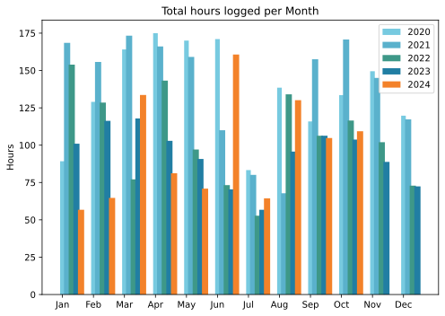
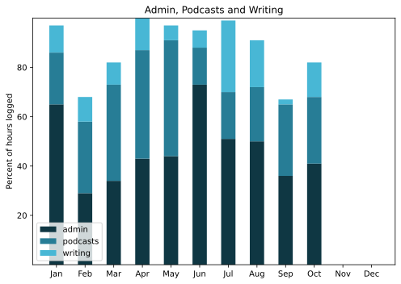

Back to work (haha) with quite a lot of time spent catching up with all the many things I didn't keep up with in Ireland. And then all over again after a week in London. Decidedly a good month, with some splendid warm, bright, blue-sky days.

===

## Highlights of the month:

- A week in London seeing my Mum and a great Van Gogh show
- Restarted HIIT
- Moved from Pinboard to Linkding; win.
- Mending shirt collars with the sewing machine
- Dentist, kinda sorta
- Lots of visitors to town
- Delivered a good webinar on biofortification
- Getting a grip on subtitles in app for the podcast
- Clean keyboard!

### Activities

Once again, being in a different city, even if for only a week, boosts the step count with no obvious distress. And getting back into HIIT was not as hard as I expected it to be. Made an executive decision not to start big bread bakes, and was glad of that, while domestic bakes got the starters going again. The kefir is slowly coming back to life too.

#### October: 
* Walking with sticks: 0
* Reading: 15
* Steps (avge): 9349
* Podcasts: 22 (18 of them [logged](https://www.jeremycherfas.net/stream/)).
* In bed/asleep 9:02/8:00
* 7 Minutes: 8 days
* Cycled: 4 days
* Weight (avge): 87.9
* Naps: 5

#### September: 
* Walking with sticks: 0
* Reading: 23
* Steps (avge): 7753
* Podcasts: 10 (All of them [logged](https://www.jeremycherfas.net/stream/)).
* In bed/asleep 9:08/7:58
* 7 Minutes: 0 days
* Cycled: 0 days
* Weight (avge): N/A
* Naps: 13

### Stuff Done

Work for money went well, although I am still not entirely comfortable spouting forth on Zoom etc. Finished season six of Line of Duty and remebered to cancel my free two weeks with Acorn TV. The mystery remains: how did they get the rights when everything else they offer is of minimal interest (to me)?

#### Hours logged per month

#### Percent of logged hours

Previous years are still on [an archive page](https://jeremycherfas.net/blog/working-life).

### Goals

Six blog posts, not too shabby, even if two of them were regular features. Redesign of the podcast site is going too slowly, not least because I quite like the current version. The obstacle to customising it -- and the drive towards my own -- is the sheer difficulty of understanding what it is doing and bending it too my will.

### Niggles

The sync problem, getting better with each spell away from home, but not perfect yet. Oh, and, a fair amount of existential dread.

### Final remarks

Promotion/marketing is hard.

----

## Here’s the table

Click the triangle to see or hide the table

<table class="worktable">
<thead>
<tr>
<th style="text-align: right;" class="bigrow">Month</th>
<th style="text-align: center;" class="bigrow">Total</th>
<th style="text-align: center;" class="smallrow">Daily</th>
<th style="text-align: center;"class="smallrow">Admin %</th>
<th style="text-align: center;"class="smallrow">ETP %</th>
<th style="text-align: center;"class="smallrow">Writing %</th>
<th style="text-align: center;"class="smallrow">Other %</th>
</tr>
</thead>
<tbody>
<tr>
<td style="text-align: right;">10</td>
<td style="text-align: center;">109.3</td>
<td style="text-align: center;">3.53</td>
<td style="text-align: center;">41</td>
<td style="text-align: center;">27</td>
<td style="text-align: center;">18</td>
<td style="text-align: center;">14</td>
</tr>
<tr>
<td style="text-align: right;">09</td>
<td style="text-align: center;">104.8</td>
<td style="text-align: center;">4.20</td>
<td style="text-align: center;">36</td>
<td style="text-align: center;">29</td>
<td style="text-align: center;">2</td>
<td style="text-align: center;">34</td>
</tr>
<tr>
<td style="text-align: right;">08</td>
<td style="text-align: center;">130.1</td>
<td style="text-align: center;">4.20</td>
<td style="text-align: center;">50</td>
<td style="text-align: center;">22</td>
<td style="text-align: center;">19</td>
<td style="text-align: center;">9</td>
</tr>
<tr>
<td style="text-align: right;">07</td>
<td style="text-align: center;">64.4</td>
<td style="text-align: center;">2.08</td>
<td style="text-align: center;">51</td>
<td style="text-align: center;">19</td>
<td style="text-align: center;">29</td>
<td style="text-align: center;">1</td>
</tr>
<tr>
<td style="text-align: right;">06</td>
<td style="text-align: center;">160.7</td>
<td style="text-align: center;">5.35</td>
<td style="text-align: center;">73</td>
<td style="text-align: center;">15</td>
<td style="text-align: center;">7</td>
<td style="text-align: center;">5</td>
</tr>
<tr>
<td style="text-align: right;">05</td>
<td style="text-align: center;">70.9</td>
<td style="text-align: center;">2.29</td>
<td style="text-align: center;">44</td>
<td style="text-align: center;">47</td>
<td style="text-align: center;">6</td>
<td style="text-align: center;">3</td>
</tr>
<tr>
<td style="text-align: right;">04</td>
<td style="text-align: center;">81.2</td>
<td style="text-align: center;">2.71</td>
<td style="text-align: center;">43</td>
<td style="text-align: center;">44</td>
<td style="text-align: center;">13</td>
<td style="text-align: center;">0</td>
</tr>
<tr>
<td style="text-align: right;">03</td>
<td style="text-align: center;">133.6</td>
<td style="text-align: center;">4.75</td>
<td style="text-align: center;">34</td>
<td style="text-align: center;">39</td>
<td style="text-align: center;">18</td>
<td style="text-align: center;">9</td>
</tr>
<tr>
<td style="text-align: right;">02</td>
<td style="text-align: center;">64.7</td>
<td style="text-align: center;">4.7</td>
<td style="text-align: center;">53</td>
<td style="text-align: center;">29</td>
<td style="text-align: center;">10</td>
<td style="text-align: center;">5</td>
</tr>
<tr>
<td style="text-align: right;">2024-01</td>
<td style="text-align: center;">56.75</td>
<td style="text-align: center;">4.0</td>
<td style="text-align: center;">65</td>
<td style="text-align: center;">21</td>
<td style="text-align: center;">11</td>
<td style="text-align: center;">3</td>
</tr>
</tbody>
</table>

