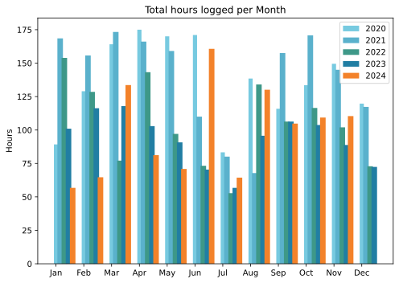
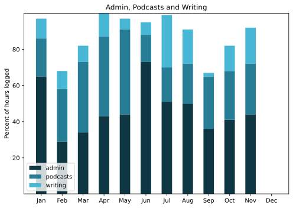

Nothing really stands out, which seems a bit odd. Neither positive nor negative, just chugging along.

===

## Highlights of the month:
- Good visits from friends old and new
- Picked 1.8 kg of our own olives (still not edible)
- That lowlife
- Learned about, and used, a PEC
- Dumped my letting agent, finally, to mutual joy
- Venice for four days
- Road bike serviced
- Domestic repairs, by me and an expert
- Ride round Lago di Bracciano with Ruotalibera

### Activities
A few more little bicycle rides to do errands, which is very enjoyable. Even coming back up the hill wasn't too bad, and I think I can now manage any on of the three climbs. Not easily, but manageably.

#### November: 
* Walking with sticks: 0
* Reading: 14
* Steps (avge): 9350 Consistent, or what?
* Podcasts: 20 (15 of them [logged](https://www.jeremycherfas.net/stream/)).
* In bed/asleep 8:50/7:53
* 7 Minutes: 6 days
* Cycled: 9 days
* Weight (avge): 89.7 Careful ...
* Naps: 8

#### October: 
* Walking with sticks: 0
* Reading: 15
* Steps (avge): 9349
* Podcasts: 22 (18 of them [logged](https://www.jeremycherfas.net/stream/)).
* In bed/asleep 9:02/8:00
* 7 Minutes: 8 days
* Cycled: 4 days
* Weight (avge): 87.9
* Naps: 5

### Stuff Done
It was good to deliver the final sessions in the training course I have been involved in, even though attendance was a bit sparse. Pretty sure the participants are being over-stretched, so not really my problem. Some other interesting paid work too. Still working through the new ETP site redesign, but losing momentum now and again. Have vowed to finish and publish that before tackling Grav redesign.

#### Hours logged per month

#### Percent of logged hours

Previous years are still on [an archive page](https://jeremycherfas.net/blog/working-life).

### Goals

Three posts. Three miserable posts. No real idea why, beyond a failure to act on scribbled notes to myself. They might even still be around here somewhere.

### Niggles

See above. I'm beginning to think that keeping up with the socials is taking more time than it deserves, although I also still find it more or less rewarding.

### Final remarks

December is for socialising IRL and my dance card is almost filled.

----

## Here’s the table

Click the triangle to see or hide the table

<table class="worktable">
<thead>
<tr>
<th style="text-align: right;" class="bigrow">Month</th>
<th style="text-align: center;" class="bigrow">Total</th>
<th style="text-align: center;" class="smallrow">Daily</th>
<th style="text-align: center;"class="smallrow">Admin %</th>
<th style="text-align: center;"class="smallrow">ETP %</th>
<th style="text-align: center;"class="smallrow">Writing %</th>
<th style="text-align: center;"class="smallrow">Other %</th>
</tr>
</thead>
<tbody>
<tr>
<td style="text-align: right;">11</td>
<td style="text-align: center;">110.4</td>
<td style="text-align: center;">3.68</td>
<td style="text-align: center;">44</td>
<td style="text-align: center;">28</td>
<td style="text-align: center;">8</td>
<td style="text-align: center;">20</td>
</tr>
<tr>
<td style="text-align: right;">10</td>
<td style="text-align: center;">109.3</td>
<td style="text-align: center;">3.53</td>
<td style="text-align: center;">41</td>
<td style="text-align: center;">27</td>
<td style="text-align: center;">18</td>
<td style="text-align: center;">14</td>
</tr>
<tr>
<td style="text-align: right;">09</td>
<td style="text-align: center;">104.8</td>
<td style="text-align: center;">4.20</td>
<td style="text-align: center;">36</td>
<td style="text-align: center;">29</td>
<td style="text-align: center;">2</td>
<td style="text-align: center;">34</td>
</tr>
<tr>
<td style="text-align: right;">08</td>
<td style="text-align: center;">130.1</td>
<td style="text-align: center;">4.20</td>
<td style="text-align: center;">50</td>
<td style="text-align: center;">22</td>
<td style="text-align: center;">19</td>
<td style="text-align: center;">9</td>
</tr>
<tr>
<td style="text-align: right;">07</td>
<td style="text-align: center;">64.4</td>
<td style="text-align: center;">2.08</td>
<td style="text-align: center;">51</td>
<td style="text-align: center;">19</td>
<td style="text-align: center;">29</td>
<td style="text-align: center;">1</td>
</tr>
<tr>
<td style="text-align: right;">06</td>
<td style="text-align: center;">160.7</td>
<td style="text-align: center;">5.35</td>
<td style="text-align: center;">73</td>
<td style="text-align: center;">15</td>
<td style="text-align: center;">7</td>
<td style="text-align: center;">5</td>
</tr>
<tr>
<td style="text-align: right;">05</td>
<td style="text-align: center;">70.9</td>
<td style="text-align: center;">2.29</td>
<td style="text-align: center;">44</td>
<td style="text-align: center;">47</td>
<td style="text-align: center;">6</td>
<td style="text-align: center;">3</td>
</tr>
<tr>
<td style="text-align: right;">04</td>
<td style="text-align: center;">81.2</td>
<td style="text-align: center;">2.71</td>
<td style="text-align: center;">43</td>
<td style="text-align: center;">44</td>
<td style="text-align: center;">13</td>
<td style="text-align: center;">0</td>
</tr>
<tr>
<td style="text-align: right;">03</td>
<td style="text-align: center;">133.6</td>
<td style="text-align: center;">4.75</td>
<td style="text-align: center;">34</td>
<td style="text-align: center;">39</td>
<td style="text-align: center;">18</td>
<td style="text-align: center;">9</td>
</tr>
<tr>
<td style="text-align: right;">02</td>
<td style="text-align: center;">64.7</td>
<td style="text-align: center;">4.7</td>
<td style="text-align: center;">53</td>
<td style="text-align: center;">29</td>
<td style="text-align: center;">10</td>
<td style="text-align: center;">5</td>
</tr>
<tr>
<td style="text-align: right;">2024-01</td>
<td style="text-align: center;">56.75</td>
<td style="text-align: center;">4.0</td>
<td style="text-align: center;">65</td>
<td style="text-align: center;">21</td>
<td style="text-align: center;">11</td>
<td style="text-align: center;">3</td>
</tr>
</tbody>
</table>

