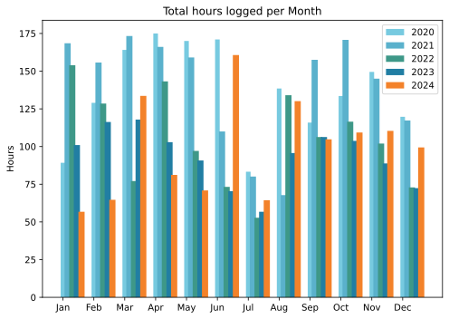
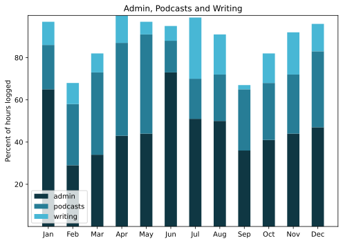

There's a temptation to review the whole year, not the month, which I shall try to resist.

===

## Highlights of the month:
- The olives are surprisingly good. I mean, really tasty
- Triumphed over bureaucracy; now we wait
- Medical shenanigans investigated and dealt with, mostly
- Spontaneous evenings out with friends
- Giant bike ride with a Bromptonian in appalling conditions
- Confit of six duck legs made
- Rescued the building from a flood
- Cocktail party
- Launched the new podcast site design and tweaked this one behind the scenes
- Duck confit exceptionally good. Would do again.

### Activities
A slow month, fo' sho. Wound up the big bit of paid work and admitted to myself that I actually enjoyed it far more than I expected. Will it recur? It might.

#### December: 
* Walking with sticks: 0
* Reading: 17
* Steps (avge): 8645
* Podcasts: 23 (20 of them [logged](https://www.jeremycherfas.net/listens)).
* In bed/asleep 8:16/8:04
* 7 Minutes: 1 day (for shame)
* Cycled: 1 day
* Weight (avge): 89.9
* Naps: 9

#### November: 
* Walking with sticks: 0
* Reading: 14
* Steps (avge): 9350 Consistent, or what?
* Podcasts: 20 (15 of them [logged](https://www.jeremycherfas.net/stream/)).
* In bed/asleep 8:50/7:53
* 7 Minutes: 6 days
* Cycled: 9 days
* Weight (avge): 89.7 Careful ...
* Naps: 8

### Stuff Done
The new ETP site redesign published, to a deafening silence, which is probably a good thing. Still need to streamline and simplify the whole donations business. Looking forward to putting what I have learned into a redesign of this place.

#### Hours logged per month

#### Percent of logged hours

Previous years are still on [an archive page](https://jeremycherfas.net/blog/working-life).

### Goals

Eight posts. That's better.

### Niggles

Not a one. It was a fine month, enjoyed to the max.

### Final remarks

See above. I will now succumb to the temptation and say that the year too was pretty good. Yes, there's the politics, which seems broken just about everywhere, and I haven't a clue what I could do other than vote. And maybe protest if a suitable occasion arises.

----

## Here’s the table

Click the triangle to see or hide the table

<table class="worktable">
<thead>
<tr>
<th style="text-align: right;" class="bigrow">Month</th>
<th style="text-align: center;" class="bigrow">Total</th>
<th style="text-align: center;" class="smallrow">Daily</th>
<th style="text-align: center;"class="smallrow">Admin %</th>
<th style="text-align: center;"class="smallrow">ETP %</th>
<th style="text-align: center;"class="smallrow">Writing %</th>
<th style="text-align: center;"class="smallrow">Other %</th>
</tr>
</thead>
<tbody>
<tr>
<td style="text-align: right;">12</td>
<td style="text-align: center;">99.4</td>
<td style="text-align: center;">3.21</td>
<td style="text-align: center;">47</td>
<td style="text-align: center;">36</td>
<td style="text-align: center;">13</td>
<td style="text-align: center;">4</td>
</tr>
<tr>
<td style="text-align: right;">11</td>
<td style="text-align: center;">110.4</td>
<td style="text-align: center;">3.68</td>
<td style="text-align: center;">44</td>
<td style="text-align: center;">28</td>
<td style="text-align: center;">8</td>
<td style="text-align: center;">20</td>
</tr>
<tr>
<td style="text-align: right;">10</td>
<td style="text-align: center;">109.3</td>
<td style="text-align: center;">3.53</td>
<td style="text-align: center;">41</td>
<td style="text-align: center;">27</td>
<td style="text-align: center;">18</td>
<td style="text-align: center;">14</td>
</tr>
<tr>
<td style="text-align: right;">09</td>
<td style="text-align: center;">104.8</td>
<td style="text-align: center;">4.20</td>
<td style="text-align: center;">36</td>
<td style="text-align: center;">29</td>
<td style="text-align: center;">2</td>
<td style="text-align: center;">34</td>
</tr>
<tr>
<td style="text-align: right;">08</td>
<td style="text-align: center;">130.1</td>
<td style="text-align: center;">4.20</td>
<td style="text-align: center;">50</td>
<td style="text-align: center;">22</td>
<td style="text-align: center;">19</td>
<td style="text-align: center;">9</td>
</tr>
<tr>
<td style="text-align: right;">07</td>
<td style="text-align: center;">64.4</td>
<td style="text-align: center;">2.08</td>
<td style="text-align: center;">51</td>
<td style="text-align: center;">19</td>
<td style="text-align: center;">29</td>
<td style="text-align: center;">1</td>
</tr>
<tr>
<td style="text-align: right;">06</td>
<td style="text-align: center;">160.7</td>
<td style="text-align: center;">5.35</td>
<td style="text-align: center;">73</td>
<td style="text-align: center;">15</td>
<td style="text-align: center;">7</td>
<td style="text-align: center;">5</td>
</tr>
<tr>
<td style="text-align: right;">05</td>
<td style="text-align: center;">70.9</td>
<td style="text-align: center;">2.29</td>
<td style="text-align: center;">44</td>
<td style="text-align: center;">47</td>
<td style="text-align: center;">6</td>
<td style="text-align: center;">3</td>
</tr>
<tr>
<td style="text-align: right;">04</td>
<td style="text-align: center;">81.2</td>
<td style="text-align: center;">2.71</td>
<td style="text-align: center;">43</td>
<td style="text-align: center;">44</td>
<td style="text-align: center;">13</td>
<td style="text-align: center;">0</td>
</tr>
<tr>
<td style="text-align: right;">03</td>
<td style="text-align: center;">133.6</td>
<td style="text-align: center;">4.75</td>
<td style="text-align: center;">34</td>
<td style="text-align: center;">39</td>
<td style="text-align: center;">18</td>
<td style="text-align: center;">9</td>
</tr>
<tr>
<td style="text-align: right;">02</td>
<td style="text-align: center;">64.7</td>
<td style="text-align: center;">4.7</td>
<td style="text-align: center;">53</td>
<td style="text-align: center;">29</td>
<td style="text-align: center;">10</td>
<td style="text-align: center;">5</td>
</tr>
<tr>
<td style="text-align: right;">2024-01</td>
<td style="text-align: center;">56.75</td>
<td style="text-align: center;">4.0</td>
<td style="text-align: center;">65</td>
<td style="text-align: center;">21</td>
<td style="text-align: center;">11</td>
<td style="text-align: center;">3</td>
</tr>
</tbody>
</table>

