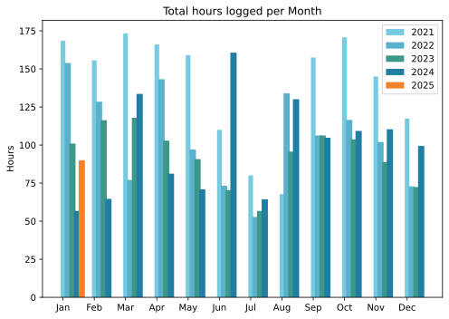
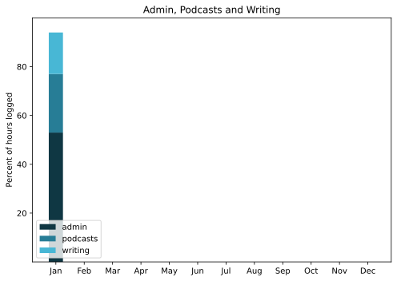

First monthly of the new year means it is time to update all the things; colours and labels on graphs, lists of things I've watched, probably others.

===

## Highlights of the month:
- Bureaucratic Triumph in my wallet
- Tidied up here behind the scenes
- Visit to London to see my sainted mother
- Visit to Torquay to see my sainted sister in law
- Caught up with friends
- Caught a cold and still dealing with it
- Sewing!
- Crochet!
- Thought a bit on the 18th anniversary of my father's funeral
- Salted my lemons and limes
- Dipping a toe in Bluesky
- Submitted an episode to the Fortnum & Mason awards; pointless, but ...

### Activities
Almost no paid work, and I don't care one bit. Keeping out of mischief with all my other projects. Resolved to walk more and it seems to be working.

#### January: 
* Walking with sticks: 0
* Reading: 16
* Steps (avge): 9327
* Podcasts: 19 (16 of them [logged](https://www.jeremycherfas.net/listens)).
* In bed/asleep 7:56/7:47
* HIIT: 0 days
* Cycled: 2 days
* Weight (avge): 89.9
* Naps: 7

#### December: 
* Walking with sticks: 0
* Reading: 17
* Steps (avge): 8645
* Podcasts: 23 (20 of them [logged](https://www.jeremycherfas.net/listens)).
* In bed/asleep 8:16/8:04
* 7 Minutes: 1 day (for shame)
* Cycled: 1 day
* Weight (avge): 89.9
* Naps: 9

### Stuff Done
Failed to streamline and simplify the whole donations business on ETP. Made a start to the redesign here, to be informed by the need to consider a dark mode design from the start, even though I don't personally like dark mode one bit.

#### Hours logged per month

#### Percent of logged hours

Previous years are still on [an archive page](https://jeremycherfas.net/blog/working-life).

### Goals

Nine posts. That's even better.

### Niggles

Still occasionally lose my grip on the things I need to get done, that super-annoying important and but not urgent quadrant.

### Final remarks

See above.

----

## Here’s the table

Click the triangle to see or hide the table

<table class="worktable">
<thead>
<tr>
<th style="text-align: right;" class="bigrow">Month</th>
<th style="text-align: center;" class="bigrow">Total</th>
<th style="text-align: center;" class="smallrow">Daily</th>
<th style="text-align: center;"class="smallrow">Admin %</th>
<th style="text-align: center;"class="smallrow">ETP %</th>
<th style="text-align: center;"class="smallrow">Writing %</th>
<th style="text-align: center;"class="smallrow">Other %</th>
</tr>
</thead>
<tbody>
<tr>
<td style="text-align: right;">2025-01</td>
<td style="text-align: center;">90.0</td>
<td style="text-align: center;">4.1</td>
<td style="text-align: center;">53</td>
<td style="text-align: center;">24</td>
<td style="text-align: center;">17</td>
<td style="text-align: center;">6</td>
</tr>
</tbody>
</table>

