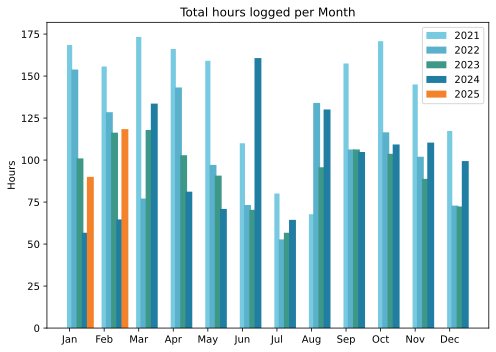

There’s a very good reason why this monthly update is as late as it is, but as all the delay actually happened in March, I shouldn’t discuss it until April, IYSWIM.

===

## Highlights of the month:
- Completed the thing that hijacked this update
- Crochet proceeding apace and improving
- Semi-annual trip down to Porta Portese, enjoyable
- Fine day trip to a friend in Umbria
- Some work on the terrace before the murky weather returned
- Lunch at the beach

### Activities
A couple of nice pieces of work, one of them a voice-over, work that was fun to pick up again.

#### February: 
* Walking with sticks: 0
* Reading: 17
* Steps (avge): 7783 (I blame two colds)
* Podcasts: 21 (19 of them [logged](https://www.jeremycherfas.net/listens)).
* In bed/asleep 8:03/7:55
* HIIT: 0 days
* Cycled: 4 days
* Weight (avge): 89.6
* Naps: 8

#### January: 
* Walking with sticks: 0
* Reading: 16
* Steps (avge): 9327
* Podcasts: 19 (16 of them [logged](https://www.jeremycherfas.net/listens)).
* In bed/asleep 7:56/7:47
* HIIT: 0 days
* Cycled: 2 days
* Weight (avge): 89.9
* Naps: 7

### Stuff Done
Signed up for a new, open podcast tracking service that offers much more [useful information](https://op3.dev/show/c9c7bad3-4712-514e-9ebd-d1e208fa1b76)[^1] than both Apple Podcasts and the stats service I pay for, so need to cancel that. I particularly like how it makes it easy to see that even very old episodes still get the occasional listen. The data visualisation is SO good.

[^1]: Not that I ever do anything with the information; it is purely information.

#### Hours logged per month

#### Percent of logged hours

Of note, a lot of time spent writing this month, in reality banging my head against the brick wall of site redesign and codifying, which an historical accident placed in that category.

Previous years are still on [an archive page](https://jeremycherfas.net/blog/working-life).

### Goals

Seven posts, one of which was only a seasonal update. I take comfort that February is a short month.

### Niggles

Nothing much, really, keeping me awake at night. But then again, nothing much ever has. A blessing.

### Final remarks

Having got a couple of housekeeping projects out of the way it must be about time to return to the list of things I’d like to do someday when I have the time. That time is now.

----

## Here’s the table

Click the triangle to see or hide the table

<table class="worktable">
<thead>
<tr>
<th style="text-align: right;" class="bigrow">Month</th>
<th style="text-align: center;" class="bigrow">Total</th>
<th style="text-align: center;" class="smallrow">Daily</th>
<th style="text-align: center;"class="smallrow">Admin %</th>
<th style="text-align: center;"class="smallrow">ETP %</th>
<th style="text-align: center;"class="smallrow">Writing %</th>
<th style="text-align: center;"class="smallrow">Other %</th>
</tr>
</thead>
<tbody>
<tr>
<td style="text-align: right;">02</td>
<td style="text-align: center;">118.4</td>
<td style="text-align: center;">4.6</td>
<td style="text-align: center;">35</td>
<td style="text-align: center;">25</td>
<td style="text-align: center;">35</td>
<td style="text-align: center;">5</td>
</tr>
<tr>
<td style="text-align: right;">2025-01</td>
<td style="text-align: center;">90.0</td>
<td style="text-align: center;">4.1</td>
<td style="text-align: center;">53</td>
<td style="text-align: center;">24</td>
<td style="text-align: center;">17</td>
<td style="text-align: center;">6</td>
</tr>
</tbody>
</table>

