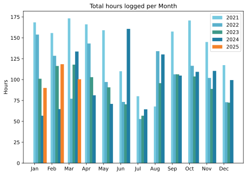
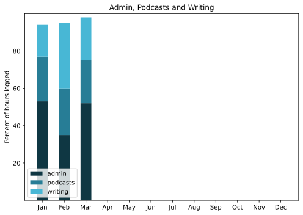

Once again, later than it “ought” to be, but this time the answer is simple: holidays. A glorious couple of weeks tooling around Sicily with one of my best, and longest-standing, friends and the Squeeze. If I wanted to delay this round-up even more, I’d focus first on writing that up, but I won’t.

===

## Highlights of the month:
- A redesign of this very space that you are reading now, most of which works the way I want it to
- Learned how dangerous I can be in a remote terminal session, and also how to recover
- The Squeeze’s final (?) show at Temple Rome Gallery; a huge success
- Plants on the terrace starting to move along, so gardening resumed
- Sowed seven kinds of home-saved seeds; only two good (Cupani’s sweetpea and a pink-flowered morning glory)
- Counting crochet stitches as you go is boring but it works
- Good visits with friends I haven’t seen in a while
- Abandoned Apple Music for Jellyfin; rapidly abandoned Jellyfin for Navidrome
- Then, Tailscale. Miraculous!
- No line for the Pantheon, so in for the first time since Covid
- Tropea! Catania! Palermo! Monreale!

### Activities
Er, nothing for money. A couple of lovely, sunny bicycle rides, one with a friend, which is always better.

#### March: 
* Walking with sticks: 8 (**Enjoyable, again**)
* Reading: 11
* Steps (avge): 10174
* Podcasts: 13 (all of them [logged](https://www.jeremycherfas.net/listens)).
* In bed/asleep 7:58/7:51 (Must be the lengthening days)
* HIIT: 0 days
* Cycled: 2 days
* Weight (avge): 89.2
* Naps: 10

#### February: 
* Walking with sticks: 0
* Reading: 17
* Steps (avge): 7783 (I blame two colds)
* Podcasts: 21 (19 of them [logged](https://www.jeremycherfas.net/listens)).
* In bed/asleep 8:03/7:55
* HIIT: 0 days
* Cycled: 4 days
* Weight (avge): 89.6
* Naps: 8

### Stuff Done
Very impressed with the stats from [OP3](https://op3.dev). I gushed last month about the excellent data visualisation, and I’m still finding it a revelation. It would be nice (and probably not too difficult) to download the data in a way that would allow me to add a marker on a day in which I am able to promote an episode from the back catalogue to see whether that might possibly influence downloads in the real world. But then, as I also said before, I don’t actually do anything with the information except feel good. And sometimes bad. 

#### Hours logged per month

#### Percent of logged hours

Previous years are still on [an archive page](https://jeremycherfas.net/blog/working-life).

### Goals

Seven posts again, and this month I take comfort that I was having a fine time not writing about the holiday.

### Niggles

None.

### Final remarks

Not something I’ve really written up, but spending some time every evening listening to music and doing something mindful with my hands has been a real pleasure and one I hope to continue.

----

## Here’s the table

Click the triangle to see or hide the table

<table class="worktable">
<thead>
<tr>
<th style="text-align: right;" class="bigrow">Month</th>
<th style="text-align: center;" class="bigrow">Total</th>
<th style="text-align: center;" class="smallrow">Daily</th>
<th style="text-align: center;"class="smallrow">Admin %</th>
<th style="text-align: center;"class="smallrow">ETP %</th>
<th style="text-align: center;"class="smallrow">Writing %</th>
<th style="text-align: center;"class="smallrow">Other %</th>
</tr>
</thead>
<tbody>
<tr>
<td style="text-align: right;">03</td>
<td style="text-align: center;">100.4</td>
<td style="text-align: center;">3.2</td>
<td style="text-align: center;">52</td>
<td style="text-align: center;">23</td>
<td style="text-align: center;">23</td>
<td style="text-align: center;">2</td>
</tr>
<tr>
<td style="text-align: right;">02</td>
<td style="text-align: center;">118.4</td>
<td style="text-align: center;">4.6</td>
<td style="text-align: center;">35</td>
<td style="text-align: center;">25</td>
<td style="text-align: center;">35</td>
<td style="text-align: center;">5</td>
</tr>
<tr>
<td style="text-align: right;">2025-01</td>
<td style="text-align: center;">90.0</td>
<td style="text-align: center;">4.1</td>
<td style="text-align: center;">53</td>
<td style="text-align: center;">24</td>
<td style="text-align: center;">17</td>
<td style="text-align: center;">6</td>
</tr>
</tbody>
</table>

