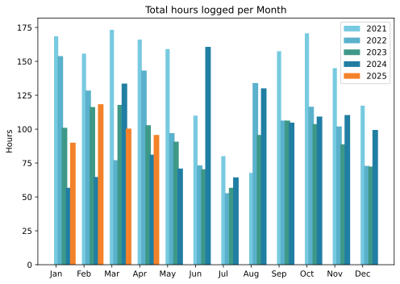
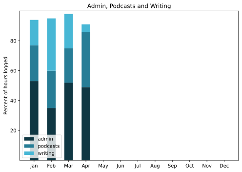

Back on track; who would blog on May Day?

Still enjoying reminiscing about the glorious trip early in the month, and still haven't written it up. Truth be told, I probably never will, but never say never. Absolute highlight on the last day of the month was a tiny water feature on the terrace. It has a lot of settling in to do, including I hope a dwarf waterlily, but for now the burbling of the solar-powered fountain is music to my ears. Eat your heart out, Charlie Dimmock.

===

## Highlights of the month:
- Valderice! Marsala! Trapani! Agrigento! Piazza Armerina! Tropea!
- An interview, in Italian, with a very interesting miller
- Continuing growth on the terrace
- Revised recording checklist to avoid future cockups
- Finished a crochet project
- Meals on Feets for a poorly friend
- Annual elderflower cordial session
- Bagel brunch
- Netflix playing up
- Crazed day trip to south of Bari to record a very pleasant interview.

### Activities
Holidays and day trips and a wee bit of work.

#### April: 
* Walking with sticks: 5 (**Still enjoyable**)
* Reading: 17
* Steps (avge): 9281
* Podcasts: 22 (all of them [logged](https://www.jeremycherfas.net/listens)).
* In bed/asleep 7:52/7:45 (declining gently)
* HIIT: 0 days
* Cycled: 2 days
* Weight (avge): 89.3
* Naps: 10

#### March: 
* Walking with sticks: 8 (**Enjoyable, again**)
* Reading: 11
* Steps (avge): 10174
* Podcasts: 13 (all of them [logged](https://www.jeremycherfas.net/listens)).
* In bed/asleep 7:58/7:51 (Must be the lengthening days)
* HIIT: 0 days
* Cycled: 2 days
* Weight (avge): 89.2
* Naps: 10

### Stuff Done
Still enjoying looking at my podcast on [OP3](https://op3.dev/show/267f7514d23a4f15905fc2a852c0b030), a fine reminder that, yes, Virginia, there is a long tail. Episodes from 2019, 2016, 2015 and even 2013 recording respectable double-digit downloads in the past 30 days. Hard to think of other specifics that aren’t covered in the highlights.

#### Hours logged per month

#### Percent of logged hours

Previous years are still on [an archive page](https://jeremycherfas.net/blog/working-life).

### Goals

Only four posts here, and trying to keep up with an unspoken goal to do with the podcasts. I think that’s going OK too.

### Niggles

Haven’t found a dwarf waterlily locally, yet.

### Final remarks

Navidrome and Tailscale make for a game-changing combination. Although one or the other can be a bit flaky at times, I think that's usually my fault.

----

## Here’s the table

Click the triangle to see or hide the table

<table class="worktable">
<thead>
<tr>
<th style="text-align: right;" class="bigrow">Month</th>
<th style="text-align: center;" class="bigrow">Total</th>
<th style="text-align: center;" class="smallrow">Daily</th>
<th style="text-align: center;"class="smallrow">Admin %</th>
<th style="text-align: center;"class="smallrow">ETP %</th>
<th style="text-align: center;"class="smallrow">Writing %</th>
<th style="text-align: center;"class="smallrow">Other %</th>
</tr>
</thead>
<tbody>
<tr>
<td style="text-align: right;">04</td>
<td style="text-align: center;">95.7</td>
<td style="text-align: center;">3.2</td>
<td style="text-align: center;">49</td>
<td style="text-align: center;">37</td>
<td style="text-align: center;">5</td>
<td style="text-align: center;">9</td>
</tr>
<tr>
<td style="text-align: right;">03</td>
<td style="text-align: center;">100.4</td>
<td style="text-align: center;">3.2</td>
<td style="text-align: center;">52</td>
<td style="text-align: center;">23</td>
<td style="text-align: center;">23</td>
<td style="text-align: center;">2</td>
</tr>
<tr>
<td style="text-align: right;">02</td>
<td style="text-align: center;">118.4</td>
<td style="text-align: center;">4.6</td>
<td style="text-align: center;">35</td>
<td style="text-align: center;">25</td>
<td style="text-align: center;">35</td>
<td style="text-align: center;">5</td>
</tr>
<tr>
<td style="text-align: right;">2025-01</td>
<td style="text-align: center;">90.0</td>
<td style="text-align: center;">4.1</td>
<td style="text-align: center;">53</td>
<td style="text-align: center;">24</td>
<td style="text-align: center;">17</td>
<td style="text-align: center;">6</td>
</tr>
</tbody>
</table>

