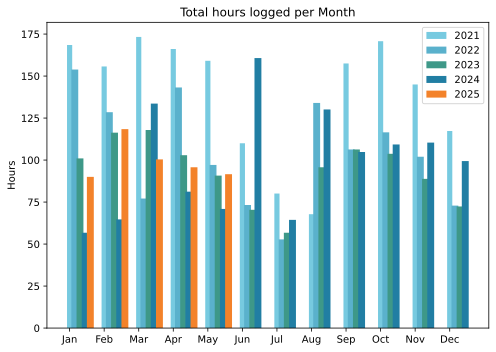
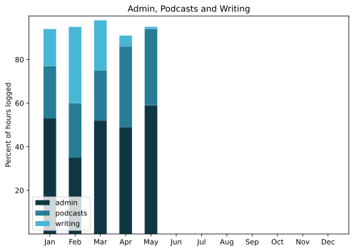

The top event of the month was, I suppose, my Mother’s 100th birthday, the celebration of which (in June) is the reason this entry is as late as it. Also a lot of fun was a bicycling holiday — only four days — in the Po Delta. Like last month’s trip to Sicily, I haven’t written that up yet either. It has been a month full of visits from family and friends. 

===

## Highlights of the month:
- Fine MayDay lunch with old friends
- Demonstration by Democrats Abroad; a lowlight
- A crow — I call him Crow Magnon — has been hanging around
- Visit from The Squeeze’s college pals and their kids, good people
- Global Baroque show at the Scuderie, very impressive
- Visit to family visiting Foligno, discovered the stunning Palazzo Trinci
- First visit to the [Borghese Museum](https://www.jeremycherfas.net/blog/a-few-highlights-from-the-villa-borghese) in a long time
- Submitted Italian tax info and came down with a raging sore throat. Coincidence? I think not
- Squeeze’s sister and grand-niece to visit, chill
- Home made tarragon mayonnaise
- A.OK from the dermatologist
- Chilli peppers x2 and tomatoes x4 potted on
- Crochet holding steady

### Activities
So. Many. Visitors.

#### May: 
* Walking with sticks: 5
* Reading: 7
* Steps (avge): 9898
* Podcasts: 17 (15 of them [logged](https://www.jeremycherfas.net/listens)).
* In bed/asleep 7:44/7:37 (gentle decline continues)
* HIIT: 0 days
* Cycled: 7 days
* Weight (avge): 89.3
* Naps: 14

#### April: 
* Walking with sticks: 5 (**Still enjoyable**)
* Reading: 17
* Steps (avge): 9281
* Podcasts: 22 (all of them [logged](https://www.jeremycherfas.net/listens)).
* In bed/asleep 7:52/7:45 (declining gently)
* HIIT: 0 days
* Cycled: 2 days
* Weight (avge): 89.3
* Naps: 10

### Stuff Done

Not sure whether this counts, but in an effort to reclaim my music listening I have much enjoyed Navidrome, even letting it do the song shuffle one time. The downside, if it can be called that, is making sure all the track and artist info is as good as it can be. I’m using Picard Brainz for that and most of the time I am pleasantly surprised how good it is. Then every now and again up pops an album or an artist that makes everything more difficult, probably remnants from my days as a Dread Pirate. I’m more sage about those now, just letting go if I can’t solve the problem in a couple of minutes.

In a way, it is just like using Bookends to fix other people’s bibliographies.

#### Hours logged per month

#### Percent of logged hours

Previous years are still on [an archive page](https://jeremycherfas.net/blog/working-life).

### Goals

Four posts here again, and that’ll do given how busy life away from my desk has been. I’ve been trying to engage more on the fedi-socials, and that’s been fun.

### Niggles

None for this month.

### Final remarks

Promotion is hard, and I really wish I knew why people seem to think YouTube is a good place to put my podcast.

----

## Here’s the table

Click the triangle to see or hide the table

<table class="worktable">
<thead>
<tr>
<th style="text-align: right;" class="bigrow">Month</th>
<th style="text-align: center;" class="bigrow">Total</th>
<th style="text-align: center;" class="smallrow">Daily</th>
<th style="text-align: center;"class="smallrow">Admin %</th>
<th style="text-align: center;"class="smallrow">ETP %</th>
<th style="text-align: center;"class="smallrow">Writing %</th>
<th style="text-align: center;"class="smallrow">Other %</th>
</tr>
</thead>
<tbody>
<tr>
<td style="text-align: right;">05</td>
<td style="text-align: center;">91.6</td>
<td style="text-align: center;">2.9</td>
<td style="text-align: center;">59</td>
<td style="text-align: center;">35</td>
<td style="text-align: center;">1</td>
<td style="text-align: center;">5</td>
</tr>
<tr>
<td style="text-align: right;">04</td>
<td style="text-align: center;">95.7</td>
<td style="text-align: center;">3.2</td>
<td style="text-align: center;">49</td>
<td style="text-align: center;">37</td>
<td style="text-align: center;">5</td>
<td style="text-align: center;">9</td>
</tr>
<tr>
<td style="text-align: right;">03</td>
<td style="text-align: center;">100.4</td>
<td style="text-align: center;">3.2</td>
<td style="text-align: center;">52</td>
<td style="text-align: center;">23</td>
<td style="text-align: center;">23</td>
<td style="text-align: center;">2</td>
</tr>
<tr>
<td style="text-align: right;">02</td>
<td style="text-align: center;">118.4</td>
<td style="text-align: center;">4.6</td>
<td style="text-align: center;">35</td>
<td style="text-align: center;">25</td>
<td style="text-align: center;">35</td>
<td style="text-align: center;">5</td>
</tr>
<tr>
<td style="text-align: right;">2025-01</td>
<td style="text-align: center;">90.0</td>
<td style="text-align: center;">4.1</td>
<td style="text-align: center;">53</td>
<td style="text-align: center;">24</td>
<td style="text-align: center;">17</td>
<td style="text-align: center;">6</td>
</tr>
</tbody>
</table>

