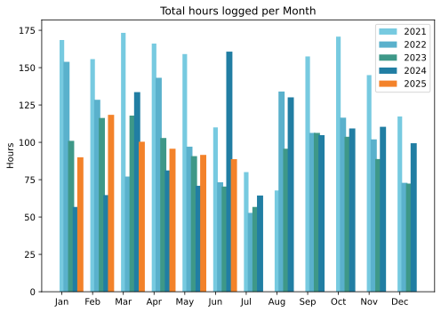

Are we really halfway through the year? Seems impossible. And what do I have to show for it? Certainly not much in the way of concrete achievements, although another 10 podcast episodes count for something. And the finale of the season attracted some satisfying remarks, so all good.

===

## Highlights of the month:
- A fine, too brief mass bicycle ride to celebrate the final day of the *Giro d’Italia*
- Aforementioned trip to my mother’s hundredth birthday; least said ...
- Tomatoes and chillies doing well
- Purchased music
- Good meals with good friends, home and away
- Watermelon!
- Cataracts progress, but not before September
- Week-long house party in Umbria with swimming
- Very hot

### Activities
Lots of social engagements, none of them arduous.

#### June: 
* Walking with sticks: 6
* Reading: 21
* Steps (avge): 8991
* Podcasts: 22 (all of them [logged](https://www.jeremycherfas.net/listens)).
* In bed/asleep 7:25/7:16 (Naps don’t count, apparently)
* HIIT: 0 days
* Cycled: 4 days
* Weight (avge): 89.2
* Naps: 22

#### May: 
* Walking with sticks: 5
* Reading: 7
* Steps (avge): 9898
* Podcasts: 17 (15 of them [logged](https://www.jeremycherfas.net/listens)).
* In bed/asleep 7:44/7:37 (gentle decline continues)
* HIIT: 0 days
* Cycled: 7 days
* Weight (avge): 89.3
* Naps: 14

### Stuff Done

Life just continued with nothing particularly striking about it. I’ve dropped the ball on a couple of projects, but it is summer.

Slight achievement of persuading the upstairs neighbour, who had both knees replaced earlier this year, to join me on walks with sticks through the park. I appreciate having someone alongside, with occasional bits of conversation, and going slightly further at a more reasonable pace. There’s a place for both.

#### Hours logged per month

#### Percent of logged hours

Previous years are still on [an archive page](https://jeremycherfas.net/blog/working-life).

### Goals

Two posts, a disgrace.

### Niggles

Once again, I found it very difficult to write anything on this site while I was travelling. Not sure why that is. Probably because I am trying to keep on top of the streams and feeds and what have you, and at the same time feel guilty about not devoting my time to the people I am with.

### Final remarks

The living is easy.

----

## Here’s the table

Click the triangle to see or hide the table

<table class="worktable">
<thead>
<tr>
<th style="text-align: right;" class="bigrow">Month</th>
<th style="text-align: center;" class="bigrow">Total</th>
<th style="text-align: center;" class="smallrow">Daily</th>
<th style="text-align: center;"class="smallrow">Admin %</th>
<th style="text-align: center;"class="smallrow">ETP %</th>
<th style="text-align: center;"class="smallrow">Writing %</th>
<th style="text-align: center;"class="smallrow">Other %</th>
</tr>
</thead>
<tbody>
<tr>
<td style="text-align: right;">06</td>
<td style="text-align: center;">88.75</td>
<td style="text-align: center;">2.9</td>
<td style="text-align: center;">40</td>
<td style="text-align: center;">51</td>
<td style="text-align: center;">4</td>
<td style="text-align: center;">5</td>
</tr>
<tr>
<td style="text-align: right;">05</td>
<td style="text-align: center;">91.6</td>
<td style="text-align: center;">2.9</td>
<td style="text-align: center;">59</td>
<td style="text-align: center;">35</td>
<td style="text-align: center;">1</td>
<td style="text-align: center;">5</td>
</tr>
<tr>
<td style="text-align: right;">04</td>
<td style="text-align: center;">95.7</td>
<td style="text-align: center;">3.2</td>
<td style="text-align: center;">49</td>
<td style="text-align: center;">37</td>
<td style="text-align: center;">5</td>
<td style="text-align: center;">9</td>
</tr>
<tr>
<td style="text-align: right;">03</td>
<td style="text-align: center;">100.4</td>
<td style="text-align: center;">3.2</td>
<td style="text-align: center;">52</td>
<td style="text-align: center;">23</td>
<td style="text-align: center;">23</td>
<td style="text-align: center;">2</td>
</tr>
<tr>
<td style="text-align: right;">02</td>
<td style="text-align: center;">118.4</td>
<td style="text-align: center;">4.6</td>
<td style="text-align: center;">35</td>
<td style="text-align: center;">25</td>
<td style="text-align: center;">35</td>
<td style="text-align: center;">5</td>
</tr>
<tr>
<td style="text-align: right;">2025-01</td>
<td style="text-align: center;">90.0</td>
<td style="text-align: center;">4.1</td>
<td style="text-align: center;">53</td>
<td style="text-align: center;">24</td>
<td style="text-align: center;">17</td>
<td style="text-align: center;">6</td>
</tr>
</tbody>
</table>

