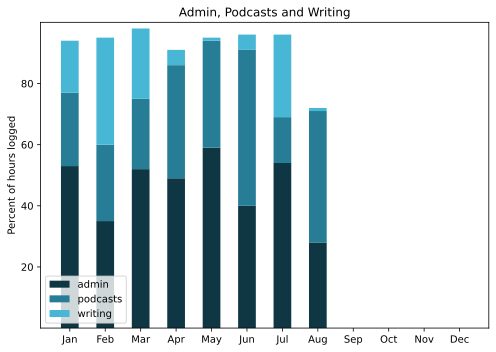

Two for the price of one. Way too idle, and too far from home too much of the time, to get much done in a timely fashion, and this roundup will not offer any great insights into that time. It is, however, a signal of sorts; summer is over.

===

## Highlights of the months:
- Just having a very, very good time, to whit:
	- Another two house parties in Umbria
	- Two weeks in Torquay

### Activities

#### July & August: 
* Walking with sticks: 1
* Reading: 36
* Steps (avge): 6884 & 7405
* Podcasts: 20 & 15 (all of them [logged](https://www.jeremycherfas.net/listens))
* In bed/asleep 7:17/7:09 & 8:07/7:59 (Naps don’t count, apparently)
* HIIT: 0 days
* Cycled: 1 day
* Weight (avge): 89.2 (but very few data points)
* Naps: 45

#### June: 
* Walking with sticks: 6
* Reading: 21
* Steps (avge): 8991
* Podcasts: 22 (all of them [logged](https://www.jeremycherfas.net/listens)).
* In bed/asleep 7:25/7:16 (Naps don’t count, apparently)
* HIIT: 0 days
* Cycled: 4 days
* Weight (avge): 89.2
* Naps: 22

### Stuff Done

Kept Eat This Newsletter going weekly despite being here, there and everywhere, and managed a modicum of paid work.

#### Hours logged per month

#### Percent of logged hours

Previous years are still on [an archive page](https://jeremycherfas.net/blog/working-life).

### Goals

Six posts in July and none in August. On the slack side, I fully admit. No apologies.

### Niggles

Data for hours logged in August needs to be taken with a bucket of salt because the truth is I seldom bother to record time spent catching up on feeds and that sort of thing when I am away.

### Final remarks

It was fun, all of it. Even the one or two bits that weren’t total fun were enjoyable at some level. I mean, a good Indian lunch is worth something under almost any circumstances.

----

## Here’s the table

Click the triangle to see or hide the table

<table class="worktable">
<thead>
<tr>
<th style="text-align: right;" class="bigrow">Month</th>
<th style="text-align: center;" class="bigrow">Total</th>
<th style="text-align: center;" class="smallrow">Daily</th>
<th style="text-align: center;"class="smallrow">Admin %</th>
<th style="text-align: center;"class="smallrow">ETP %</th>
<th style="text-align: center;"class="smallrow">Writing %</th>
<th style="text-align: center;"class="smallrow">Other %</th>
</tr>
</thead>
<tbody>
<tr>
<td style="text-align: right;">08</td>
<td style="text-align: center;">17.8</td>
<td style="text-align: center;">3.0</td>
<td style="text-align: center;">28</td>
<td style="text-align: center;">43</td>
<td style="text-align: center;">1</td>
<td style="text-align: center;">28</td>
</tr>
<tr>
<td style="text-align: right;">07</td>
<td style="text-align: center;">71.67</td>
<td style="text-align: center;">3.4</td>
<td style="text-align: center;">54</td>
<td style="text-align: center;">15</td>
<td style="text-align: center;">27</td>
<td style="text-align: center;">4</td>
</tr>
<tr>
<td style="text-align: right;">06</td>
<td style="text-align: center;">88.75</td>
<td style="text-align: center;">2.9</td>
<td style="text-align: center;">40</td>
<td style="text-align: center;">51</td>
<td style="text-align: center;">4</td>
<td style="text-align: center;">5</td>
</tr>
<tr>
<td style="text-align: right;">05</td>
<td style="text-align: center;">91.6</td>
<td style="text-align: center;">2.9</td>
<td style="text-align: center;">59</td>
<td style="text-align: center;">35</td>
<td style="text-align: center;">1</td>
<td style="text-align: center;">5</td>
</tr>
<tr>
<td style="text-align: right;">04</td>
<td style="text-align: center;">95.7</td>
<td style="text-align: center;">3.2</td>
<td style="text-align: center;">49</td>
<td style="text-align: center;">37</td>
<td style="text-align: center;">5</td>
<td style="text-align: center;">9</td>
</tr>
<tr>
<td style="text-align: right;">03</td>
<td style="text-align: center;">100.4</td>
<td style="text-align: center;">3.2</td>
<td style="text-align: center;">52</td>
<td style="text-align: center;">23</td>
<td style="text-align: center;">23</td>
<td style="text-align: center;">2</td>
</tr>
<tr>
<td style="text-align: right;">02</td>
<td style="text-align: center;">118.4</td>
<td style="text-align: center;">4.6</td>
<td style="text-align: center;">35</td>
<td style="text-align: center;">25</td>
<td style="text-align: center;">35</td>
<td style="text-align: center;">5</td>
</tr>
<tr>
<td style="text-align: right;">2025-01</td>
<td style="text-align: center;">90.0</td>
<td style="text-align: center;">4.1</td>
<td style="text-align: center;">53</td>
<td style="text-align: center;">24</td>
<td style="text-align: center;">17</td>
<td style="text-align: center;">6</td>
</tr>
</tbody>
</table>

