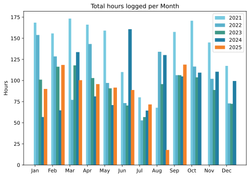
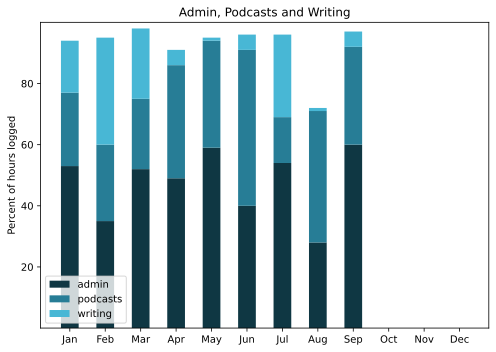

I thought I might get this done two days ago, and then yesterday arrived with [an onslaught of Russian spambots](https://www.jeremycherfas.net/blog/attacked-by-the-evil-empire) abusing the comment form. I think that’s fixed, at least enough to recall the glories of September.

===

## Highlights of the months:
- Got back into the podcast season
- Locked into the local park at night
- Bought new music, Einaudi and Offa Rex
- A good group ride in the suburbs
- Lunch at the seaside
- Resumed Anki for vocabulary
- Custard!
- Lime pickle and chilli & peach ferment
- Filleting past notebooks
- Slow Horses 5; first TV in months
- Brompton World Championship

### Activities

#### September: 
* Walking with sticks: 1
* Reading: 7
* Steps (avge): 7737
* Podcasts: 20 (all of them [logged](https://www.jeremycherfas.net/listens))
* In bed/asleep 7:51/7:43
* HIIT: 0 days
* Cycled: 2 days
* Weight (avge): 89.9
* Naps: 15

#### July & August: 
* Walking with sticks: 1
* Reading: 36
* Steps (avge): 6884 & 7405
* Podcasts: 20 & 15 (all of them [logged](https://www.jeremycherfas.net/listens))
* In bed/asleep 7:17/7:09 & 8:07/7:59 (Naps don’t count, apparently)
* HIIT: 0 days
* Cycled: 1 day
* Weight (avge): 89.2 (but very few data points)
* Naps: 45

### Stuff Done

Back into podcast episodes, with what seems like quite an uptick in listeners, although that could be either fleeting, or illusory, or both.

#### Hours logged per month

#### Percent of logged hours

Previous years are still on [an archive page](https://jeremycherfas.net/blog/working-life).

### Goals

Six posts in September, which is OK.

### Niggles

The main niggle has to be that I am **still** not doing enough to promote both the podcast and the newsletter. I don’t want to be perceived as I perceive some people, who seem to have nothing else to say on the social. And yet, I have to keep putting things out these to try and tempt new people to find me. Why? Because that’s the main extrinsic reward and intrinsic rewards take me only so far.

### Final remarks

Filleting some notebooks has added to the list of things I ought to at least think about doing. More triage is going to be needed.

----

## Here’s the table

Click the triangle to see or hide the table

<table class="worktable">
<thead>
<tr>
<th style="text-align: right;" class="bigrow">Month</th>
<th style="text-align: center;" class="bigrow">Total</th>
<th style="text-align: center;" class="smallrow">Daily</th>
<th style="text-align: center;"class="smallrow">Admin %</th>
<th style="text-align: center;"class="smallrow">ETP %</th>
<th style="text-align: center;"class="smallrow">Writing %</th>
<th style="text-align: center;"class="smallrow">Other %</th>
</tr>
</thead>
<tbody>
<tr>
<td style="text-align: right;">09</td>
<td style="text-align: center;">118.8</td>
<td style="text-align: center;">4.6</td>
<td style="text-align: center;">60</td>
<td style="text-align: center;">32</td>
<td style="text-align: center;">5</td>
<td style="text-align: center;">3</td>
</tr>
<tr>
<td style="text-align: right;">08</td>
<td style="text-align: center;">17.8</td>
<td style="text-align: center;">3.0</td>
<td style="text-align: center;">28</td>
<td style="text-align: center;">43</td>
<td style="text-align: center;">1</td>
<td style="text-align: center;">28</td>
</tr>
<tr>
<td style="text-align: right;">07</td>
<td style="text-align: center;">71.67</td>
<td style="text-align: center;">3.4</td>
<td style="text-align: center;">54</td>
<td style="text-align: center;">15</td>
<td style="text-align: center;">27</td>
<td style="text-align: center;">4</td>
</tr>
<tr>
<td style="text-align: right;">06</td>
<td style="text-align: center;">88.75</td>
<td style="text-align: center;">2.9</td>
<td style="text-align: center;">40</td>
<td style="text-align: center;">51</td>
<td style="text-align: center;">4</td>
<td style="text-align: center;">5</td>
</tr>
<tr>
<td style="text-align: right;">05</td>
<td style="text-align: center;">91.6</td>
<td style="text-align: center;">2.9</td>
<td style="text-align: center;">59</td>
<td style="text-align: center;">35</td>
<td style="text-align: center;">1</td>
<td style="text-align: center;">5</td>
</tr>
<tr>
<td style="text-align: right;">04</td>
<td style="text-align: center;">95.7</td>
<td style="text-align: center;">3.2</td>
<td style="text-align: center;">49</td>
<td style="text-align: center;">37</td>
<td style="text-align: center;">5</td>
<td style="text-align: center;">9</td>
</tr>
<tr>
<td style="text-align: right;">03</td>
<td style="text-align: center;">100.4</td>
<td style="text-align: center;">3.2</td>
<td style="text-align: center;">52</td>
<td style="text-align: center;">23</td>
<td style="text-align: center;">23</td>
<td style="text-align: center;">2</td>
</tr>
<tr>
<td style="text-align: right;">02</td>
<td style="text-align: center;">118.4</td>
<td style="text-align: center;">4.6</td>
<td style="text-align: center;">35</td>
<td style="text-align: center;">25</td>
<td style="text-align: center;">35</td>
<td style="text-align: center;">5</td>
</tr>
<tr>
<td style="text-align: right;">2025-01</td>
<td style="text-align: center;">90.0</td>
<td style="text-align: center;">4.1</td>
<td style="text-align: center;">53</td>
<td style="text-align: center;">24</td>
<td style="text-align: center;">17</td>
<td style="text-align: center;">6</td>
</tr>
</tbody>
</table>

