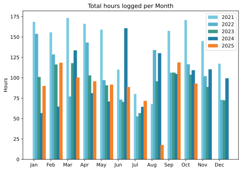
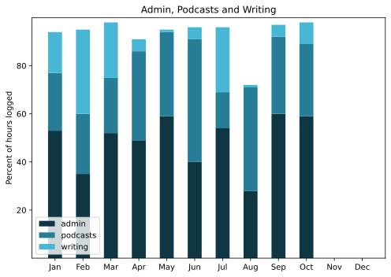

The highlight was a lowlife spambot attack that I could counter only by putting the site behind CloudFlare, and don't get me wrong, I'm glad I could do that, but I wish I hadn't had to. Also, somehow in that process, while one of the subdomains came through with no further effort from me, the other went AWOL. The certainty of an [admin tax](https://indieweb.org/admin_tax) is the price you pay for a smidgen of independence.

===

Actually, that just goes to show how negativity predominates. There were some terrific things in the month, like a trip to Dublin and a new lens in my right eye.

## Highlights of the month:
- To Dublin for the Food & Drink as Education conference; cracking time.
- Some good meals for friends.
- Broke a tooth. The good news is it is basically sound.
- Finally got to lunch at Janta Fast Food and wishing I hadn't waited so long.
- Movie in a cinema.
- New shoes, NB860.
- Fermentation lab yielded salt lemons and peach chilli sauce.
- Olives harvested, scant 300g.
- Wrote and sent A Difficult Letter.
- Fabulous train trip to Berlin, including a comfortable night in a Railjet Mini-cabin. Would do again.

### Activities

#### October: 
* Walking with sticks: 0
* Reading: 4
* Steps (avge): 8650
* Podcasts: 29 (all of them [logged](https://www.jeremycherfas.net/listens))
* In bed/asleep 7:51/7:43 — remarkable, no change!
* Cycled: 2 days
* Weight (avge): 90.2
* Naps: 16

#### September: 
* Walking with sticks: 1
* Reading: 7
* Steps (avge): 7737
* Podcasts: 20 (all of them [logged](https://www.jeremycherfas.net/listens))
* In bed/asleep 7:51/7:43
* HIIT: 0 days
* Cycled: 2 days
* Weight (avge): 89.9
* Naps: 15

### Stuff Done

Dealing with the spambots was a pain in the bum, and losing the connection to geo-tracking an irritant. Thinking about photos and doing something about those thoughts was fun too. And even though it is throwing up more tasks for the future, I think I will enjoy them.

#### Hours logged per month

#### Percent of logged hours

Previous years are still on [an archive page](https://jeremycherfas.net/blog/working-life).

### Goals

Nine posts, which is very encouraging as I don’t recall it being at all onerous.

### Niggles

I should try and use the laptop more frequently, because when I do travel there are often a bunch of things that need sorting out before I can do much. If I used it at home more often, that would probably make traveling easier.

### Final remarks

This is getting boring, but life is good and I’m not ashamed to be enjoying it a lot.

----

## Here’s the table

Click the triangle to see or hide the table

<table class="worktable">
<thead>
<tr>
<th style="text-align: right;" class="bigrow">Month</th>
<th style="text-align: center;" class="bigrow">Total</th>
<th style="text-align: center;" class="smallrow">Daily</th>
<th style="text-align: center;"class="smallrow">Admin %</th>
<th style="text-align: center;"class="smallrow">ETP %</th>
<th style="text-align: center;"class="smallrow">Writing %</th>
<th style="text-align: center;"class="smallrow">Other %</th>
</tr>
</thead>
<tbody>
<tr>
<td style="text-align: right;">10</td>
<td style="text-align: center;">92.9</td>
<td style="text-align: center;">4.7</td>
<td style="text-align: center;">59</td>
<td style="text-align: center;">30</td>
<td style="text-align: center;">9</td>
<td style="text-align: center;">2</td>
</tr>
<tr>
<td style="text-align: right;">09</td>
<td style="text-align: center;">118.8</td>
<td style="text-align: center;">4.6</td>
<td style="text-align: center;">60</td>
<td style="text-align: center;">32</td>
<td style="text-align: center;">5</td>
<td style="text-align: center;">3</td>
</tr>
<tr>
<td style="text-align: right;">08</td>
<td style="text-align: center;">17.8</td>
<td style="text-align: center;">3.0</td>
<td style="text-align: center;">28</td>
<td style="text-align: center;">43</td>
<td style="text-align: center;">1</td>
<td style="text-align: center;">28</td>
</tr>
<tr>
<td style="text-align: right;">07</td>
<td style="text-align: center;">71.67</td>
<td style="text-align: center;">3.4</td>
<td style="text-align: center;">54</td>
<td style="text-align: center;">15</td>
<td style="text-align: center;">27</td>
<td style="text-align: center;">4</td>
</tr>
<tr>
<td style="text-align: right;">06</td>
<td style="text-align: center;">88.75</td>
<td style="text-align: center;">2.9</td>
<td style="text-align: center;">40</td>
<td style="text-align: center;">51</td>
<td style="text-align: center;">4</td>
<td style="text-align: center;">5</td>
</tr>
<tr>
<td style="text-align: right;">05</td>
<td style="text-align: center;">91.6</td>
<td style="text-align: center;">2.9</td>
<td style="text-align: center;">59</td>
<td style="text-align: center;">35</td>
<td style="text-align: center;">1</td>
<td style="text-align: center;">5</td>
</tr>
<tr>
<td style="text-align: right;">04</td>
<td style="text-align: center;">95.7</td>
<td style="text-align: center;">3.2</td>
<td style="text-align: center;">49</td>
<td style="text-align: center;">37</td>
<td style="text-align: center;">5</td>
<td style="text-align: center;">9</td>
</tr>
<tr>
<td style="text-align: right;">03</td>
<td style="text-align: center;">100.4</td>
<td style="text-align: center;">3.2</td>
<td style="text-align: center;">52</td>
<td style="text-align: center;">23</td>
<td style="text-align: center;">23</td>
<td style="text-align: center;">2</td>
</tr>
<tr>
<td style="text-align: right;">02</td>
<td style="text-align: center;">118.4</td>
<td style="text-align: center;">4.6</td>
<td style="text-align: center;">35</td>
<td style="text-align: center;">25</td>
<td style="text-align: center;">35</td>
<td style="text-align: center;">5</td>
</tr>
<tr>
<td style="text-align: right;">2025-01</td>
<td style="text-align: center;">90.0</td>
<td style="text-align: center;">4.1</td>
<td style="text-align: center;">53</td>
<td style="text-align: center;">24</td>
<td style="text-align: center;">17</td>
<td style="text-align: center;">6</td>
</tr>
</tbody>
</table>

