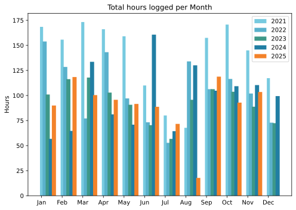
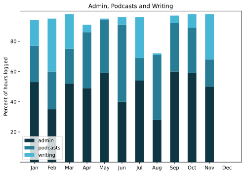

Slightly conflicted. The spambot in October meant I was no longer recording my various forms of travel and the need for a new battery for my Apple Watch reduced my quantifiable self to a nubbin. And now I wonder whether I really care enough to do anything about that. Probably not to restore the _status quo ante_ but possibly to have a slightly more meaningful approach to where I've been.

===

## Highlights of the month:
- IWC Berlin was great
- Repatriated Instagram and made a start of a photo portfolio that went live on Black Friday Create Day
- Went too far with 1Password
- Went further with Raspberry Pi
- Tooth fixed
- Second eye fixed
- Cooked a bagel brunch for a friend's birthday
- Sold a piece of land (end of an era and a dream)
- Lovely trip to Venice to see old friends
- Good working week home alone.

### Activities

#### November: 
* Walking with sticks: 0
* Reading: 7
* *Steps (avge): 7784*
* Podcasts: 39 (37 of them [logged](https://www.jeremycherfas.net/listens))
* *In bed/asleep 7:47/7:39*
* Cycled: 1 day
* Weight (avge): 90.3
* Naps: 13

#### October: 
* Walking with sticks: 0
* Reading: 4
* Steps (avge): 8650
* Podcasts: 29 (all of them [logged](https://www.jeremycherfas.net/listens))
* In bed/asleep 7:51/7:43 — remarkable, no change!
* Cycled: 2 days
* Weight (avge): 90.2
* Naps: 16

### Stuff Done

#### Hours logged per month

#### Percent of logged hours

Previous years are still on [an archive page](https://jeremycherfas.net/blog/working-life).

### Goals

Only six blog posts, but that's fine both because there was a lot of work behind those posts and because some of that work means there's stuff in the pipeline.

### Niggles

Nothing comes to mind.

### Final remarks

Re-energising my Raspberry Pi was a pretty good move and I hope I can maintain the momentum of asking it to do more and more of the routine stuff. In conjection with Tailscale and Raspberry Pi's own online Connect system, life is certainly a lot easier.

----

## Here’s the table

Click the triangle to see or hide the table

<table class="worktable">
<thead>
<tr>
<th style="text-align: right;" class="bigrow">Month</th>
<th style="text-align: center;" class="bigrow">Total</th>
<th style="text-align: center;" class="smallrow">Daily</th>
<th style="text-align: center;"class="smallrow">Admin %</th>
<th style="text-align: center;"class="smallrow">ETP %</th>
<th style="text-align: center;"class="smallrow">Writing %</th>
<th style="text-align: center;"class="smallrow">Other %</th>
</tr>
</thead>
<tbody>
<tr>
<td style="text-align: right;">11</td>
<td style="text-align: center;">103.5</td>
<td style="text-align: center;">4.75</td>
<td style="text-align: center;">50</td>
<td style="text-align: center;">18</td>
<td style="text-align: center;">32</td>
<td style="text-align: center;">0</td>
</tr>
<tr>
<td style="text-align: right;">10</td>
<td style="text-align: center;">92.9</td>
<td style="text-align: center;">4.7</td>
<td style="text-align: center;">59</td>
<td style="text-align: center;">30</td>
<td style="text-align: center;">9</td>
<td style="text-align: center;">2</td>
</tr>
<tr>
<td style="text-align: right;">09</td>
<td style="text-align: center;">118.8</td>
<td style="text-align: center;">4.6</td>
<td style="text-align: center;">60</td>
<td style="text-align: center;">32</td>
<td style="text-align: center;">5</td>
<td style="text-align: center;">3</td>
</tr>
<tr>
<td style="text-align: right;">08</td>
<td style="text-align: center;">17.8</td>
<td style="text-align: center;">3.0</td>
<td style="text-align: center;">28</td>
<td style="text-align: center;">43</td>
<td style="text-align: center;">1</td>
<td style="text-align: center;">28</td>
</tr>
<tr>
<td style="text-align: right;">07</td>
<td style="text-align: center;">71.67</td>
<td style="text-align: center;">3.4</td>
<td style="text-align: center;">54</td>
<td style="text-align: center;">15</td>
<td style="text-align: center;">27</td>
<td style="text-align: center;">4</td>
</tr>
<tr>
<td style="text-align: right;">06</td>
<td style="text-align: center;">88.75</td>
<td style="text-align: center;">2.9</td>
<td style="text-align: center;">40</td>
<td style="text-align: center;">51</td>
<td style="text-align: center;">4</td>
<td style="text-align: center;">5</td>
</tr>
<tr>
<td style="text-align: right;">05</td>
<td style="text-align: center;">91.6</td>
<td style="text-align: center;">2.9</td>
<td style="text-align: center;">59</td>
<td style="text-align: center;">35</td>
<td style="text-align: center;">1</td>
<td style="text-align: center;">5</td>
</tr>
<tr>
<td style="text-align: right;">04</td>
<td style="text-align: center;">95.7</td>
<td style="text-align: center;">3.2</td>
<td style="text-align: center;">49</td>
<td style="text-align: center;">37</td>
<td style="text-align: center;">5</td>
<td style="text-align: center;">9</td>
</tr>
<tr>
<td style="text-align: right;">03</td>
<td style="text-align: center;">100.4</td>
<td style="text-align: center;">3.2</td>
<td style="text-align: center;">52</td>
<td style="text-align: center;">23</td>
<td style="text-align: center;">23</td>
<td style="text-align: center;">2</td>
</tr>
<tr>
<td style="text-align: right;">02</td>
<td style="text-align: center;">118.4</td>
<td style="text-align: center;">4.6</td>
<td style="text-align: center;">35</td>
<td style="text-align: center;">25</td>
<td style="text-align: center;">35</td>
<td style="text-align: center;">5</td>
</tr>
<tr>
<td style="text-align: right;">2025-01</td>
<td style="text-align: center;">90.0</td>
<td style="text-align: center;">4.1</td>
<td style="text-align: center;">53</td>
<td style="text-align: center;">24</td>
<td style="text-align: center;">17</td>
<td style="text-align: center;">6</td>
</tr>
</tbody>
</table>

