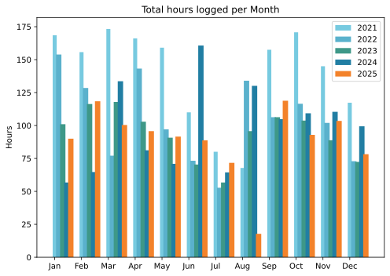
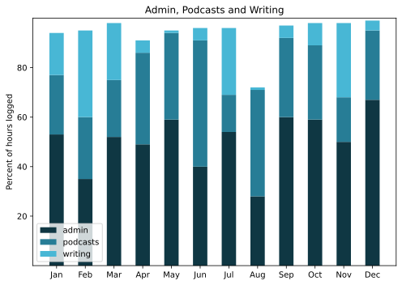

Janus incarnate; they get you leaving and they get you coming back. Not in living memory have I spent such a dreadful year end and start, restricted to my bed by a heavy cold and bronchitis. A couple of days after Christmas I could not catch my breath during standard, easy walks. Tuesday night went badly, shivery and unable to get warm, necessitating a hot water bottle. Wednesday to Friday lying in bed unable to do much of anything and here we are, up and about in a quiet way and already looking forward to wrapping this up and going back to bed. Need to do some good recuperating because tomorrow we head off for 10 days cat-sitting in the countryside and at the very least I need to drive us there.

===

## Highlights of the month:
- Family cut ties, which suits me fine.
- Interesting food symposium at the American Academy, Rome
- Got the Apple Watch back. Meh
- Installed Dawarich to track location and it mostly just works, although the data are well hidden
- Precious Plumeria brought indoors
- New tyres and tubes on the hybrid bicycle
- Spectacular Fra Angelico show in Florence, fine day trip
- Tried Qigong in the park; might stick at it, although it is a chunk out of the morning
- Another great show, Treasures of the Pharoahs, at the Scuderie
- Mending a beloved sweater
- Transferred Arq backups from Amazon to Hetzner
- Little road trip to Urbino and Ascoli Piceno and a fine interview about Cooking in Maximum Security
- Excellent Holiday Festivities

### Activities

#### December: 
* Walking with sticks: 0
* Reading: 6
* Steps (avge): 8344
* Podcasts: 17 (16 of them [logged](https://www.jeremycherfas.net/listens))
* In bed/asleep 8:13/8:05
* Cycled: 3 days
* Weight (avge): 90.8
* Naps: 12

#### November: 
* Walking with sticks: 0
* Reading: 7
* *Steps (avge): 7784*
* Podcasts: 39 (37 of them [logged](https://www.jeremycherfas.net/listens))
* *In bed/asleep 7:47/7:39*
* Cycled: 1 day
* Weight (avge): 90.3
* Naps: 13

### Stuff Done

#### Hours logged per month

#### Percent of logged hours

Previous years are still on [an archive page](https://jeremycherfas.net/blog/working-life).

### Goals

Six blog posts, which is fine, and even though it sounds like an excuse I had planned to write up two or three geeky explainers of stuff I managed this month, but whether I will when I am feeling better is anybody’s guess.

### Niggles

Nothing comes to mind.

### Final remarks

Still happy with the idea of moving stuff away from Dreamhost and Amazon to Hetzner, but having great difficulty getting my head around how different things can work on the same server. In Dreamhost, you don't really see any of that. Maybe I should do webhosting rather than a server at Hetzner. Very hard to learn about these things. Very grateful to friends who help, though I do not want to be a pest.

----

## Here’s the table

Click the triangle to see or hide the table

<table class="worktable">
<thead>
<tr>
<th style="text-align: right;" class="bigrow">Month</th>
<th style="text-align: center;" class="bigrow">Total</th>
<th style="text-align: center;" class="smallrow">Daily</th>
<th style="text-align: center;"class="smallrow">Admin %</th>
<th style="text-align: center;"class="smallrow">ETP %</th>
<th style="text-align: center;"class="smallrow">Writing %</th>
<th style="text-align: center;"class="smallrow">Other %</th>
</tr>
</thead>
<tbody>
<tr>
<td style="text-align: right;">12</td>
<td style="text-align: center;">78.2</td>
<td style="text-align: center;">3.54</td>
<td style="text-align: center;">67</td>
<td style="text-align: center;">28</td>
<td style="text-align: center;">4</td>
<td style="text-align: center;">1</td>
</tr>
<tr>
<td style="text-align: right;">11</td>
<td style="text-align: center;">103.5</td>
<td style="text-align: center;">4.75</td>
<td style="text-align: center;">50</td>
<td style="text-align: center;">18</td>
<td style="text-align: center;">32</td>
<td style="text-align: center;">0</td>
</tr>
<tr>
<td style="text-align: right;">10</td>
<td style="text-align: center;">92.9</td>
<td style="text-align: center;">4.7</td>
<td style="text-align: center;">59</td>
<td style="text-align: center;">30</td>
<td style="text-align: center;">9</td>
<td style="text-align: center;">2</td>
</tr>
<tr>
<td style="text-align: right;">09</td>
<td style="text-align: center;">118.8</td>
<td style="text-align: center;">4.6</td>
<td style="text-align: center;">60</td>
<td style="text-align: center;">32</td>
<td style="text-align: center;">5</td>
<td style="text-align: center;">3</td>
</tr>
<tr>
<td style="text-align: right;">08</td>
<td style="text-align: center;">17.8</td>
<td style="text-align: center;">3.0</td>
<td style="text-align: center;">28</td>
<td style="text-align: center;">43</td>
<td style="text-align: center;">1</td>
<td style="text-align: center;">28</td>
</tr>
<tr>
<td style="text-align: right;">07</td>
<td style="text-align: center;">71.67</td>
<td style="text-align: center;">3.4</td>
<td style="text-align: center;">54</td>
<td style="text-align: center;">15</td>
<td style="text-align: center;">27</td>
<td style="text-align: center;">4</td>
</tr>
<tr>
<td style="text-align: right;">06</td>
<td style="text-align: center;">88.75</td>
<td style="text-align: center;">2.9</td>
<td style="text-align: center;">40</td>
<td style="text-align: center;">51</td>
<td style="text-align: center;">4</td>
<td style="text-align: center;">5</td>
</tr>
<tr>
<td style="text-align: right;">05</td>
<td style="text-align: center;">91.6</td>
<td style="text-align: center;">2.9</td>
<td style="text-align: center;">59</td>
<td style="text-align: center;">35</td>
<td style="text-align: center;">1</td>
<td style="text-align: center;">5</td>
</tr>
<tr>
<td style="text-align: right;">04</td>
<td style="text-align: center;">95.7</td>
<td style="text-align: center;">3.2</td>
<td style="text-align: center;">49</td>
<td style="text-align: center;">37</td>
<td style="text-align: center;">5</td>
<td style="text-align: center;">9</td>
</tr>
<tr>
<td style="text-align: right;">03</td>
<td style="text-align: center;">100.4</td>
<td style="text-align: center;">3.2</td>
<td style="text-align: center;">52</td>
<td style="text-align: center;">23</td>
<td style="text-align: center;">23</td>
<td style="text-align: center;">2</td>
</tr>
<tr>
<td style="text-align: right;">02</td>
<td style="text-align: center;">118.4</td>
<td style="text-align: center;">4.6</td>
<td style="text-align: center;">35</td>
<td style="text-align: center;">25</td>
<td style="text-align: center;">35</td>
<td style="text-align: center;">5</td>
</tr>
<tr>
<td style="text-align: right;">2025-01</td>
<td style="text-align: center;">90.0</td>
<td style="text-align: center;">4.1</td>
<td style="text-align: center;">53</td>
<td style="text-align: center;">24</td>
<td style="text-align: center;">17</td>
<td style="text-align: center;">6</td>
</tr>
</tbody>
</table>

