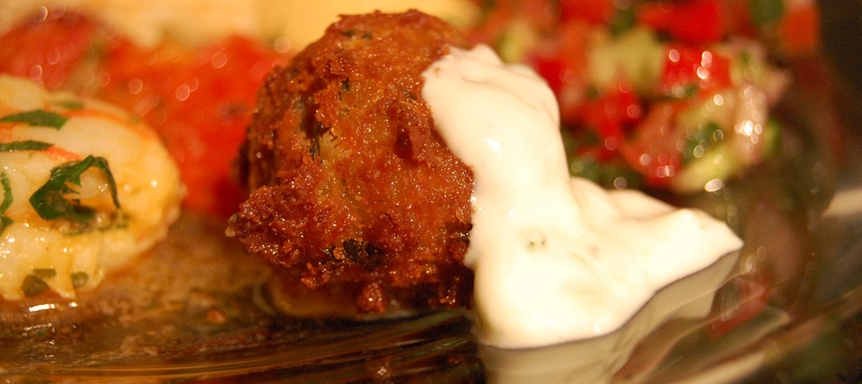

When people say we have no choice, do they really mean we have no choice? I ask because Jess Fanzo, a nutrition scientist I admire, respect and like, recently published <a class="u-in-reply-to" href="https://www.thenutritionarchive.com/blog/2022/4/25/we-may-not-have-a-choice-but-to-consume-alternative-proteins" >We may not have a choice but to consume alternative proteins</a > on her blog The Food Archive. 

{.center}

She is talking about meat-like alternatives to meat, and she is absolutely right to draw attention to the problems they pose: health concerns related to the processing they entail, cost for the people who most desire more meat in their diets, transparency about just what goes into them. Is there, however, no choice?

Only in the final paragraph does Dr Fanzo say:

> while the innovation for these new foods is tempting, there are many traditional foods such as legumes, insects, and algae that have important nutritional value, particularly protein, have low environmental footprints, and do not require raising animals. These traditional foods, while traditional, may offer low-cost, low-resources alternatives to shiny and new future foods.

Bingo! Just yesterday I wrote <a class="u-in-reply-to" href="https://www.eatthispodcast.com/a-diet-for-the-future/" >A diet for the future, but not my future</a >, talking about two new reports. 

One is from Finnish scientists saying that the best possible diet for the environment, which also satisfies known nutritional needs, would consist of an insect meal smoothie made with cultured (in a bioreactor, not with microbes) milk. 

The other is a report from IPES-Food, an august body of the great and the good (plus a few makeweights), which reveals that novel and future foods really aren't all that they are cracked up to be; behind the glittering curtain that surrounds them Big Meat is pulling our levers to become Big Protein.

We simply do not need as much protein as we think we do, and legumes (insects and algae too, perhaps) do indeed "offer low-cost, low-resources alternatives". I hope that those are what Dr Fanzo is, in fact, driving at when she says we may have no choice in the matter.

There could even be another protein myth that needs busting. It is probably true, as anthropologist Marvin Harris first said, that humans experience a very real “meat hunger” even when they apparently have a diet adequate in protein. But the idea that meat is associated with high status may need to be revisited. Another [recent paper, in the Journal _Anglo-Saxon England_](https://www.cambridge.org/core/journals/anglo-saxon-england/article/food-and-power-in-early-medieval-england-a-lack-of-isotopic-enrichment/46263E5BB81F455CD873220C0B7601B9), debunks the idea that high-status individuals and particularly males had a more meat heavy diet.

> We utilise the largest isotopic dataset on early medieval diets to date to show that not only were high protein diets extremely rare in England before Scandinavian settlement, but that dietary differences cannot be linked to gender or social status from the funerary record.

No need, then, to think that eating meat will make people think you're important.

!!! Flickr photograph [by Stu Spivak](https://www.flickr.com/photos/stuart_spivack/4526929499/in/photolist-7U2GqB-fg26Er-4bMQZs-4eujDL-8otYnJ-9McGK2-6wPZtn-6DiCXc-aaw3Sy-87qwxF-89Z4KD-8b8MCA-6cc7sL-NnPhg-r8BRpU-5JbwDy-5LJfiz-NV5RT-8TwFJf-ShUFqP-5Gfq7G-6t6eYe-gYzn-9HTFe-9ooiaR-2krSKgW-6i5cAj-58EdXP-wPq8je-4addqy-aoube3-5mqFqD-hvvRLE-DrUEY-p5cpUV-b2s3yX-7XnYv1-7XnXaW-fSEAxw-5kgqRE-DJAh-DJB8-8u7itd-8u7iPS-77hDVM-6amVGR-c6WhKq-qoDaJS-6i5do9-nDTQW7).