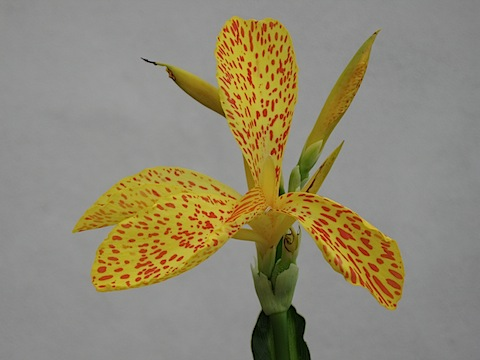

Six years ago now, I collected seeds from a nice enough red canna growing at my last apartment but one. I sowed some the following year, and they sprouted, which was satisfactory enough. Then I moved, and took just three plants -- an orange, a lemon and a _Brugmannsia_ -- with me. The cannas, young and old, stayed behind, although I took the seeds. Four years later, last year, I moved again, and took one plant -- the lemon -- with me. I brought the seeds too. This year, for a laugh, [I sowed them](http://jeremycherfas.net/blog/promises-promises/). Well, nothing ventured ...

Blow me if they didn't germinate.

And then, a couple of weeks ago, the biggest was showing definite signs of a flower spike. It opened a couple of days ago, and I was astonished.

{.center}

I’ve now discovered that yellow-spotted-red cannas are not all that uncommon; I prefer mine to all the others I’ve seen on the web. Now to over-winter it, and the others, and see what happens next year.

