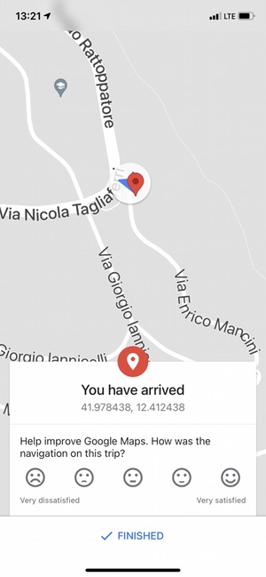
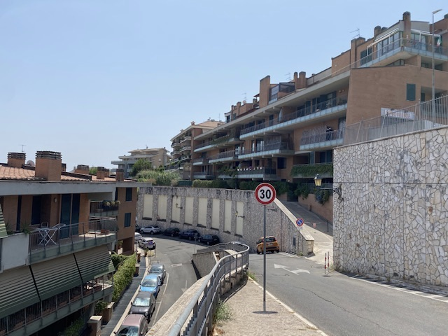
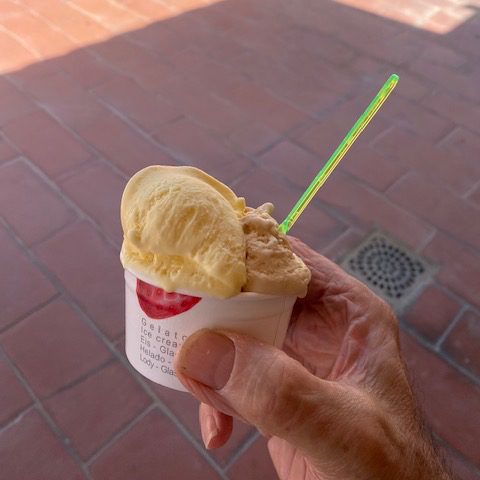

I bagged my first geohash. It was fun, in a boring kind of way.

===

{.left} The idea of geohashing was born in [a comic from the genius who is Randall Munro](https://xkcd.com/426/), published on 21 May 2008. I cannot remember whether I latched onto it then or at some later date, but it seems like I have been checking my local targets forever.

Each day, an algorithm uses the value of the Dow Jones index to calculate a position within each 1° x 1° graticule of the Earth’s surface. What you do with that is up to you. [The wiki suggests](https://geohashing.site/geohashing/Main_Page) that “The generated coordinates are used as destinations for adventures, à la Geocaching, or for local meetups”. I subscribe to RSS feeds of the geohash location for three graticules — the one I’m in and two adjacent — and most days I take a lazy look. Most days amount to nothing. Two of my graticules contain an awful lots of sea, and the third is the furthest away, so in all this time I have never actually set out to find one.

Today was different. A quick glance showed the Rome location just outside the Grande Raccordo Anulare, the ring road around the city. It being August, the streets are almost empty and I knew there would be no problem finding parking on my return, so off I went.

{.center}

The whole thing was pathetically easy. The location was effectively on a road, Google Maps took me straight there, and there was as little excitement as is possible on an “adventure”. The location is in an area of new housing that is mostly dormitory space for people who work in Rome, pretty charmless and baking hot today. I stayed only long enough to snap a photo or two.

{.center} 

My reward, apart from an inner glow, was a delicious ice cream (salted caramel and _crema_) at an extremely good artisanal gelateria just around the corner. 

Of course I should have done the whole thing on a bicycle (in 37°C heat) or walked over hill and dale, or lost my way and had to bivouac overnight, but there will be time for that in the future, and I will keep checking the RSS feeds most days.

!!! This successful adventure also gave me the opportunity to create an [expedition page](https://geohashing.site/geohashing/2021-08-16_41_12) on the Geohashing wiki, which is nice.
