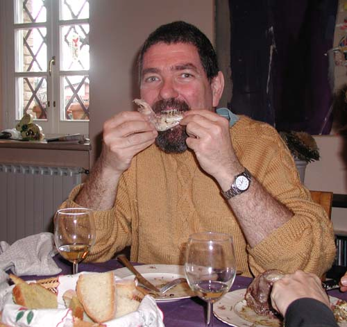
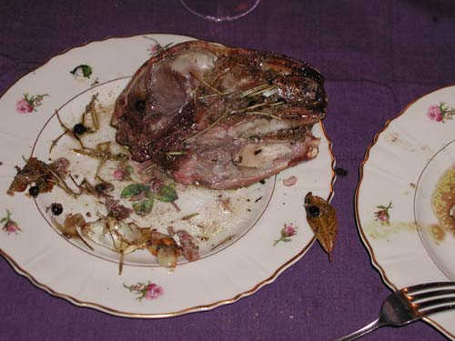

---
title: 'My head on a plate'
published: true
date: '29-03-2005 18:30'
taxonomy:
    category:
        - blog
    tag:
        - Glory
summary:
    enabled: '1'
subhead: " "
header_image: '0'
--- 

{.center} 

Some while ago, shortly after I arrived here, someone said how Italian I had become. "If you're not eating, you're discussing what you ate yesterday, or what you're going to eat tomorrow." I took that as a bit of a compliment. But at Easter, what else is there to discuss?

Off to Montecchio on Sunday, to garden for my lunch. Alas it was raining, so no work was possible, and that allowed me to spend far too much time in the kitchen. There, on the counter, was a large wooden chopping board neatly covered with small piles of individual organ meats, chopped. And on the stove, a large frying pan with a gently softening sofrito of onions. In went the organ meats in turn, each to enjoy its own necessary cooking time, so that at the moment of serving each would be done to perfection. Lungs and heart were first in, kidneys a while later, with pancreas and liver popped in for a quick stir just before serving. And Lord but it was delicious, with my own sourdough bread as a mop.

{.center} 

Just a taster though. While all that was happening on the stove top, two lamb's heads had been roasting in the oven below. Yes, whole lamb heads. Well, sliced in half, actually, straight down the middle. Very traditional. Very anatomy text book. Very hard to obtain. Cost an entire carton of cigarettes. And -- after an initial slight problem with the concept, quickly banished -- utterly toothsome. It has been a while since I last ate brains (in Albi, with the first Mrs Cherfas, as I recall) and they really are rather good. Tongue too, though I'm not sure I don't prefer it cold, with a lightly vinegared green sauce. Scraping the cheek meat off and then gnawing on a jaw will also live long in my memory. (I think clicking on the photo of the head will take you to a slide show of it all.)

And as if that weren't enough, there was the rest of the lamb, the body of the lamb as one guest called it (having refused the previous two courses). And that was good too, although, I have to say, just a little fatty. But hey, who's complaining?

After which, the only possible thing to do was lie in front of the fire and digest. Which I did.

So, grateful thanks to Joanne and Mara, who cooked and helped me deal with my head on a plate.
