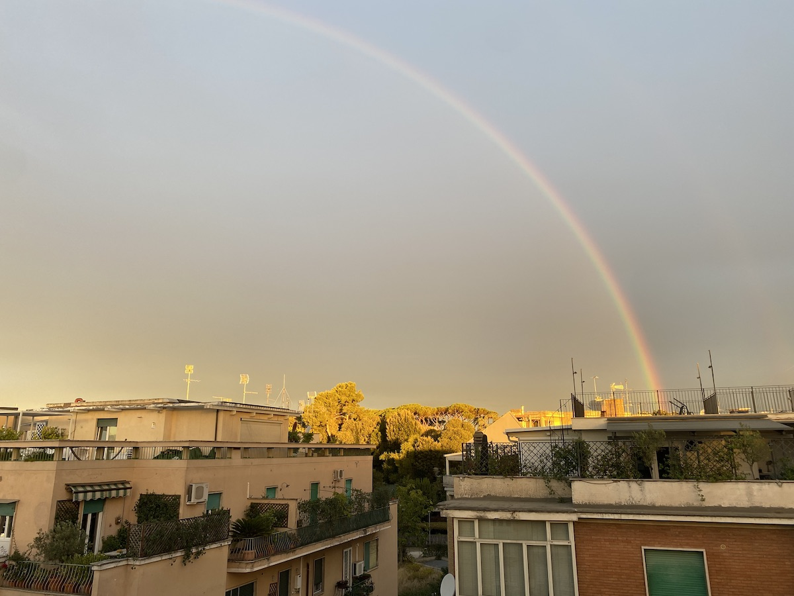

Time to bite the bullet I launched at myself a long time ago, and specify a topic for September's [Indieweb Carnival](https://indieweb.org/indieweb-carnival): My Kind of Weather.

{.center}

===

Talking about the weather (and doing nothing about it) is a fact of life for British and many other societies. The same could be said for talking about the climate, but that is a much bigger topic, and aside from putting pressure on the largest actors, we each have to decide on our own how much we are willing to do about it. For my part, I really am trying to stop taking short flights in Europe when a train is usually much more relaxing, much more fun and, usually, not much more expensive, as long as you have the time.

I'm thinking more about discussing the kind of weather you take most pleasure in. For me, that would be low humidity. I can take heat as long as it is dry and as long as it cools down in the evening. And I can take the cold if I am dry. That said, I love rain, and especially gigantic thunderstorms, as long I am under cover where I can just sit and listen to the crashing noices and revel in the rain. But I don't particularly like being out in snow.

Those are the bare outlines, for me. I'll try and write up a more thought out piece during the month, and I am hoping to hear from lots of other people about the weather they do and do not enjoy. If you write something, you can send a webmention to this post, email me (easy enough to find an address) or find some other way to let me know. I'll consider everything sent before 23:59 CEST on 30 September 2023 (and probably leave a little wiggle room).

