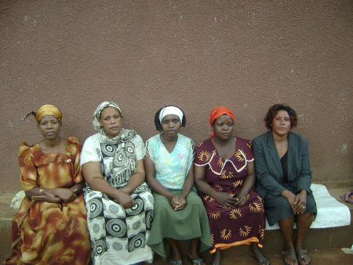

I first came across [Kiva](http://www.kiva.org/) in early January 2007. I had read a blog post about a woman in Africa who wanted a mini-mill to help grind millet.[^1] I thought, well, that's not hard, and I know, from the day job, what an effective investment it could be. I'll send her the money. And so I looked for online micro-credit sites, and found Kiva, which I had read about somewhere or other in late 2006. There was no way to lend Juliana the money through Kiva and, in fact, no way to lend anyone money through Kiva. The site was crap. It kept barfing at me, to the point where I both wrote to the founder (who sent a stalling response) and tried for a while to interest some other people in setting up a competitor. Well, why not? There's no big advantage to being first in if you're crap. But nobody bit, and I don't have the gumption or skills to do it on my own. But that's another story.

I did check back into Kiva from time to time, because I actually do want to give money to a project. But I'm also picky. I want to give to an agriculture project, and I want it to be in sub-Saharan Africa, because that's what is needed and that is where it is needed. And each time I went to Kiva, and worked my way through the bizarre user-interface, I was disappointed. There didn't seem to be anyone working in agriculture in Africa who wanted money.

{.center} 

Finally, last time I looked, on Sunday evening, there was Sylvia Kalema (I don't know which one she is in the photo) and the rest of the Nabweru III A 2030 (c) group of women in Uganda.[^2] So I lent them $25, plus 10% to Kiva, and this time the system didn't barf and it took no time at all. Sylvia has a poultry business and wants to build another chicken house. I can relate to that. And I hope it all works out. And that, in case you were wondering, is what My Latest Folly over there in the sidebar is all about. I'll be interested to see how things develop, both with Sylvia and her friends and with [my relationship with Kiva](http://www.kiva.org/lender/jeremy3823), and I may post here about it from time to time.

Two points.

First, it is a real shame that I didn't keep on reading Juliana's blog, because back in July 2007 she decided to ask for the money for a mill. I didn't know, so I couldn't give. Which is a great shame. I really wanted to. But then, Juliana didn't let me know either. That's no way to mobilize resources! The machine eventually arrived in the village and was being assembled in December 2007. By January 2008, the women were running it. And then the story dries up. I want to know, did it make the difference Juliana thought it would?

Secondly, giving the money to Kiva made me feel happy. More on that tomorrow.

[^1]: 7 October 2017: All Juliana's links are dead.

[^2]: Kiva has let that link rot away, one of the many reasons why this initial enthusiasm turned to disillusion rather quickly.

