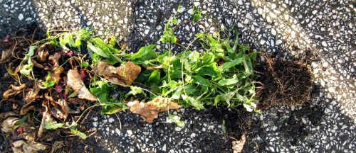

 {.center} 

That picture's a bit hard to read. _Mandevilla_ seedlings, lying on the ground, their roots to the right. No pot, note. What happened? I can't be sure, but a few times I've gone out onto the terrace and found a couple of big black crows poking about in the pots. They generally take off when I arrive and lurk on the forest of TV aerials. And pots that I swear were stable even in the howling winds have somehow ended up toppled. I can only assume that the crows were playing with these seedlings and somehow pulled them out of their pot.

The bigger mystery? Where's the pot? I swear, I looked all over and there's not a sign of it. Now, what would a crow want with a perfectly ordinary small black plastic plant pot?
